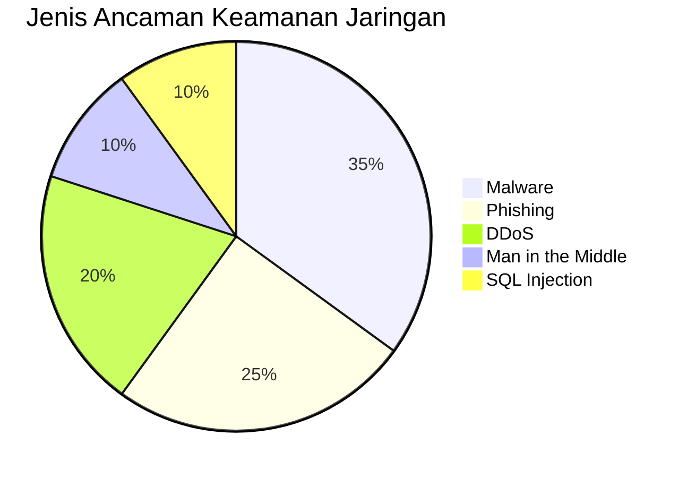
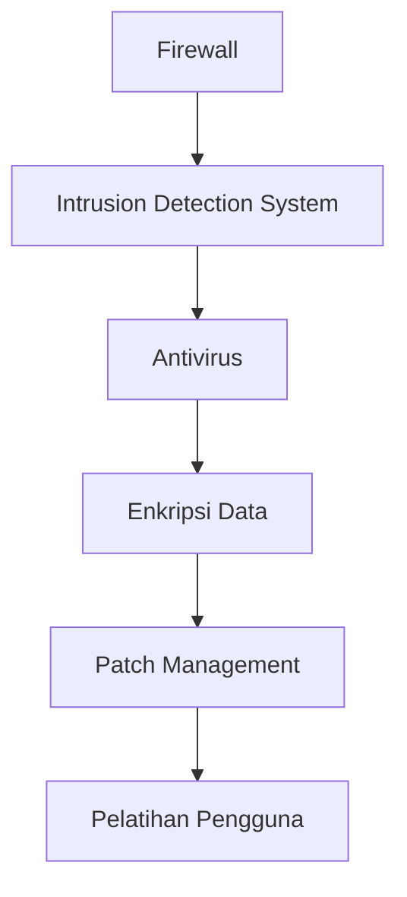

# 🔒 Konsep Dasar Keamanan Jaringan

## 🎯 Tujuan Pembelajaran
Setelah mempelajari materi ini, peserta didik mampu:
1. Memahami konsep dasar keamanan jaringan
2. Mengidentifikasi ancaman keamanan jaringan
3. Menerapkan prinsip dasar pengamanan jaringan
4. Memahami pentingnya keamanan informasi

## 1. Pengantar Keamanan Jaringan

### 1.1 Definisi Keamanan Jaringan
Keamanan jaringan adalah praktik untuk melindungi jaringan komputer dari penyusup, serangan siber, dan akses tidak sah dengan memanfaatkan perangkat keras, perangkat lunak, dan kebijakan keamanan.

### 1.2 Tujuan Keamanan Jaringan
- **Kerahasiaan (Confidentiality)**: Memastikan informasi hanya dapat diakses oleh pihak yang berwenang
- **Integritas (Integrity)**: Menjaga keakuratan dan konsistensi data
- **Ketersediaan (Availability)**: Memastikan sistem dan data dapat diakses saat dibutuhkan
- **Otorisasi (Authorization)**: Memastikan hak akses sesuai dengan peran dan tanggung jawab
- **Non-repudiation**: Mencegah penyangkalan terhadap suatu transaksi

## 2. Ancaman Keamanan Jaringan

### 2.1 Jenis Ancaman

### 2.2 Contoh Ancaman
1. **Malware**
   - Virus
   - Worm
   - Trojan
   - Ransomware
   - Spyware

2. **Serangan Jaringan**
   - Denial of Service (DoS/DDoS)
   - Man-in-the-Middle (MitM)
   - Eavesdropping
   - Spoofing
   - Phishing

## 3. Prinsip Dasar Keamanan Jaringan

### 3.1 Defense in Depth
Strategi keamanan berlapis yang mengimplementasikan beberapa lapis pertahanan untuk melindungi aset digital.

### 3.2 Prinsip Least Privilege
Setiap pengguna atau proses hanya memiliki akses ke sumber daya yang benar-benar dibutuhkan untuk menyelesaikan tugasnya.

## 4. Komponen Keamanan Jaringan

### 4.1 Perangkat Keras
- Firewall
- Intrusion Detection/Prevention System (IDS/IPS)
- Virtual Private Network (VPN) Concentrator
- Network Access Control (NAC)

### 4.2 Perangkat Lunak
- Antivirus/Antimalware
- Encryption Tools
- Security Information and Event Management (SIEM)
- Vulnerability Scanners

## 5. Standar dan Kerangka Kerja

### 5.1 Standar Internasional
- **ISO/IEC 27001**: Standar manajemen keamanan informasi
- **NIST Cybersecurity Framework**: Kerangka kerja keamanan siber
- **PCI DSS**: Standar keamanan untuk industri pembayaran

### 5.2 Regulasi di Indonesia
- **UU ITE (Undang-Undang Informasi dan Transaksi Elektronik)**
- **Perpres 82/2012**: Penyelenggaraan Sistem dan Transaksi Elektronik
- **Permenkominfo 4/2016**: Keamanan Informasi pada Penyelenggara Sistem Elektronik

## 6. Etika dalam Keamanan Jaringan

### 6.1 Etika Hacker
- Jangan merusak sistem
- Jangan mencuri data
- Jangan menyalahgunakan akses
- Laporkan kerentanan yang ditemukan

### 6.2 Kode Etik Profesional
- Menjaga kerahasiaan informasi
- Bertanggung jawab atas tindakan
- Menghormati privasi orang lain
- Mengikuti hukum dan regulasi yang berlaku

## 📌 Ringkasan
1. Keamanan jaringan melindungi sistem dari ancaman internal dan eksternal
2. Prinsip CIA (Confidentiality, Integrity, Availability) adalah fondasi keamanan informasi
3. Ancaman keamanan terus berkembang seiring kemajuan teknologi
4. Penerapan keamanan berlapis (defense in depth) sangat penting
5. Mematuhi etika dan hukum dalam praktik keamanan jaringan

## 📚 Referensi
1. Stallings, W., & Brown, L. (2018). Computer Security: Principles and Practice (4th ed.). Pearson.
2. Kim, D., & Solomon, M. G. (2018). Fundamentals of Information Systems Security (4th ed.). Jones & Bartlett Learning.
3. OWASP Top 10 (2024). https://owasp.org/www-project-top-ten/

---

  
Modul Pembelajaran - Konsep Dasar Keamanan Jaringan

  
© 2025 SMKN 1 Punggelan - Program Keahlian Teknik Komputer dan Jaringan

