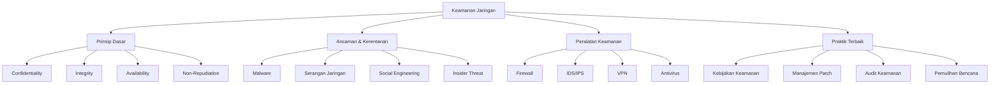

# 📚 PENGANTAR SISTEM KEAMANAN JARINGAN

## 🏫 Identitas Modul

| **Komponen** | **Keterangan** |
|--------------|----------------|
| Nama Sekolah | SMKN 1 Punggelan |
| Program Keahlian | Sistem Informasi Jaringan dan Aplikasi (SIJA) |
| Mata Pelajaran | Sistem Keamanan Jaringan |
| Kelas/Semester | XI/1 |
| Tahun Ajaran | 2025/2026 |
| Penyusun | Idiarso, S.Kom |
| Alokasi Waktu | 16 Minggu (48 JP @ 45 menit) |
| Capaian Pembelajaran | Menerapkan prinsip-prinsip keamanan jaringan dalam mengamankan infrastruktur TI |

## 🎯 Tujuan Pembelajaran

### A. Kognitif
1. **Memahami** konsep dasar keamanan jaringan dan komponen-komponennya
2. **Menganalisis** berbagai jenis ancaman dan kerentanan keamanan jaringan
3. **Mengevaluasi** efektivitas berbagai teknik pengamanan jaringan
4. **Menerapkan** prinsip-prinsip keamanan jaringan dalam skenario nyata

### B. Psikomotorik
1. **Mengkonfigurasi** perangkat jaringan dengan parameter keamanan yang tepat
2. **Mengimplementasikan** solusi keamanan jaringan dasar
3. **Melakukan** pengujian keamanan jaringan sederhana
4. **Mendokumentasikan** hasil konfigurasi dan pengujian

### C. Afektif
1. **Menunjukkan** sikap bertanggung jawab dalam menerapkan keamanan jaringan
2. **Bekerja sama** dalam tim untuk memecahkan masalah keamanan jaringan
3. **Menghargai** etika dan regulasi terkait keamanan informasi

## 📖 Peta Konsep

## 📋 Cakupan Materi

### 1. Konsep Dasar Keamanan Jaringan
   - Sejarah dan Perkembangan Keamanan Jaringan
   - Prinsip Dasar (CIA Triad)
   - Konsep Autentikasi, Otorisasi, dan Akuntansi (AAA)
   - Kriptografi Dasar
   - Standar dan Regulasi Keamanan Informasi

### 2. Ancaman dan Kerentanan Jaringan
   - Klasifikasi Ancaman Keamanan
   - Jenis-jenis Malware
   - Teknik Serangan Jaringan
   - Analisis Kerentanan
   - Manajemen Risiko Keamanan

### 3. Arsitektur Keamanan Jaringan
   - Zona Keamanan dan Segmentasi Jaringan
   - Arsitektur Perimeter Security
   - Konsep Defense in Depth
   - Zero Trust Security Model
   - Cloud Security Architecture

### 4. Teknologi Keamanan Jaringan
   - Firewall dan Sistem Pencegahan Intrusi
   - Virtual Private Network (VPN)
   - Sistem Deteksi dan Pencegahan Intrusi (IDS/IPS)
   - Keamanan Nirkabel
   - Keamanan Aplikasi Web

## 🛠️ Metode Pembelajaran

### 1. Pembelajaran Tatap Muka
   - **Kuliah Interaktif**: Pemaparan konsep dengan presentasi dan tanya jawab
   - **Demonstrasi**: Peragaan penggunaan tools keamanan jaringan
   - **Praktikum Terbimbing**: Latihan konfigurasi perangkat jaringan
   - **Studi Kasus**: Analisis kasus keamanan jaringan nyata

### 2. Pembelajaran Mandiri
   - **E-Learning**: Mengakses materi pembelajaran digital
   - **Tugas Terstruktur**: Mengerjakan proyek dan latihan mandiri
   - **Pembelajaran Berbasis Proyek**: Mengembangkan solusi keamanan jaringan
   - **Diskusi Online**: Forum diskusi dan tanya jawab

### 3. Penilaian Pembelajaran
   - **Penilaian Formatif**: Kuis, tugas, dan praktikum mingguan
   - **Penilaian Sumatif**: UTS, UAS, dan proyek akhir
   - **Penilaian Kinerja**: Observasi selama praktikum
   - **Portofolio**: Kumpulan hasil kerja peserta didik

## 📚 Sumber Belajar

### A. Referensi Utama
1. **Buku Teks**
   - "Network Security Essentials" by William Stallings
   - "Computer Networking: A Top-Down Approach" by Kurose & Ross
   - "Hacking Exposed 7: Network Security Secrets & Solutions"

2. **Dokumen Standar**
   - ISO/IEC 27001:2022 - Information Security Management
   - NIST Cybersecurity Framework
   - RFC 4949 - Internet Security Glossary

### B. Sumber Digital
1. **Platform E-Learning**
   - Cisco Networking Academy
   - TryHackMe
   - Hack The Box Academy

2. **Tools Praktikum**
   - VirtualBox/VMware Workstation
   - Wireshark
   - Nmap
   - Metasploit Framework
   - Kali Linux

### C. Referensi Tambahan
1. **Jurnal Ilmiah**
   - Journal of Network and Computer Applications
   - IEEE Transactions on Information Forensics and Security
   - Computers & Security Journal

2. **Sumber Online**
   - OWASP Foundation
   - SANS Internet Storm Center
   - US-CERT Alerts

## 📝 Rencana Pembelajaran Semester (RPS)

| Minggu | Materi | Aktivitas Pembelajaran | Penugasan |
|--------|--------|------------------------|------------|
| 1 | Konsep Dasar Keamanan Jaringan | Kuliah, Diskusi | Resume Materi |
| 2 | Prinsip CIA dan AAA | Diskusi Kelompok, Studi Kasus | Presentasi Kelompok |
| 3 | Kriptografi Dasar | Demonstrasi, Praktikum | Laporan Praktikum |
| 4 | Ancaman Keamanan Jaringan | Studi Kasus, Simulasi | Analisis Kasus |
| 5 | Teknik Serangan Jaringan | Praktikum Lab | Dokumentasi Serangan |
| 6 | Analisis Kerentanan | Workshop, Diskusi | Laporan Analisis |
| 7 | Firewall dan IDS/IPS | Praktikum Konfigurasi | Laporan Konfigurasi |
| 8 | Ujian Tengah Semester | - | - |
| 9 | Keamanan Jaringan Nirkabel | Praktikum, Diskusi | Laporan Praktikum |
| 10 | Keamanan Aplikasi Web | Workshop OWASP Top 10 | Analisis Keamanan Web |
| 11 | Manajemen Identitas dan Akses | Praktikum, Diskusi | Proyek Kecil |
| 12 | Konsep Enkripsi dan PKI | Demonstrasi, Praktikum | Implementasi Sederhana |
| 13 | Audit Keamanan Jaringan | Workshop, Diskusi | Laporan Audit |
| 14 | Manajemen Insiden Keamanan | Simulasi, Diskusi | Laporan Insiden |
| 15 | Proyek Akhir | Presentasi Proyek | Demo dan Presentasi |
| 16 | Ujian Akhir Semester | - | - |

## 📋 Penilaian

### Komponen Penilaian
1. **Tugas Harian (20%)**
   - Kuis
   - Tugas Individu
   - Partisipasi Kelas

2. **Praktikum (30%)**
   - Laporan Praktikum
   - Keterampilan Praktis
   - Kerja Sama Tim

3. **Proyek (25%)**
   - Perencanaan
   - Implementasi
   - Presentasi
   - Dokumentasi

4. **Ujian (25%)**
   - UTS (10%)
   - UAS (15%)

### Rubrik Penilaian Praktikum

| Kriteria | Sangat Baik (90-100) | Baik (80-89) | Cukup (70-79) | Perlu Bimbingan (<70) |
|----------|----------------------|--------------|----------------|----------------------|
| Ketepatan Konfigurasi | Konfigurasi sempurna, tidak ada kesalahan | Beberapa kesalahan minor | Beberapa kesalahan signifikan | Banyak kesalahan |
| Dokumentasi | Lengkap, rapi, dan mudah dipahami | Cukup lengkap dan jelas | Kurang lengkap | Tidak lengkap |
| Analisis | Analisis mendalam dan kritis | Analisis cukup baik | Analisis minimal | Tidak ada analisis |
| Ketepatan Waktu | Selesai sebelum deadline | Tepat waktu | Terlambat maksimal 1x24 jam | Terlambat >24 jam |

## 📞 Kontak Pengajar

### Idiarso, S.Kom
- **Email**: [email yang sesuai]
- **Jam Konsultasi**: Senin-Jumat, 13.00-15.00 WIB
- **Ruangan**: Lab. Komputer 1
- **Telepon**: [nomor yang sesuai]

## 📝 Catatan Khusus

1. **Kehadiran**: Minimal 80% kehadiran untuk mengikuti ujian akhir
2. **Keterlambatan**: Maksimal 15 menit dari jadwal perkuliahan
3. **Tugas**: Keterlambatan pengumpulan akan mengurangi nilai
4. **Integritas Akademik**: Plagiarisme tidak ditoleransi
5. **Perangkat**: Bawa laptop dan peralatan praktikum sesuai jadwal

---

  
Dokumen ini merupakan bagian dari materi pembelajaran Sistem Keamanan Jaringan

  
© 2025 SMKN 1 Punggelan - All Rights Reserved

2. Modul pembelajaran
3. Sumber digital (website, video tutorial)
4. Perangkat jaringan
5. Perangkat lunak simulasi jaringan

## Penilaian

Penilaian dilakukan melalui:
1. Tugas individu dan kelompok
2. Kuis
3. Praktikum
4. Ujian tengah semester
5. Ujian akhir semester
6. Proyek akhir
