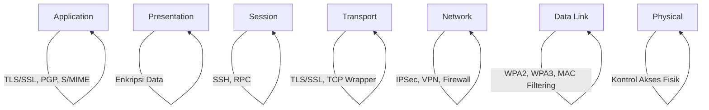
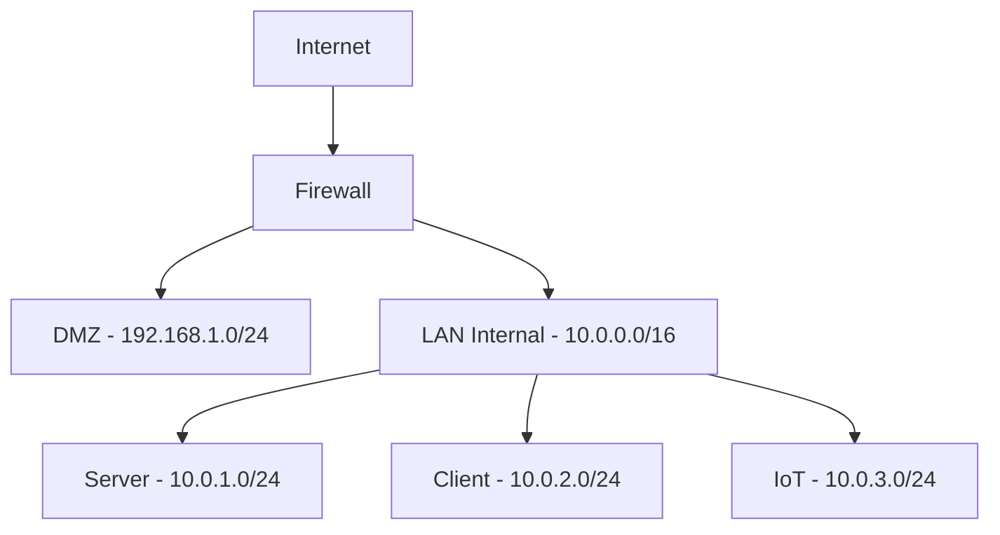
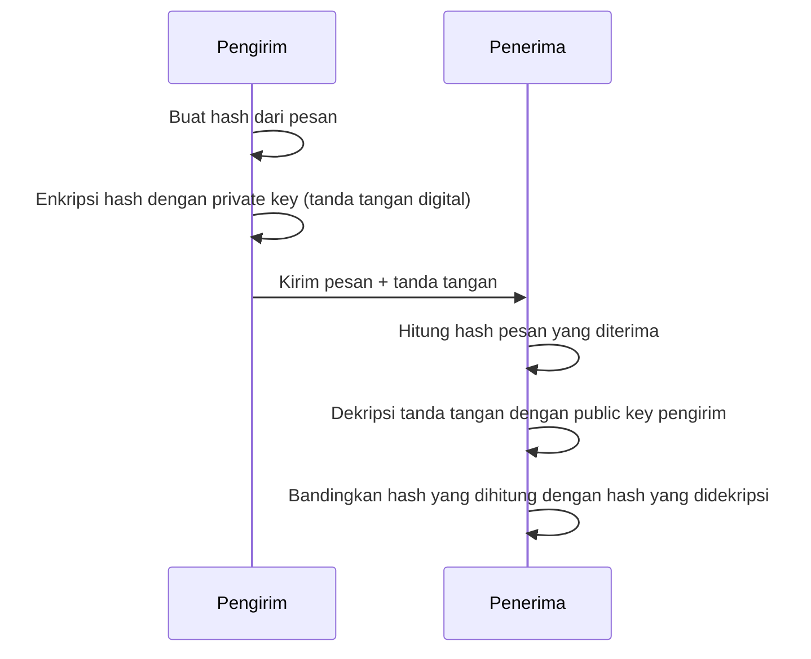

# 🌐 Dasar-dasar Keamanan Jaringan

## 🎯 Tujuan Pembelajaran
Setelah mempelajari materi ini, peserta didik mampu:
1. Memahami model referensi OSI dan TCP/IP dalam konteks keamanan
2. Mengidentifikasi protokol jaringan dan keamanannya
3. Menerapkan teknik pengalamatan IP yang aman
4. Memahami konsep enkripsi dan autentikasi
5. Menerapkan kebijakan keamanan dasar

## 1. Model Referensi Jaringan dan Keamanan

### 1.1 Model OSI dan Lapisan Keamanan

### 1.2 Model TCP/IP dan Keamanan
| Lapisan | Protokol | Ancaman | Keamanan |
|---------|----------|---------|----------|
| Aplikasi | HTTP, FTP, SMTP | Sniffing, Spoofing | TLS/SSL, PGP |
| Transport | TCP, UDP | Hijacking, DoS | TLS, DTLS |
| Internet | IP, ICMP | Spoofing, MITM | IPSec, VPN |
| Network Access | Ethernet, WiFi | Sniffing, MAC Spoofing | WPA3, 802.1X |

## 2. Protokol Jaringan dan Keamanannya

### 2.1 Protokol yang Aman vs Tidak Aman
#### Protokol Tidak Aman:
- **HTTP**: Data dikirim dalam teks biasa
- **FTP**: Otentikasi dalam teks biasa
- **Telnet**: Semua komunikasi tidak terenkripsi
- **SNMPv1/v2c**: Otentikasi lemah

#### Protokol Aman:
- **HTTPS**: HTTP + TLS/SSL
- **SFTP/SCP**: Pengganti FTP yang aman
- **SSH**: Pengganti Telnet yang aman
- **SNMPv3**: Mendukung enkripsi dan otentikasi kuat

### 2.2 Port-port Penting dan Keamanannya
| Port | Protokol | Keterangan | Keamanan |
|------|----------|------------|----------|
| 22 | SSH | Remote Login | ✅ Aman dengan kunci kriptografi |
| 80 | HTTP | Web Traffic | ❌ Tidak aman, gunakan 443 |
| 443 | HTTPS | Web Traffic Aman | ✅ Aman dengan sertifikat valid |
| 21 | FTP | File Transfer | ❌ Tidak aman, gunakan SFTP/22 |
| 25 | SMTP | Email | ⚠️ Butuh STARTTLS |
| 53 | DNS | Resolusi Nama | ⚠️ Rentan spoofing, gunakan DNSSEC |

## 3. Pengalamatan IP dan Keamanan

### 3.1 Konsep Subnetting untuk Keamanan

### 3.2 IPv6 dan Keamanan
- **Alamat IPv6** memiliki ruang alamat yang jauh lebih besar
- **IPSec** diwajibkan dalam standar IPv6
- **Stateless Address Autoconfiguration (SLAAC)** memerlukan perhatian khusus
- **Penyaringan (filtering)** lebih kompleks karena berbagai tipe alamat IPv6

## 4. Kriptografi Dasar

### 4.1 Jenis-jenis Enkripsi
#### Simetris (AES, DES, 3DES)
- Kelebihan: Cepat, cocok untuk enkripsi data dalam jumlah besar
- Kekurangan: Membutuhkan pertukaran kunci yang aman

#### Asimetris (RSA, ECC)
- Kelebihan: Memecahkan masalah pertukaran kunci
- Kekurangan: Lebih lambat, membutuhkan komputasi lebih besar

### 4.2 Hash dan Digital Signature

## 5. Autentikasi dan Otorisasi

### 5.1 Metode Autentikasi
1. **Something You Know** (Password, PIN)
2. **Something You Have** (Token, Smart Card)
3. **Something You Are** (Biometrik)
4. **Somewhere You Are** (Lokasi)
5. **Something You Do** (Pola perilaku)

### 5.2 Protokol Autentikasi
- **RADIUS**: Untuk autentikasi jaringan terpusat
- **TACACS+**: Alternatif RADIUS dengan enkripsi lebih baik
- **Kerberos**: Protokol autentikasi jaringan yang menggunakan tiket
- **OAuth 2.0 & OpenID Connect**: Untuk autentikasi berbasis web

## 6. Kebijakan Keamanan Dasar

### 6.1 Komponen Kebijakan Keamanan
1. **Kebijakan Kata Sandi**
   - Panjang minimal 12 karakter
   - Kompleksitas karakter
   - Masa berlaku
   - Sejarah kata sandi

2. **Kebijakan Penggunaan yang Dapat Diterima (AUP)**
   - Penggunaan sumber daya jaringan
   - Penggunaan email
   - Akses internet
   - Penggunaan perangkat pribadi

3. **Kebijakan Backup dan Pemulihan**
   - Frekuensi backup
   - Media penyimpanan
   - Retensi data
   - Prosedur pemulihan

## 7. Praktik Terbaik Keamanan Jaringan

### 7.1 Hardening Sistem
- Nonaktifkan layanan yang tidak digunakan
- Terapkan prinsip least privilege
- Update dan patch sistem secara teratur
- Konfigurasi firewall dengan default deny

### 7.2 Monitoring dan Logging
- Aktifkan logging untuk peristiwa keamanan
- Terapkan rotasi log
- Monitor log secara teratur
- Gunakan SIEM untuk analisis terpusat

## 📌 Ringkasan
1. Model referensi jaringan membantu memahami titik-titik keamanan
2. Protokol yang tidak aman harus dihindari atau diamankan
3. Subnetting meningkatkan keamanan dengan segmentasi jaringan
4. Enkripsi dan autentikasi adalah fondasi keamanan jaringan
5. Kebijakan keamanan yang jelas penting untuk perlindungan menyeluruh

## 📚 Referensi
1. Forouzan, B. A. (2017). *Data Communications and Networking* (6th ed.). McGraw-Hill.
2. Stallings, W. (2017). *Network Security Essentials* (6th ed.). Pearson.
3. NIST Special Publication 800-123: *Guide to General Server Security*

---

  
Modul Pembelajaran - Dasar-dasar Keamanan Jaringan

  
© 2025 SMKN 1 Punggelan - Program Keahlian Teknik Komputer dan Jaringan

