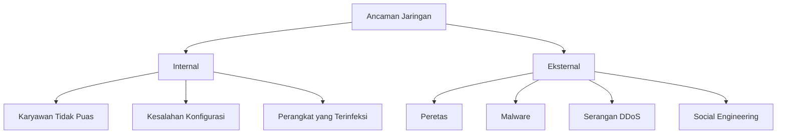
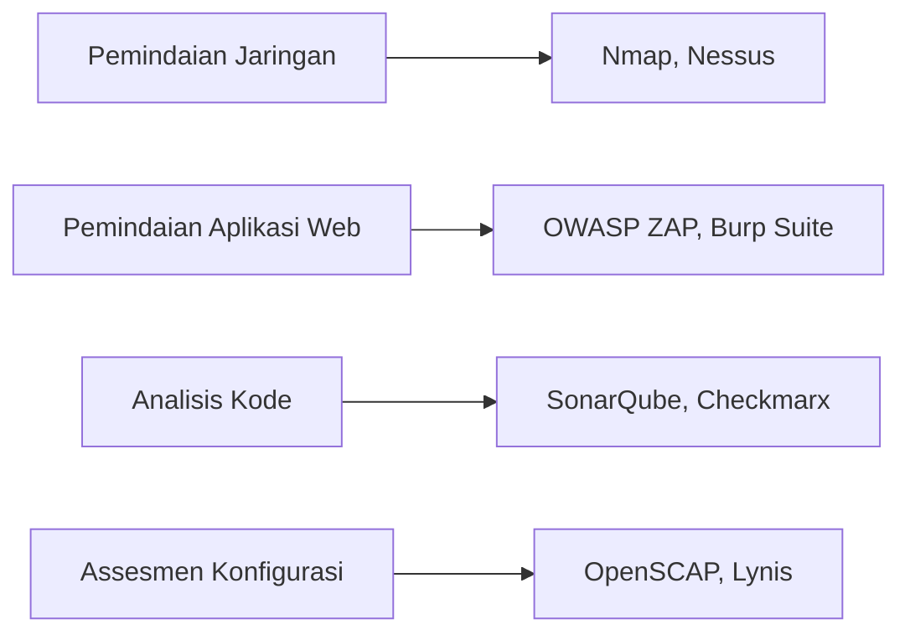
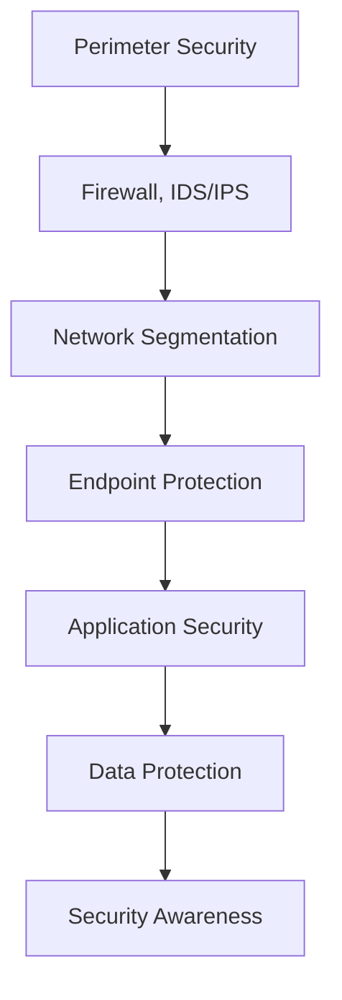

# 🛡️ Ancaman dan Kerentanan Jaringan

## 🎯 Tujuan Pembelajaran
Setelah mempelajari materi ini, peserta didik mampu:
1. Mengidentifikasi berbagai jenis ancaman keamanan jaringan
2. Menganalisis kerentanan pada sistem jaringan
3. Memahami teknik serangan jaringan yang umum
4. Menerapkan teknik pengujian keamanan dasar
5. Mengembangkan strategi mitigasi risiko keamanan

## 1. Klasifikasi Ancaman Jaringan

### 1.1 Berdasarkan Sumber Ancaman


### 1.2 Berdasarkan Jenis Serangan
| Kategori | Contoh Serangan | Dampak Potensial |
|----------|----------------|------------------|
| **Eksploitasi** | Buffer Overflow, SQL Injection | Eksekusi kode jarak jauh |
| **Denial of Service** | DDoS, SYN Flood | Gangguan ketersediaan layanan |
| **Man-in-the-Middle** | ARP Spoofing, DNS Spoofing | Pencurian data, Penyadapan |
| **Credential-Based** | Brute Force, Credential Stuffing | Akses tidak sah |
| **Malware** | Ransomware, Spyware | Kehilangan data, Pemantauan rahasia |

## 2. Analisis Kerentanan Jaringan

### 2.1 Kategori Kerentanan
1. **Perangkat Keras**
   - Firmware usang
   - Backdoor pabrikan
   - Kerusakan fisik

2. **Perangkat Lunak**
   - Bug keamanan
   - Konfigurasi default yang tidak aman
   - Ketergantungan yang rentan

3. **Manusia**
   - Kesalahan pengguna
   - Kurangnya pelatihan
   - Social engineering

4. **Protokol**
   - Kelemahan desain
   - Enkripsi lemah
   - Tidak ada otentikasi

### 2.2 Alat Analisis Kerentanan


## 3. Teknik Serangan Umum

### 3.1 Serangan Lapisan Jaringan
1. **ARP Spoofing/Poisoning**
   - Memanipulasi tabel ARP untuk mengalihkan lalu lintas
   - **Contoh**: `arpspoof -i eth0 -t target_ip router_ip`

2. **DNS Spoofing**
   - Memalsukan respons DNS untuk mengarahkan ke server jahat
   - **Contoh**: `dnsspoof -i eth0 -f hosts.txt`

3. **SYN Flood**
   - Membanjiri target dengan permintaan koneksi TCP SYN
   - **Mitigasi**: SYN cookies, rate limiting

### 3.2 Serangan Aplikasi
1. **SQL Injection**
   ```sql
   -- Contoh payload
   ' OR '1'='1'--
   UNION SELECT username, password FROM users--
   ```

2. **Cross-Site Scripting (XSS)**
   ```html
   <script>alert('XSS')</script>
   
   ```

3. **Cross-Site Request Forgery (CSRF)**
   ```html
   
   ```

## 4. Teknik Pengujian Keamanan

### 4.1 Metodologi Pengujian
1. **Reconnaissance**
   ```bash
   # Pemindaian jaringan
   nmap -sS -sV -p- target_ip
   
   # Pengumpulan informasi WHOIS
   whois example.com
   ```

2. **Pemindaian Kerentanan**
   ```bash
   # Menggunakan Nikto untuk web scanning
   nikto -h target_ip
   
   # Pemindaian dengan OpenVAS
   gvm-start   # Memulai OpenVAS
   # Lanjutkan melalui antarmuka web
   ```

3. **Eksploitasi**
   ```bash
   # Menggunakan Metasploit Framework
   msfconsole
   > use exploit/multi/handler
   > set payload windows/meterpreter/reverse_tcp
   > set LHOST your_ip
   > exploit
   ```

## 5. Strategi Mitigasi Risiko

### 5.1 Pertahanan Berlapis (Defense in Depth)


### 5.2 Praktik Terbaik Keamanan
1. **Patch Management**
   - Otomatisasi pembaruan keamanan
   - Pengujian pra-produksi
   - Jadwal pemeliharaan rutin

2. **Konfigurasi Kuat**
   - Nonaktifkan layanan yang tidak perlu
   - Terapkan prinsip least privilege
   - Gunakan konfigurasi yang aman (CIS Benchmarks)

3. **Monitoring dan Logging**
   - Kumpulkan dan analisis log
   - Terapkan SIEM (Security Information and Event Management)
   - Buat sistem peringatan dini

## 6. Regulasi dan Standar Keamanan

### 6.1 Standar Internasional
- **ISO/IEC 27001**: Manajemen Keamanan Informasi
- **NIST Cybersecurity Framework**: Kerangka kerja keamanan siber
- **PCI DSS**: Standar keamanan untuk industri pembayaran
- **GDPR**: Perlindungan data pribadi Uni Eropa

### 6.2 Regulasi Indonesia
- **UU ITE (UU No. 19 Tahun 2016)**: Transaksi dan Dokumen Elektronik
- **Peraturan Menteri Kominfo No. 4/2016**: Keamanan Sistem Elektronik
- **POJK No. 38/2016**: Keamanan Teknologi Informasi Sektor Jasa Keuangan

## 📌 Ringkasan
1. Ancaman jaringan dapat berasal dari internal maupun eksternal dengan berbagai motif
2. Kerentanan dapat terjadi di berbagai lapisan (perangkat keras, lunak, manusia, protokol)
3. Teknik serangan terus berkembang seiring kemajuan teknologi
4. Pengujian keamanan yang komprehensif penting untuk mengidentifikasi kerentanan
5. Strategi mitigasi harus mencakup aspek teknis dan non-teknis

## 📚 Referensi
1. Scarfone, K., & Mell, P. (2007). *Guide to Intrusion Detection and Prevention Systems (IDPS)*. NIST SP 800-94.
2. OWASP Top 10 (2024). https://owasp.org/www-project-top-ten/
3. MITRE ATT&CK Matrix. https://attack.mitre.org/
4. NIST Special Publication 800-115: *Technical Guide to Information Security Testing and Assessment*

---
<div align="center">
  <p>Modul Pembelajaran - Ancaman dan Kerentanan Jaringan</p>
  <p>© 2025 SMKN 1 Punggelan - Program Keahlian Teknik Komputer dan Jaringan</p>
</div>
