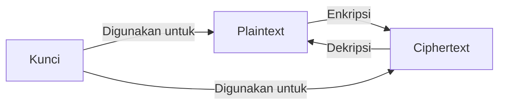
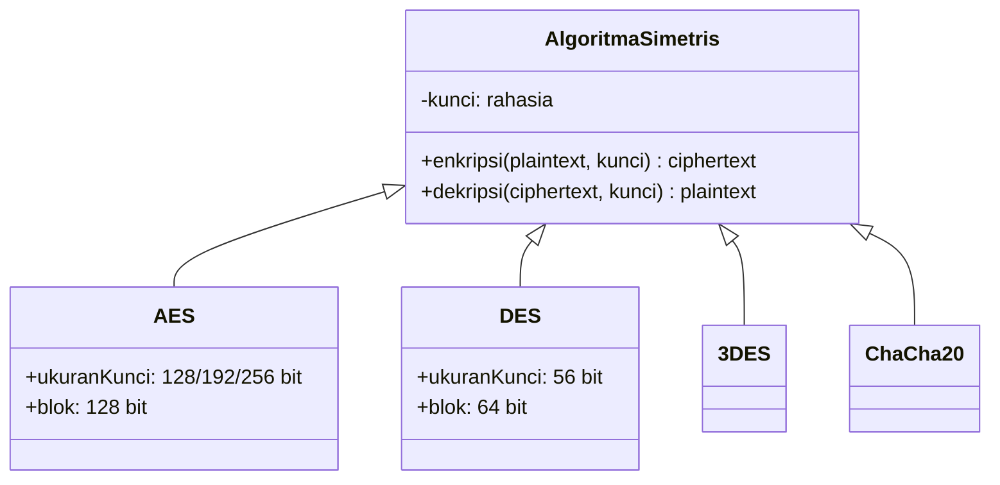
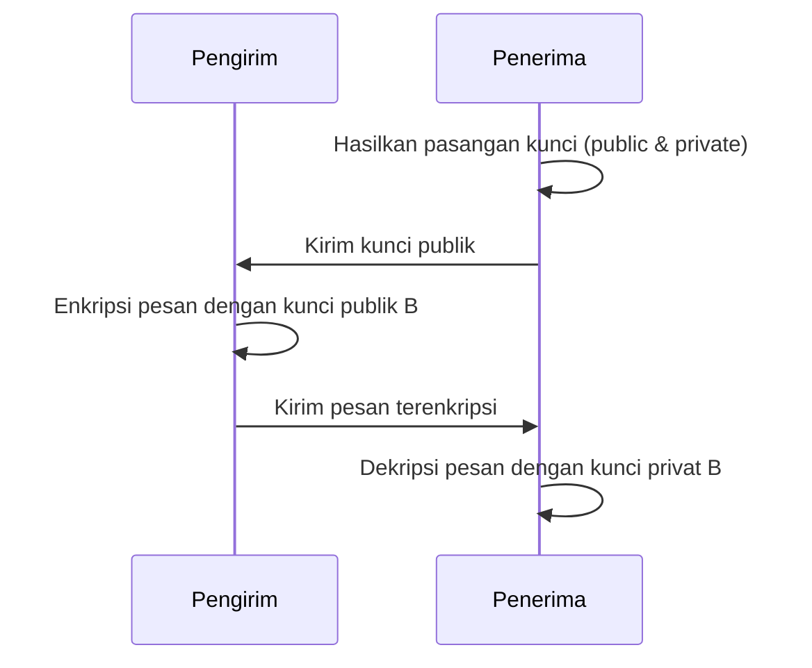
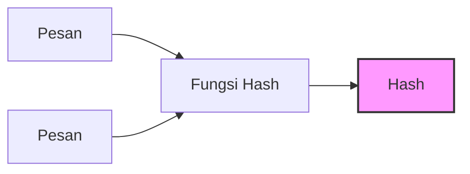
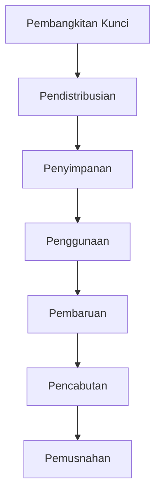
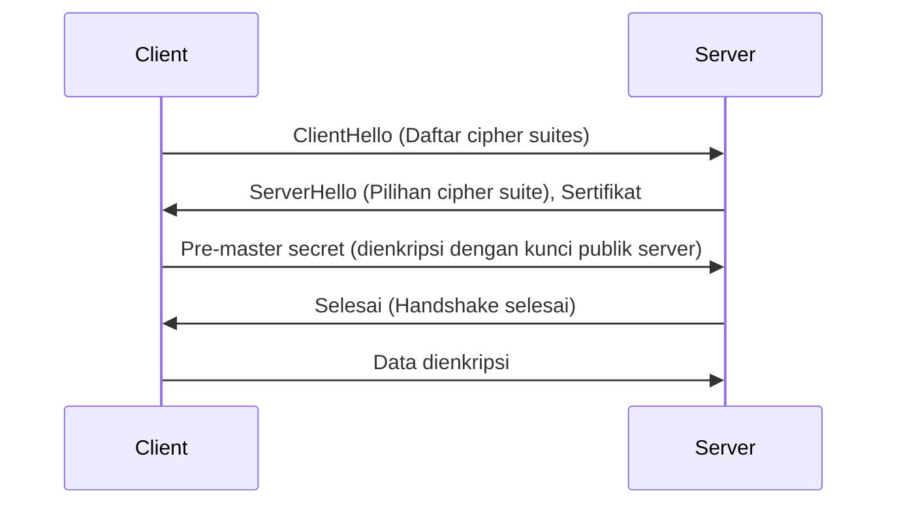

# 🔐 Kriptografi Dasar

## 🎯 Tujuan Pembelajaran
Setelah mempelajari materi ini, peserta didik mampu:
1. Memahami konsep dasar kriptografi
2. Membedakan jenis-jenis algoritma kriptografi
3. Menerapkan teknik enkripsi dan dekripsi dasar
4. Memahami penggunaan kriptografi dalam keamanan jaringan
5. Menerapkan praktik keamanan dalam implementasi kriptografi

## 1. Pengantar Kriptografi

### 1.1 Konsep Dasar


### 1.2 Tujuan Kriptografi
1. **Kerahasiaan (Confidentiality)**
   - Memastikan informasi hanya dapat diakses oleh pihak yang berwenang
   - Contoh: Enkripsi email, pesan WhatsApp

2. **Integritas (Integrity)**
   - Memastikan informasi tidak diubah selama transmisi
   - Contoh: Checksum, hash

3. **Otentikasi (Authentication)**
   - Memverifikasi identitas pengirim/penerima
   - Contoh: Digital signature, sertifikat digital

4. **Nirpenyangkalan (Non-repudiation)**
   - Mencegah penyangkalan atas tindakan yang dilakukan
   - Contoh: Tanda tangan digital

## 2. Jenis-jenis Algoritma Kriptografi

### 2.1 Algoritma Simetris


### 2.2 Algoritma Asimetris


### 2.3 Fungsi Hash Kriptografis


## 3. Implementasi Kriptografi

### 3.1 Enkripsi dengan OpenSSL
```bash
# Enkripsi file dengan AES-256-CBC
openssl enc -aes-256-cbc -salt -in plaintext.txt -out encrypted.enc

# Dekripsi file
openssl enc -d -aes-256-cbc -in encrypted.enc -out decrypted.txt

# Generate RSA key pair
openssl genpkey -algorithm RSA -out private_key.pem -aes256
openssl rsa -pubout -in private_key.pem -out public_key.pem
```

### 3.2 Contoh Implementasi di Python
```python
from cryptography.hazmat.primitives.ciphers import Cipher, algorithms, modes
from cryptography.hazmat.backends import default_backend
from cryptography.hazmat.primitives import padding
import os

def encrypt_aes(plaintext, key):
    # Generate random IV
    iv = os.urandom(16)
    
    # Create cipher object
    cipher = Cipher(
        algorithms.AES(key),
        modes.CBC(iv),
        backend=default_backend()
    )
    
    # Pad the plaintext
    padder = padding.PKCS7(128).padder()
    padded_data = padder.update(plaintext) + padder.finalize()
    
    # Encrypt
    encryptor = cipher.encryptor()
    ciphertext = encryptor.update(padded_data) + encryptor.finalize()
    
    return iv + ciphertext

def decrypt_aes(ciphertext, key):
    # Extract IV
    iv = ciphertext[:16]
    ciphertext = ciphertext[16:]
    
    # Create cipher object
    cipher = Cipher(
        algorithms.AES(key),
        modes.CBC(iv),
        backend=default_backend()
    )
    
    # Decrypt
    decryptor = cipher.decryptor()
    padded_plaintext = decryptor.update(ciphertext) + decryptor.finalize()
    
    # Unpad
    unpadder = padding.PKCS7(128).unpadder()
    plaintext = unpadder.update(padded_plaintext) + unpadder.finalize()
    
    return plaintext
```

## 4. Standar dan Protokol Kriptografi

### 4.1 Standar Enkripsi
| Standar | Deskripsi | Penggunaan Umum |
|---------|-----------|-----------------|
| **AES** | Advanced Encryption Standard | Enkripsi file, disk, jaringan |
| **RSA** | Rivest-Shamir-Adleman | Pertukaran kunci, tanda tangan digital |
| **ECC** | Elliptic Curve Cryptography | Perangkat mobile, IoT |
| **SHA** | Secure Hash Algorithm | Integritas data, blockchain |

### 4.2 Protokol yang Menggunakan Kriptografi
1. **TLS/SSL**
   - Menggunakan AES, RSA/ECC, SHA
   - Digunakan di HTTPS, FTPS, dll.

2. **SSH**
   - Enkripsi koneksi remote
   - Menggunakan algoritma seperti AES, ChaCha20

3. **PGP/GPG**
   - Enkripsi email dan file
   - Menggunakan kombinasi RSA/AES

## 5. Manajemen Kunci Kriptografi

### 5.1 Siklus Hidup Kunci


### 5.2 Praktik Terbaik
1. **Pembangkitan Kunci**
   - Gunakan sumber entropi yang kuat
   - Gunakan panjang kunci yang memadai (minimal 128-bit untuk simetris, 2048-bit untuk RSA)

2. **Penyimpanan Kunci**
   - Jangan simpan kunci di kode sumber
   - Gunakan HSM (Hardware Security Module) untuk kunci kritis
   - Enkripsi kunci dengan kunci lain (key wrapping)

3. **Rotasi Kunci**
   - Ganti kunci secara berkala
   - Gunakan teknik key derivation function (KDF) untuk kunci turunan

## 6. Kriptografi dalam Keamanan Jaringan

### 6.1 VPN (Virtual Private Network)
- Mengenkripsi semua lalu lintas antara klien dan server
- Protokol: OpenVPN, WireGuard, IPsec

### 6.2 HTTPS/TLS


## 7. Tantangan dan Perkembangan Terkini

### 7.1 Ancaman Kuantum
- Komputer kuantum dapat memecahkan RSA/ECC
- Solusi: Kriptografi pascakuantum (lattice-based, hash-based)

### 7.2 Implementasi yang Aman
- Serangan side-channel
- Timing attacks
- Fault injection

## 📌 Ringkasan
1. Kriptografi adalah fondasi keamanan informasi modern
2. Memahami perbedaan antara enkripsi simetris dan asimetris
3. Implementasi yang aman memerlukan lebih dari sekadar memilih algoritma yang kuat
4. Manajemen kunci yang baik sama pentingnya dengan algoritma itu sendiri
5. Selalu ikuti praktik terbaru dan standar industri

## 📚 Referensi
1. Menezes, A. J., van Oorschot, P. C., & Vanstone, S. A. (1996). *Handbook of Applied Cryptography*. CRC Press.
2. Paar, C., & Pelzl, J. (2009). *Understanding Cryptography: A Textbook for Students and Practitioners*. Springer.
3. NIST FIPS 197: Advanced Encryption Standard (AES)
4. RFC 8446: The Transport Layer Security (TLS) Protocol Version 1.3

---
<div align="center">
  <p>Modul Pembelajaran - Kriptografi Dasar</p>
  <p>© 2025 SMKN 1 Punggelan - Program Keahlian Teknik Komputer dan Jaringan</p>
</div>
