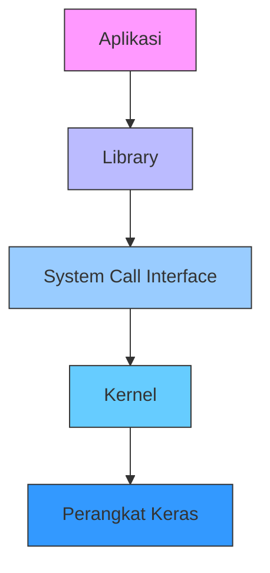
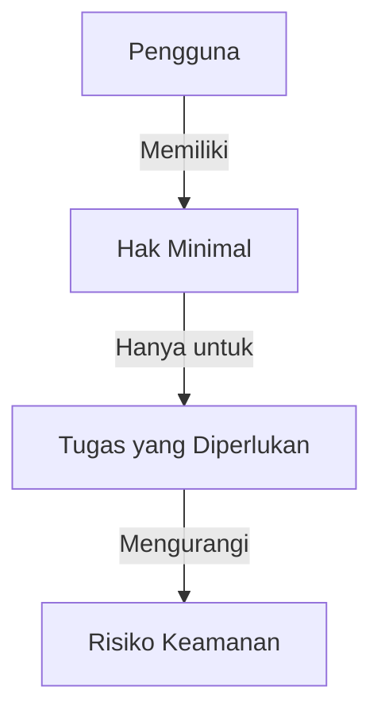
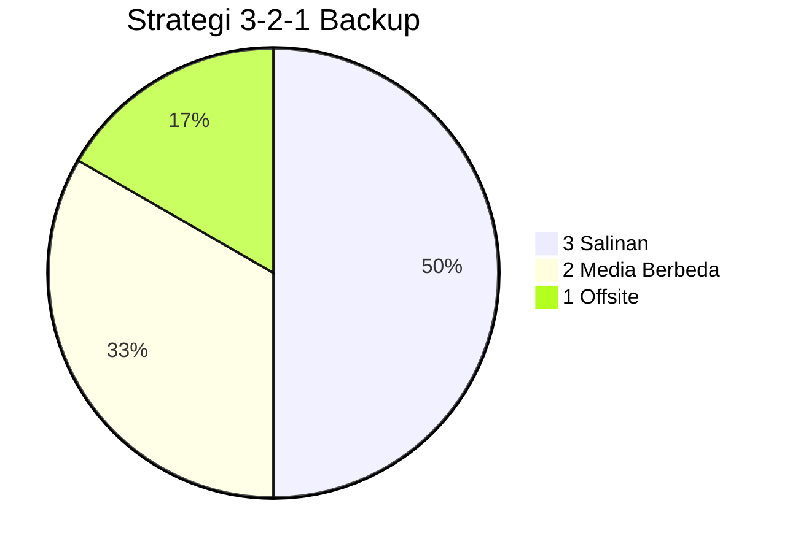

# 🖥️ Keamanan Sistem Operasi

## 🎯 Tujuan Pembelajaran
Setelah mempelajari materi ini, peserta didik mampu:
1. Memahami konsep dasar keamanan sistem operasi
2. Menerapkan teknik hardening pada sistem operasi
3. Mengelola pengguna dan izin dengan benar
4. Mengamankan layanan dan proses sistem
5. Menerapkan logging dan monitoring keamanan

## 1. Arsitektur Keamanan Sistem Operasi

### 1.1 Lapisan Keamanan Sistem Operasi


### 1.2 Komponen Keamanan Inti
| Komponen | Deskripsi | Contoh |
|----------|-----------|--------|
| **Autentikasi** | Verifikasi identitas pengguna | Login dengan username/password |
| **Otorisasi** | Menentukan hak akses pengguna | Izin baca/tulis file |
| **Audit** | Pencatatan aktivitas sistem | Log akses file |
| **Proteksi Memori** | Isolasi antar proses | Address Space Layout Randomization (ASLR) |
| **Manajemen Proses** | Kontrol eksekusi program | Pembatasan akses system call |

## 2. Hardening Sistem Operasi

### 2.1 Prinsip Dasar Hardening
1. **Prinsip Privilege Minimal**
   - Berikan hak akses minimal yang diperlukan
   - Gunakan akun non-root untuk tugas rutin

2. **Reduksi Permukaan Serangan**
   - Nonaktifkan layanan yang tidak diperlukan
   - Hapus perangkat lunak yang tidak digunakan

3. **Pertahanan Berlapis**
   - Gabungan mekanisme keamanan
   - Contoh: Firewall + IDS + Antivirus

### 2.2 Hardening Linux
```bash
# 1. Update sistem
sudo apt update && sudo apt upgrade -y

# 2. Nonaktifkan akun root
sudo passwd -l root

# 3. Konfigurasi firewall (UFW)
sudo ufw enable
sudo ufw default deny incoming
sudo ufw default allow outgoing
sudo ufw allow ssh

# 4. Nonaktifkan IPv6 jika tidak digunakan
echo 'net.ipv6.conf.all.disable_ipv6 = 1' | sudo tee -a /etc/sysctl.conf
echo 'net.ipv6.conf.default.disable_ipv6 = 1' | sudo tee -a /etc/sysctl.conf
sudo sysctl -p

# 5. Aktifkan ASLR
echo 2 | sudo tee /proc/sys/kernel/randomize_va_space
```

### 2.3 Hardening Windows
```powershell
# 1. Aktifkan Windows Update otomatis
Set-ItemProperty -Path "HKLM:\SOFTWARE\Policies\Microsoft\Windows\WindowsUpdate\AU" -Name "NoAutoUpdate" -Value 0

# 2. Aktifkan Windows Defender
Set-MpPreference -DisableRealtimeMonitoring $false

# 3. Nonaktifkan SMBv1 (rentan terhadap serangan WannaCry)
Disable-WindowsOptionalFeature -Online -FeatureName smb1protocol

# 4. Aktifkan Firewall
Set-NetFirewallProfile -Profile Domain,Public,Private -Enabled True

# 5. Konfigurasi kebijakan kata sandi
secedit /export /cfg c:\secpol.cfg
(Get-Content C:\secpol.cfg) -replace 'PasswordComplexity = 0', 'PasswordComplexity = 1' | Set-Content C:\secpol.cfg
secedit /configure /db c:\windows\security\local.sdb /cfg c:\secpol.cfg /areas SECURITYPOLICY
```

## 3. Manajemen Pengguna dan Izin

### 3.1 Prinsip Least Privilege


### 3.2 Contoh Implementasi di Linux
```bash
# 1. Buat grup baru
sudo groupadd developers

# 2. Buat pengguna baru
sudo useradd -m -s /bin/bash alice
sudo passwd alice

# 3. Tambahkan pengguna ke grup
sudo usermod -aG developers alice

# 4. Atur kepemilikan direktori
sudo chown -R alice:developers /projects

# 5. Atur izin
sudo chmod 770 /projects  # rwxrwx---
```

### 3.3 Contoh Implementasi di Windows
```powershell
# 1. Buat grup baru
New-LocalGroup -Name "Developers" -Description "Tim Pengembang"

# 2. Buat pengguna baru
$password = ConvertTo-SecureString "P@ssw0rd123" -AsPlainText -Force
New-LocalUser -Name "alice" -Password $password -FullName "Alice" -Description "Pengembang"

# 3. Tambahkan pengguna ke grup
Add-LocalGroupMember -Group "Developers" -Member "alice"

# 4. Atur izin folder
$acl = Get-Acl "C:\Projects"
$accessRule = New-Object System.Security.AccessControl.FileSystemAccessRule("Developers","Modify","ContainerInherit,ObjectInherit","None","Allow")
$acl.SetAccessRule($accessRule)
Set-Acl "C:\Projects" $acl
```

## 4. Keamanan Layanan dan Proses

### 4.1 Analisis Layanan
```bash
# Linux: Daftar layanan yang berjalan
systemctl list-units --type=service --state=running

# Windows: Daftar layanan yang berjalan
Get-Service | Where-Object {$_.Status -eq 'Running'}
```

### 4.2 Mengamankan SSH (Linux)
```bash
# Edit file konfigurasi SSH
sudo nano /etc/ssh/sshd_config

# Konfigurasi yang direkomendasikan:
Port 2222                            # Ubah port default
PermitRootLogin no                   # Nonaktifkan login root
PasswordAuthentication no            # Hanya mengizinkan kunci SSH
X11Forwarding no                     # Nonaktifkan X11 forwarding
MaxAuthTries 3                       # Batas percobaan login
ClientAliveInterval 300              # Batas waktu tidak aktif
ClientAliveCountMax 2                # Maksimum pesan keepalive
AllowUsers alice bob                 # Hanya izinkan pengguna tertentu

# Restart layanan SSH
sudo systemctl restart sshd
```

## 5. Logging dan Monitoring

### 5.1 Konfigurasi Logging
#### Linux (rsyslog)
```bash
# Edit konfigurasi rsyslog
sudo nano /etc/rsyslog.conf

# Contoh konfigurasi:
*.info;mail.none;authpriv.none;cron.none    /var/log/messages
authpriv.*                                  /var/log/secure
mail.*                                      -/var/log/maillog
cron.*                                      /var/log/cron

# Aktifkan log remote (opsional)
module(load="imudp")
input(type="imudp" port="514")

# Restart rsyslog
sudo systemctl restart rsyslog
```

#### Windows (Event Forwarding)
```powershell
# Aktifkan Windows Event Collector
wecutil qc /q

# Buat subscription baru
$subscriptionArgs = @{
    Name = 'ForwardedEvents'
    DestinationLog = 'ForwardedEvents'
    SubscriptionType = 'SourceInitiated'
    Query = "*"
}
New-WinEvent -ProviderName Microsoft-Windows-EventCollector -Id 104 -Payload $subscriptionArgs
```

### 5.2 Tools Monitoring Keamanan
1. **Linux**
   - **auditd**: Audit sistem
   - **fail2ban**: Mencegah brute force
   - **Lynis**: Audit keamanan otomatis

2. **Windows**
   - **Windows Event Forwarding**: Koleksi log terpusat
   - **Windows Defender ATP**: Perlindungan tingkat lanjut
   - **Sysmon**: Monitoring aktivitas sistem

## 6. Backup dan Pemulihan

### 6.1 Strategi Backup 3-2-1


### 6.2 Contoh Skrip Backup
#### Linux (menggunakan rsync)
```bash
#!/bin/bash
# Backup harian ke direktori terenkripsi

# Konfigurasi
BACKUP_DIR="/backup/$(date +%Y%m%d)
SOURCE_DIR="/data/important"
REMOTE_SERVER="user@backup-server:/backups"
ENCRYPT_KEY="your-encryption-key"

# Buat direktori backup
mkdir -p "$BACKUP_DIR"

# Backup dengan rsync
rsync -avz --delete "$SOURCE_DIR" "$BACKUP_DIR/"

# Enkripsi backup (menggunakan openssl)
tar -czf - "$BACKUP_DIR" | openssl enc -aes-256-cbc -salt -out "${BACKUP_DIR}.tar.gz.enc" -pass pass:"$ENCRYPT_KEY"

# Hapus direktori asli
rm -rf "$BACKUP_DIR"

# Sinkronisasi ke remote server
rsync -avz -e "ssh -p 2222" "${BACKUP_DIR}.tar.gz.enc" "$REMOTE_SERVER/"

# Hapus backup lokal yang lebih lama dari 7 hari
find /backup -name "*.tar.gz.enc" -mtime +7 -delete
```

## 📌 Ringkasan
1. Keamanan sistem operasi memerlukan pendekatan berlapis
2. Hardening sistem mengurangi permukaan serangan
3. Manajemen pengguna dan izin yang tepat sangat penting
4. Monitoring dan logging membantu deteksi dini ancaman
5. Backup rutin adalah pertahanan terakhir yang penting

## 📚 Referensi
1. CIS Benchmarks: https://www.cisecurity.org/cis-benchmarks/
2. NIST SP 800-123: Guide to General Server Security
3. Microsoft Security Baselines: https://techcommunity.microsoft.com/t5/microsoft-security-baselines/bg-p/Microsoft-Security-Baselines
4. Linux Hardening Guide: https://github.com/trimstray/the-practical-linux-hardening-guide

---
<div align="center">
  <p>Modul Pembelajaran - Keamanan Sistem Operasi</p>
  <p>© 2025 SMKN 1 Punggelan - Program Keahlian Teknik Komputer dan Jaringan</p>
</div>
