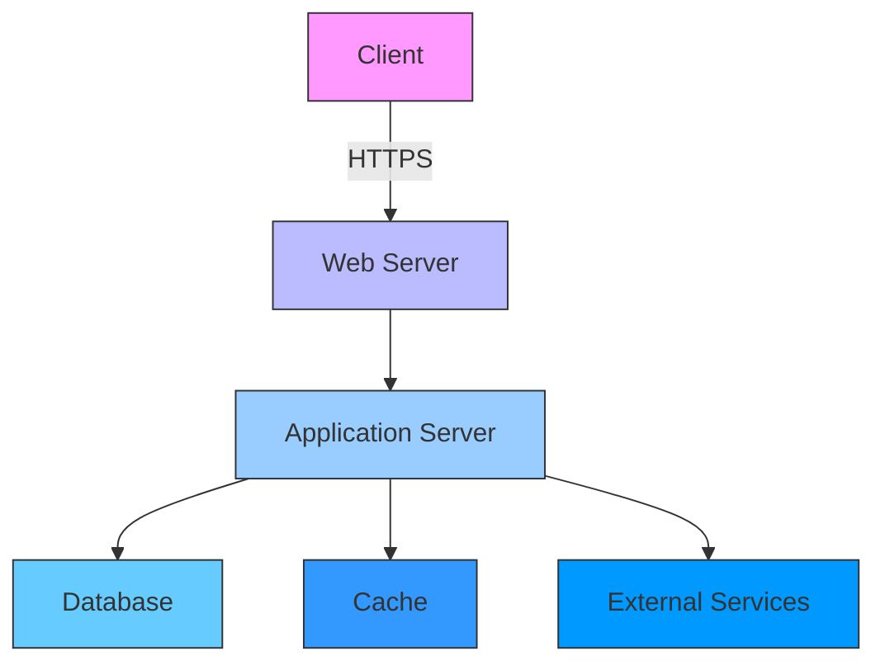

# 🌐 Keamanan Aplikasi Web

## 🎯 Tujuan Pembelajaran
Setelah mempelajari materi ini, peserta didik mampu:
1. Memahami ancaman keamanan umum pada aplikasi web
2. Menerapkan praktik pengembangan yang aman
3. Mengidentifikasi dan memitigasi kerentanan OWASP Top 10
4. Menerapkan mekanisme autentikasi dan otorisasi yang aman
5. Melakukan pengujian keamanan aplikasi web dasar

## 1. Arsitektur Keamanan Aplikasi Web

### 1.1 Lapisan Keamanan Aplikasi Web


### 1.2 Komponen Keamanan Penting
| Komponen | Ancaman | Perlindungan |
|----------|---------|--------------|
| **Input Pengguna** | XSS, SQLi, Command Injection | Validasi Input, Parameterized Queries |
| **Autentikasi** | Brute Force, Credential Stuffing | Multi-Factor Auth, Rate Limiting |
| **Otorisasi** | Broken Access Control | Principle of Least Privilege, RBAC |
| **Data** | Data Breach, XSS | Enkripsi, Output Encoding |
| **Konfigurasi** | Sensitive Data Exposure | Hardening, Security Headers |

## 2. OWASP Top 10 2021

### 2.1 Daftar Ancaman
1. **Broken Access Control**
   - Deskripsi: Pengguna dapat mengakses sumber daya yang tidak seharusnya bisa diakses
   - Contoh: Mengubah parameter URL untuk mengakses data pengguna lain
   - Mitigasi: Implementasikan kontrol akses yang tepat, validasi izin di setiap request

2. **Cryptographic Failures**
   - Deskripsi: Data sensitif tidak dilindungi dengan enkripsi yang tepat
   - Contoh: Penyimpanan password tanpa hashing yang kuat
   - Mitigasi: Gunakan algoritma hashing yang kuat (Argon2, bcrypt, PBKDF2)

3. **Injection**
   - Deskripsi: Kode berbahaya disisipkan ke dalam query/interpreter
   - Contoh: SQL Injection, Command Injection, LDAP Injection
   - Mitigasi: Gunakan parameterized queries/prepared statements

4. **Insecure Design**
   - Deskripsi: Kelemahan desain yang menyebabkan kerentanan keamanan
   - Contoh: Tidak memvalidasi input di sisi server
   - Mitigasi: Integrasikan keamanan dalam siklus pengembangan (SDLC)

5. **Security Misconfiguration**
   - Deskripsi: Konfigurasi default yang tidak aman
   - Contoh: Halaman admin default yang tidak dihapus
   - Mitigasi: Hardening sistem, hapus fitur yang tidak digunakan

6. **Vulnerable and Outdated Components**
   - Deskripsi: Menggunakan komponen dengan kerentanan yang diketahui
   - Contoh: Framework/library yang tidak di-update
   - Mitigasi: Update rutin, gunakan dependency checker

7. **Identification and Authentication Failures**
   - Deskripsi: Implementasi autentikasi yang lemah
   - Contoh: Password yang lemah, tidak ada proteksi brute force
   - Mitigasi: Terapkan MFA, kebijakan password yang kuat

8. **Software and Data Integrity Failures**
   - Deskripsi: Integritas kode dan data tidak terjamin
   - Contoh: Update otomatis tanpa verifikasi tanda tangan
   - Mitigasi: Verifikasi tanda tangan digital, gunakan checksum

9. **Security Logging & Monitoring Failures**
   - Deskripsi: Kegagalan dalam mendeteksi dan merespons insiden
   - Contoh: Tidak ada log untuk aktivitas mencurigakan
   - Mitigasi: Implementasikan logging yang komprehensif, monitoring real-time

10. **Server-Side Request Forgery (SSRF)**
    - Deskripsi: Memaksa server untuk membuat request ke domain internal
    - Contoh: Eksploitasi fungsi fetch URL
    - Mitigasi: Validasi input, gunakan whitelist domain

## 3. Praktik Pengembangan yang Aman

### 3.1 Input Validation
```javascript
// Buruk
app.get('/search', (req, res) => {
  const query = req.query.q;
  const results = db.query(`SELECT * FROM products WHERE name LIKE '%${query}%'`);
  res.json(results);
});

// Baik
app.get('/search', (req, res) => {
  const query = req.query.q;
  // Validasi input
  if (!/^[a-zA-Z0-9 ]+$/.test(query)) {
    return res.status(400).json({ error: 'Invalid search query' });
  }
  // Gunakan parameterized query
  const results = db.query('SELECT * FROM products WHERE name LIKE ?', [`%${query}%`]);
  res.json(results);
});
```

### 3.2 Autentikasi yang Aman
```python
# Contoh menggunakan Flask-Login dengan bcrypt
from flask import Flask, request, redirect, url_for, flash
from flask_login import LoginManager, UserMixin, login_user, login_required, current_user
from werkzeug.security import generate_password_hash, check_password_hash
import bcrypt

app = Flask(__name__)
app.secret_key = 'your-secret-key-here'
login_manager = LoginManager()
login_manager.init_app(app)

# Simulasi database pengguna
users = {}

class User(UserMixin):
    def __init__(self, id, username, password_hash):
        self.id = id
        self.username = username
        self.password_hash = password_hash

@login_manager.user_loader
def load_user(user_id):
    return users.get(int(user_id))

# Pendaftaran pengguna baru
@app.route('/register', methods=['GET', 'POST'])
def register():
    if request.method == 'POST':
        username = request.form['username']
        password = request.form['password']
        
        # Validasi input
        if not username or not password:
            flash('Username dan password harus diisi')
            return redirect(url_for('register'))
        
        # Hash password dengan bcrypt
        password_hash = bcrypt.hashpw(password.encode('utf-8'), bcrypt.gensalt())
        
        # Simpan pengguna (dalam produksi, gunakan database yang aman)
        user_id = len(users) + 1
        users[user_id] = User(user_id, username, password_hash.decode('utf-8'))
        
        flash('Pendaftaran berhasil! Silakan login.')
        return redirect(url_for('login'))
    
    return '''
        <form method="post">
            <input type="text" name="username" placeholder="Username" required>
            <input type="password" name="password" placeholder="Password" required>
            <button type="submit">Daftar</button>
        </form>
    '''

# Proses login
@app.route('/login', methods=['GET', 'POST'])
def login():
    if request.method == 'POST':
        username = request.form['username']
        password = request.form['password']
        
        # Temukan pengguna berdasarkan username
        user = next((u for u in users.values() if u.username == username), None)
        
        # Verifikasi password
        if user and bcrypt.checkpw(password.encode('utf-8'), user.password_hash.encode('utf-8')):
            login_user(user)
            flash('Login berhasil!')
            return redirect(url_for('profile'))
        else:
            flash('Username atau password salah')
    
    return '''
        <form method="post">
            <input type="text" name="username" placeholder="Username" required>
            <input type="password" name="password" placeholder="Password" required>
            <button type="submit">Login</button>
        </form>
    '''

# Halaman profil yang memerlukan autentikasi
@app.route('/profile')
@login_required
def profile():
    return f'<h1>Selamat datang, {current_user.username}!</h1>'

if __name__ == '__main__':
    app.run(debug=True)
```

### 3.3 Proteksi terhadap XSS
```html
<!-- Buruk -->
<div>{{ user_controlled_input }}</div>

<!-- Baik: Gunakan escaping otomatis -->
<div th:text="${user_controlled_input}"></div>

<!-- Atau di JavaScript -->
function escapeHtml(unsafe) {
  return unsafe
    .replace(/&/g, "&amp;")
    .replace(/</g, "&lt;")
    .replace(/>/g, "&gt;")
    .replace(/"/g, "&quot;")
    .replace(/'/g, "&#039;");
}
```

## 4. Keamanan HTTP Headers

### 4.1 Header Keamanan Penting
```http
# Mencegah clickjacking
X-Frame-Options: DENY

# Mengaktifkan filter XSS di browser
X-XSS-Protection: 1; mode=block

# Mencegah MIME-sniffing
X-Content-Type-Options: nosniff

# Kebijakan Referrer
Referrer-Policy: strict-origin-when-cross-origin

# Kebijakan Keamanan Konten (CSP)
Content-Security-Policy: default-src 'self'; script-src 'self' 'unsafe-inline' cdn.example.com; img-src *; style-src 'self' 'unsafe-inline';

# HTTP Strict Transport Security (HSTS)
Strict-Transport-Security: max-age=31536000; includeSubDomains; preload
```

### 4.2 Konfigurasi di Nginx
```nginx
add_header X-Frame-Options "SAMEORIGIN" always;
add_header X-XSS-Protection "1; mode=block" always;
add_header X-Content-Type-Options "nosniff" always;
add_header Referrer-Policy "strict-origin-when-cross-origin" always;
add_header Content-Security-Policy "default-src 'self' https:; script-src 'self' 'unsafe-inline' https:; style-src 'self' 'unsafe-inline' https:; img-src 'self' data: https:; font-src 'self' https: data:;" always;
add_header Strict-Transport-Security "max-age=31536000; includeSubDomains; preload" always;
```

## 5. Pengujian Keamanan Dasar

### 5.1 OWASP ZAP (Zed Attack Proxy)
```bash
# Menjalankan ZAP dalam mode daemon
zap.sh -daemon -port 8080 -host 0.0.0.0 -config api.disablekey=true &

# Menjalankan pemindaian dasar
zap-cli quick-scan --self-contained -r http://target.com

# Menjalankan pemindaian penuh
zap-cli active-scan -r http://target.com

# Menghasilkan laporan
zap-cli report -o report.html -f html
zap-cli report -o report.md -f md
```

### 5.2 SQLMap untuk Pengujian SQL Injection
```bash
# Deteksi kerentanan SQL injection
sqlmap -u "http://example.com/page.php?id=1" --batch

# Mengekstrak nama database
sqlmap -u "http://example.com/page.php?id=1" --dbs

# Mengekstrak tabel dari database tertentu
sqlmap -u "http://example.com/page.php?id=1" -D database_name --tables

# Mengekstrak data dari tabel
sqlmap -u "http://example.com/page.php?id=1" -D database_name -T users --dump
```

## 6. Manajemen Sesi yang Aman

### 6.1 Praktik Terbaik Manajemen Sesi
1. **Penggunaan Cookie yang Aman**
   ```javascript
   // Contoh konfigurasi cookie aman di Express.js
   app.use(session({
     secret: 'your-secret-key',
     name: 'sessionId',
     resave: false,
     saveUninitialized: false,
     cookie: {
       httpOnly: true,         // Mencegah akses JavaScript ke cookie
       secure: true,           // Hanya dikirim melalui HTTPS
       sameSite: 'strict',     // Mencegah CSRF
       maxAge: 24 * 60 * 60 * 1000  // Masa berlaku 1 hari
     }
   }));
   ```

2. **Regenerasi Sesi**
   - Regenerasi ID sesi setelah login
   - Invalidasi sesi setelah logout
   - Batasi durasi sesi

3. **Perlindungan CSRF**
   ```html
   <!-- Form dengan token CSRF -->
   <form action="/transfer" method="POST">
     <input type="hidden" name="_csrf" value="{{csrfToken}}">
     <input type="text" name="amount">
     <button type="submit">Transfer</button>
   </form>
   ```

## 📌 Ringkasan
1. Keamanan aplikasi web memerlukan pendekatan berlapis
2. Selalu validasi dan sanitasi input pengguna
3. Terapkan autentikasi dan otorisasi yang kuat
4. Gunakan header keamanan HTTP yang sesuai
5. Lakukan pengujian keamanan secara berkala

## 📚 Referensi
1. OWASP Top 10: https://owasp.org/Top10/
2. OWASP Cheat Sheet Series: https://cheatsheetseries.owasp.org/
3. Web Security Fundamentals by Google: https://web.dev/secure/
4. Mozilla Web Security Guidelines: https://infosec.mozilla.org/guidelines/web_security.html

---
<div align="center">
  <p>Modul Pembelajaran - Keamanan Aplikasi Web</p>
  <p>© 2025 SMKN 1 Punggelan - Program Keahlian Teknik Komputer dan Jaringan</p>
</div>
