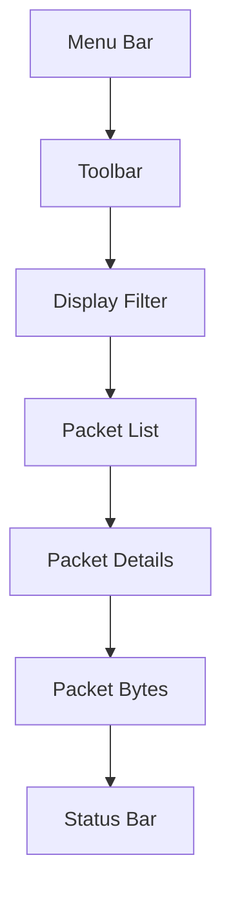

# 📊 Panduan Praktikum Wireshark untuk Analisis Jaringan

## 🎯 Tujuan Pembelajaran
Setelah menyelesaikan praktikum ini, mahasiswa mampu:
1. Menginstal dan mengkonfigurasi Wireshark
2. Menangkap dan menganalisis paket jaringan
3. Menggunakan filter display dan capture
4. Menganalisis protokol jaringan umum
5. Mendeteksi anomali jaringan

## 🛠️ Persyaratan Sistem
- **Sistem Operasi**: Windows 10/11, Linux, atau macOS
- **Wireshark**: Versi 3.6 atau terbaru
- **Hak Akses**: Administrator/root
- **Spesifikasi Minimum**:
  - CPU: Dual-core 2.0 GHz
  - RAM: 4GB
  - Storage: 500MB (untuk instalasi)

## 📥 Instalasi Wireshark

### Windows
1. Unduh installer dari [wireshark.org](https://www.wireshark.org/download.html)
2. Jalankan installer dan ikuti wizard
3. Pastikan opsi berikut dicentang:
   - Wireshark
   - Npcap (Windows PCAP)
   - USBPcap (jika diperlukan)
4. Restart komputer setelah instalasi selesai

### Linux (Ubuntu/Debian)
```bash
# Update repositori
sudo apt update

# Install Wireshark
sudo apt install wireshark

# Tambahkan pengguna ke grup wireshark
sudo usermod -aG wireshark $USER

# Reboot untuk menerapkan perubahan
sudo reboot
```

## 🔍 Dasar-Dasar Wireshark

### 1. Antarmuka Wireshark


### 2. Memulai Capture
1. Buka Wireshark
2. Pilih interface jaringan yang akan dimonitor
3. Klik ikon "shark fin" biru untuk memulai capture
4. Klik tombol merah untuk menghentikan capture

### 3. Filter Dasar

#### Filter Capture
```
# Hanya menangkap traffic HTTP
port 80

# Hanya menangkap traffic ke/dari IP tertentu
host 192.168.1.1

# Hanya menangkap traffic dari network tertentu
net 192.168.1.0/24
```

#### Filter Display
```
# Filter protokol
http

dns

# Filter IP
ip.addr == 192.168.1.1

# Filter port
tcp.port == 80

# Kombinasi filter
http and ip.addr == 192.168.1.1
```

## 🔬 Praktikum 1: Analisis Protokol HTTP

### Tujuan
Menganalisis lalu lintas HTTP dan memahami struktur protokolnya

### Langkah Kerja
1. Buka Wireshark dan mulai capture
2. Buka browser dan kunjungi http://example.com
3. Hentikan capture
4. Gunakan filter `http`
5. Analisis paket HTTP

### Pertanyaan
1. Port berapa yang digunakan oleh HTTP?
2. Apa perbedaan metode GET dan POST?
3. Header HTTP apa saja yang terlihat?

## 🔍 Praktikum 2: Analisis Protokol DNS

### Tujuan
Memahami proses resolusi DNS

### Langkah Kerja
1. Buka Wireshark dan mulai capture
2. Gunakan `nslookup example.com` di command prompt/terminal
3. Hentikan capture
4. Gunakan filter `dns`

### Pertanyaan
1. Berapa lama waktu yang dibutuhkan untuk resolusi DNS?
2. Record DNS apa saja yang dikembalikan?
3. Port berapa yang digunakan DNS?

## 🛡️ Praktikum 3: Deteksi Serangan Jaringan

### Tujuan
Mengidentifikasi aktivitas mencurigakan dalam jaringan

### Langkah Kerja
1. Buka file capture yang berisi serangan (misal: dari [Malware-Traffic-Analysis.net](https://www.malware-traffic-analysis.net/))
2. Analisis pola traffic yang tidak biasa
3. Identifikasi indikator kompromi (IoC)

### Indikator Serangan Umum
- Banyak paket RST/ACK
- Port scanning
- Traffic mencurigakan ke IP asing
- Pola komunikasi yang tidak biasa

## 📊 Praktikum 4: Analisis Kinerja Jaringan

### Tujuan
Mengidentifikasi masalah kinerja jaringan

### Metrik Penting
1. **Latensi**: Waktu perjalanan paket
2. **Retransmisi**: Jumlah paket yang dikirim ulang
3. **Window Size**: Ukuran window TCP
4. **Throughput**: Jumlah data yang ditransfer per detik

### Tools Bawaan Wireshark
1. **Statistics** > **Conversations**: Melihat percakapan jaringan
2. **Statistics** > **Protocol Hierarchy**: Hierarki protokol
3. **Statistics** > **Flow Graph**: Visualisasi aliran data

## 📝 Laporan Praktikum

### Format Laporan
1. **Halaman Judul**
   - Nama Praktikan
   - NIM/Kelas
   - Tanggal Praktikum

2. **Tujuan Praktikum**
   - Tuliskan tujuan dari praktikum

3. **Alat dan Bahan**
   - Spesifikasi perangkat
   - Software yang digunakan

4. **Langkah Kerja**
   - Dokumentasikan setiap langkah
   - Sertakan screenshot penting

5. **Hasil dan Pembahasan**
   - Tampilkan hasil capture
   - Analisis hasil
   - Jawab pertanyaan yang diberikan

6. **Kesimpulan**
   - Ringkasan hasil
   - Kendala yang dihadapi
   - Saran perbaikan

## 🧩 Tantangan Lanjutan
1. Buat filter untuk mendeteksi serangan DDoS
2. Analisis handshake TLS/SSL
3. Buat custom column untuk menampilkan informasi tambahan

## ⚠️ Etika dan Keamanan
1. Hanya analisis jaringan yang Anda miliki atau memiliki izin
2. Patuhi kebijakan keamanan organisasi
3. Jangan menangkap data sensitif tanpa izin
4. Hapus data capture setelah selesai dianalisis

## 📚 Referensi
1. [Wireshark User's Guide](https://www.wireshark.org/docs/wsug_html/)
2. [Wireshark Display Filters](https://wiki.wireshark.org/DisplayFilters)
3. [Network Analysis using Wireshark Cookbook](https://www.packtpub.com/networking-and-servers/network-analysis-using-wireshark-cookbook)

---
<div align="center">
  <p>Panduan Praktikum Wireshark - SMKN 1 Punggelan</p>
  <p>© 2025 Tim Pengajar Keamanan Jaringan</p>
</div>
