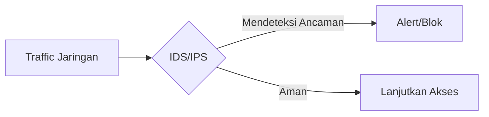
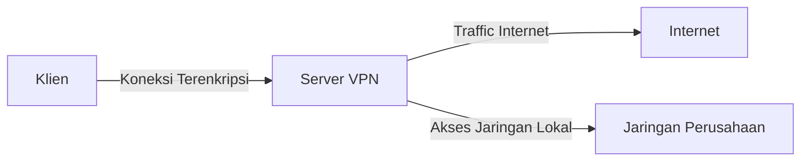
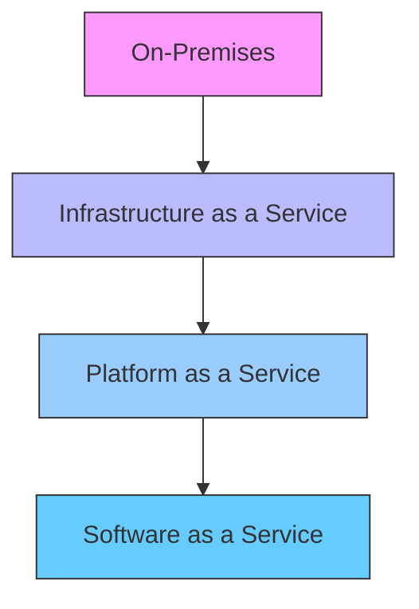
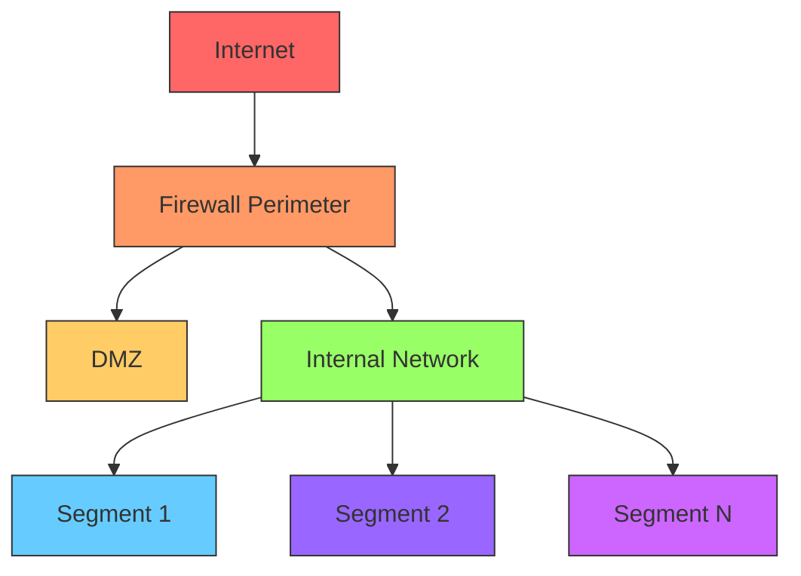

# 🔒 Keamanan Jaringan Lanjutan

## 🎯 Tujuan Pembelajaran
Setelah mempelajari materi ini, peserta didik mampu:
1. Memahami konsep IDS/IPS dan implementasinya
2. Menerapkan keamanan pada jaringan virtual (VPN)
3. Menganalisis keamanan infrastruktur cloud
4. Melakukan manajemen insiden keamanan jaringan
5. Menerapkan teknik pertahanan jaringan tingkat lanjut

## 1. Sistem Deteksi dan Pencegahan Intrusi (IDS/IPS)

### 1.1 Konsep Dasar IDS/IPS


### 1.2 Jenis-jenis IDS/IPS
| Tipe | Deskripsi | Kelebihan | Kekurangan |
|------|-----------|-----------|------------|
| **NIDS** | Network-based IDS | Memantau seluruh jaringan | Tidak bisa menginspeksi traffic terenkripsi |
| **HIDS** | Host-based IDS | Deteksi lebih akurat | Hanya melindungi host tertentu |
| **Signature-based** | Mencocokkan pola serangan | Akurat untuk serangan dikenal | Tidak bisa mendeteksi serangan baru |
| **Anomaly-based** | Mendeteksi penyimpangan | Bisa mendeteksi serangan baru | False positive tinggi |

### 1.3 Implementasi Snort (NIDS)
```bash
# Install Snort di Ubuntu
sudo apt update
sudo apt install -y snort

# Konfigurasi dasar
sudo nano /etc/snort/snort.conf

# Jalankan Snort dalam mode IDS
sudo snort -A console -q -u snort -g snort -c /etc/snort/snort.conf -i eth0
```

## 2. Keamanan Jaringan Virtual (VPN)

### 2.1 Konsep dan Protokol VPN


### 2.2 Implementasi OpenVPN
```bash
# Install OpenVPN di Server
sudo apt update
sudo apt install -y openvpn easy-rsa

# Setup PKI
easyrsa init-pki
easyrsa build-ca nopass
easyrsa gen-req server nopass
easyrsa sign-req server server

# Generate DH parameters
easyrsa gen-dh

# Generate TLS-Auth key
openvpn --genkey secret pfs.key

# Konfigurasi Server
cat > /etc/openvpn/server.conf <<EOL
port 1194
proto udp
dev tun
ca ca.crt
cert server.crt
key server.key
dh dh.pem
tls-auth pfs.key 0
server 10.8.0.0 255.255.255.0
push "redirect-gateway def1 bypass-dhcp"
push "dhcp-option DNS 8.8.8.8"
push "dhcp-option DNS 8.8.4.4"
keepalive 10 120
cipher AES-256-CBC
user nobody
group nogroup
persist-key
persist-tun
status openvpn-status.log
verb 3
EOL
```

## 3. Keamanan Infrastruktur Cloud

### 3.1 Model Tanggung Jawab Keamanan


### 3.2 Praktik Keamanan Cloud
1. **Identity and Access Management (IAM)**
   ```bash
   # Contoh kebijakan IAM AWS
   {
     "Version": "2012-10-17",
     "Statement": [
       {
         "Effect": "Allow",
         "Action": ["s3:GetObject"],
         "Resource": ["arn:aws:s3:::example-bucket/*"],
         "Condition": {
           "IpAddress": {"aws:SourceIp": ["192.0.2.0/24"]}
         }
       }
     ]
   }
   ```

2. **Enkripsi Data**
   ```bash
   # Enkripsi file sebelum upload ke cloud
   gpg --symmetric --cipher-algo AES256 file.txt
   
   # Upload ke S3 dengan enkripsi sisi server
   aws s3 cp file.txt.gpg s3://my-bucket/ --sse AES256
   ```

## 4. Manajemen Insiden Keamanan

### 4.1 Tahapan Penanganan Insiden
1. **Persiapan**
   - Dokumen kebijakan dan prosedur
   - Tim tanggap insiden
   - Tools dan infrastruktur

2. **Identifikasi**
   - Deteksi anomali
   - Verifikasi insiden
   - Klasifikasi tingkat keparahan

3. **Kontainmen**
   - Isolasi sistem yang terinfeksi
   - Pencadangan bukti forensik
   ```bash
   # Membuat image disk untuk forensik
   dc3dd if=/dev/sda hash=sha256 log=disk_image.log hofs=disk_image.raw
   ```

4. **Pemberantasan**
   - Hapus ancaman
   - Perbaiki kerentanan
   ```bash
   # Contoh pemindaian dan pembersihan malware
   sudo rkhunter --check
   sudo chkrootkit -q
   ```

5. **Pemulihan**
   - Kembalikan sistem ke operasi normal
   - Verifikasi integritas sistem
   ```bash
   # Verifikasi integritas file sistem
   debsums -c | grep -v "OK"
   ```

6. **Pelajaran yang Dipetik**
   - Analisis akar masalah
   - Perbaikan proses
   - Pelatihan dan kesadaran

## 5. Teknik Pertahanan Jaringan Tingkat Lanjut

### 5.1 Segmentasi Jaringan Mikro


### 5.2 Implementasi Zero Trust Architecture
1. **Prinsip Dasar**
   - Verifikasi eksplisit
   - Akses dengan hak istimewa minimum
   - Asumsi pelanggaran

2. **Komponen Utama**
   - Identity and Access Management (IAM)
   - Multi-Factor Authentication (MFA)
   - Micro-segmentation
   - Encryption everywhere
   - Analytics and monitoring

3. **Contoh Implementasi**
   ```bash
   # Contoh konfigurasi BeyondCorp (Google)
   # 1. Autentikasi berbasis konteks
   # 2. Otorisasi berbasis atribut
   # 3. Enkripsi ujung-ke-ujung
   # 4. Audit dan pemantauan menyeluruh
   ```

## 📌 Ringkasan
1. IDS/IPS penting untuk deteksi dan pencegahan ancaman jaringan
2. VPN menyediakan koneksi aman melalui jaringan tidak tepercaya
3. Keamanan cloud memerlukan model tanggung jawab bersama
4. Manajemen insiden yang efektif mengurangi dampak pelanggaran keamanan
5. Arsitektur pertahanan modern mengadopsi pendekatan Zero Trust

## 📚 Referensi
1. NIST SP 800-41: Guidelines on Firewalls and Firewall Policy
2. NIST SP 800-46: Guide to Enterprise Telework, Remote Access, and BYOD Security
3. Cloud Security Alliance (CSA) Security Guidance
4. MITRE ATT&CK Framework
5. Zero Trust Architecture - NIST SP 800-207

---
<div align="center">
  <p>Modul Pembelajaran - Keamanan Jaringan Lanjutan</p>
  <p>© 2025 SMKN 1 Punggelan - Program Keahlian Teknik Komputer dan Jaringan</p>
</div>
