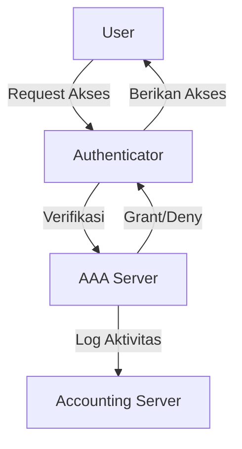
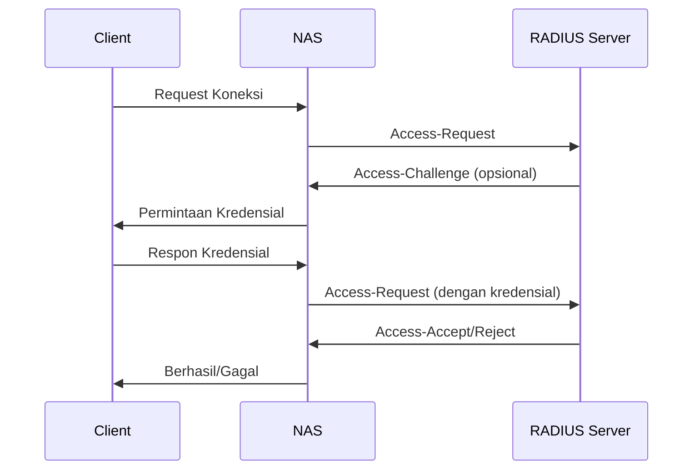

# Konsep Dasar AAA dan RADIUS

## 1. Pengenalan AAA (Authentication, Authorization, Accounting)

### 1.1 Definisi AAA
AAA adalah kerangka kerja keamanan yang mengatur:
- **Authentication**: Memverifikasi identitas pengguna
- **Authorization**: Menentukan hak akses pengguna
- **Accounting**: Mencatat aktivitas pengguna

### 1.2 Komponen AAA


## 2. Protokol RADIUS

### 2.1 Pengertian RADIUS
Remote Authentication Dial-In User Service (RADIUS) adalah protokol jaringan yang menyediakan autentikasi, otorisasi, dan akuntansi terpusat.

### 2.2 Arsitektur RADIUS


### 2.3 Keamanan RADIUS
- Menggunakan shared secret
- Enkripsi password dengan algoritma MD5
- Port standar: 1812 (autentikasi), 1813 (akuntansi)

## 3. Implementasi RADIUS

### 3.1 FreeRADIUS
- Server RADIUS open source
- Mendukung berbagai metode autentikasi
- Dapat diintegrasikan dengan database eksternal

### 3.2 Konfigurasi Dasar
```bash
# File: /etc/freeradius/3.0/users
alice Cleartext-Password := "password123"
    Service-Type = Framed-User,
    Framed-Protocol = PPP,
    Framed-IP-Address = 192.168.1.100

# File: /etc/freeradius/3.0/clients.conf
client localhost {
    ipaddr = 127.0.0.1
    secret = testing123
    require_message_authenticator = no
}
```

## 4. Integrasi dengan Perangkat Jaringan

### 4.1 MikroTik
```bash
/radius
add address=192.168.1.100 secret=rahasia123 service=ppp,login
/ppp aaa
set use-radius=yes
```

### 4.2 Switch Cisco
```
aaa new-model
aaa authentication login default group radius local
aaa authorization network default group radius local
radius-server host 192.168.1.100 auth-port 1812 acct-port 1813 key rahasia123
```

## 5. Troubleshooting

### 5.1 Tools
- `radtest`
- `raddebug`
- Wireshark (filter: `radius`)

### 5.2 Log File
```bash
tail -f /var/log/freeradius/radius.log
grep -i "reject" /var/log/freeradius/radius.log
```

## 6. Praktik Terbaik
1. Gunakan shared secret yang kuat
2. Aktifkan enkripsi untuk komunikasi sensitif
3. Lakukan backup konfigurasi secara berkala
4. Monitor log secara rutin
5. Perbarui perangkat lunak secara teratur

## 7. Latihan
1. Buat konfigurasi RADIUS untuk 3 user dengan level akses berbeda
2. Lakukan integrasi dengan perangkat jaringan (MikroTik/Cisco)
3. Analisis log autentikasi yang dihasilkan

## 8. Referensi
1. RFC 2865 - Remote Authentication Dial In User Service (RADIUS)
2. FreeRADIUS Documentation
3. MikroTik RADIUS Setup Guide

---
<div align="center">
  <p>Dokumen Teori - Sistem Autentikasi Terpusat</p>
  <p>© 2025 SMKN 1 Punggelan</p>
</div>
