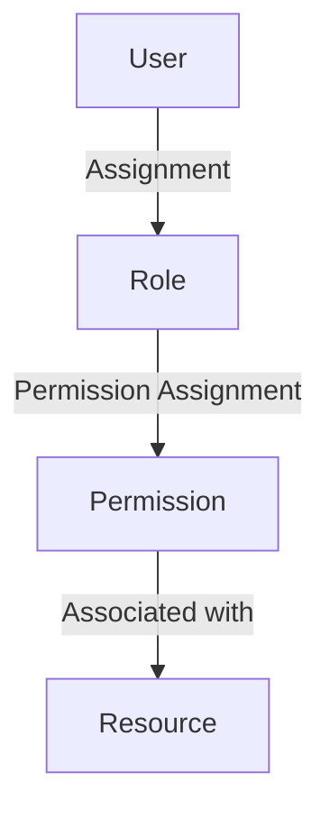
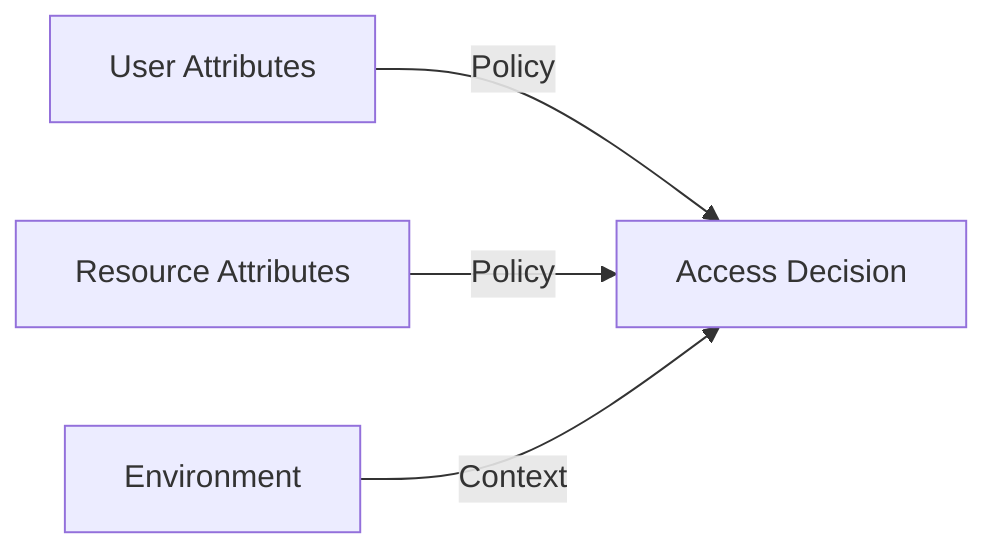

# Konsep RBAC dan ABAC dalam Manajemen Akses

## 1. Pendahuluan

### 1.1 Gambaran Umum
Manajemen akses adalah komponen kritis dalam keamanan informasi yang mengatur siapa yang dapat mengakses apa dalam suatu sistem.

### 1.2 Tujuan Pembelajaran
Setelah mempelajari materi ini, peserta didik mampu:
- Memahami konsep RBAC dan ABAC
- Menerapkan manajemen akses berbasis peran
- Menganalisis kebutuhan akses dalam organisasi

## 2. Role-Based Access Control (RBAC)

### 2.1 Konsep Dasar RBAC


### 2.2 Komponen RBAC
1. **User**: Individu yang membutuhkan akses
2. **Role**: Kumpulan permission yang terdefinisi
3. **Permission**: Hak akses ke resource
4. **Session**: Koneksi antara user dan role

### 2.3 Keuntungan RBAC
- Mengurangi kompleksitas administrasi
- Meningkatkan keamanan
- Memudahkan audit
- Skalabilitas yang baik

## 3. Attribute-Based Access Control (ABAC)

### 3.1 Konsep Dasar ABAC


### 3.2 Komponen ABAC
1. **Subject Attributes**: Karakteristik pengguna
2. **Resource Attributes**: Sifat resource yang diakses
3. **Environment Conditions**: Konteks akses
4. **Policy**: Aturan yang menghubungkan semuanya

### 3.3 Keuntungan ABAC
- Lebih fleksibel
- Mendukung kebijakan kompleks
- Dapat mempertimbangkan konteks
- Cocok untuk lingkungan dinamis

## 4. Perbandingan RBAC dan ABAC

| Aspek | RBAC | ABAC |
|-------|------|------|
| Kompleksitas | Sederhana | Kompleks |
| Fleksibilitas | Terbatas | Sangat Fleksibel |
| Skalabilitas | Baik | Sangat Baik |
| Kemudahan Audit | Mudah | Sedang-Sulit |
| Contoh Implementasi | Active Directory | AWS IAM |

## 5. Studi Kasus: Implementasi di Dunia Nyata

### 5.1 Kasus Rumah Sakit
**RBAC Implementation:**
- Dokter: Akses penuh ke rekam medis
- Perawat: Akses terbatas
- Admin: Manajemen user

**ABAC Implementation:**
- Waktu akses (hanya jam kerja)
- Lokasi akses (hanya di jaringan internal)
- Status pasien (hanya pasien dalam perawatan)

## 6. Praktik Terbaik

### 6.1 Prinsip Least Privilege
- Berikan akses minimal yang diperlukan
- Tinjau hak akses secara berkala
- Segera cabut akses yang tidak diperlukan

### 6.2 Pemisahan Tugas
- Pisahkan tugas yang berpotensi konflik
- Implementasikan four-eyes principle
- Gunakan approval workflow untuk akses kritis

## 7. Latihan

### 7.1 Studi Kasus: Perusahaan E-commerce
Buat rancangan RBAC untuk:
- Admin sistem
- Manajer produk
- Customer service
- Tim pengiriman

### 7.2 Analisis Kebijakan
Analisis kebijakan akses berikut:
```
Jika user adalah bagian dari departemen keuangan DAN
waktu akses antara 08.00-17.00 DAN
berada di jaringan internal MAKA
berikan akses ke sistem akuntansi
```

## 8. Referensi
1. NIST Special Publication 800-162: Guide to Attribute Based Access Control (ABAC)
2. Ferraiolo, D. F., Kuhn, D. R., & Chandramouli, R. (2007). Role-Based Access Control
3. Hu, V. C., et al. (2013). Guide to Attribute Based Access Control (ABAC) Definition and Considerations

---
<div align="center">
  <p>Dokumen Teori - Manajemen Akses Lanjutan</p>
  <p>© 2025 SMKN 1 Punggelan</p>
</div>
