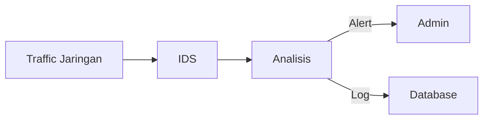
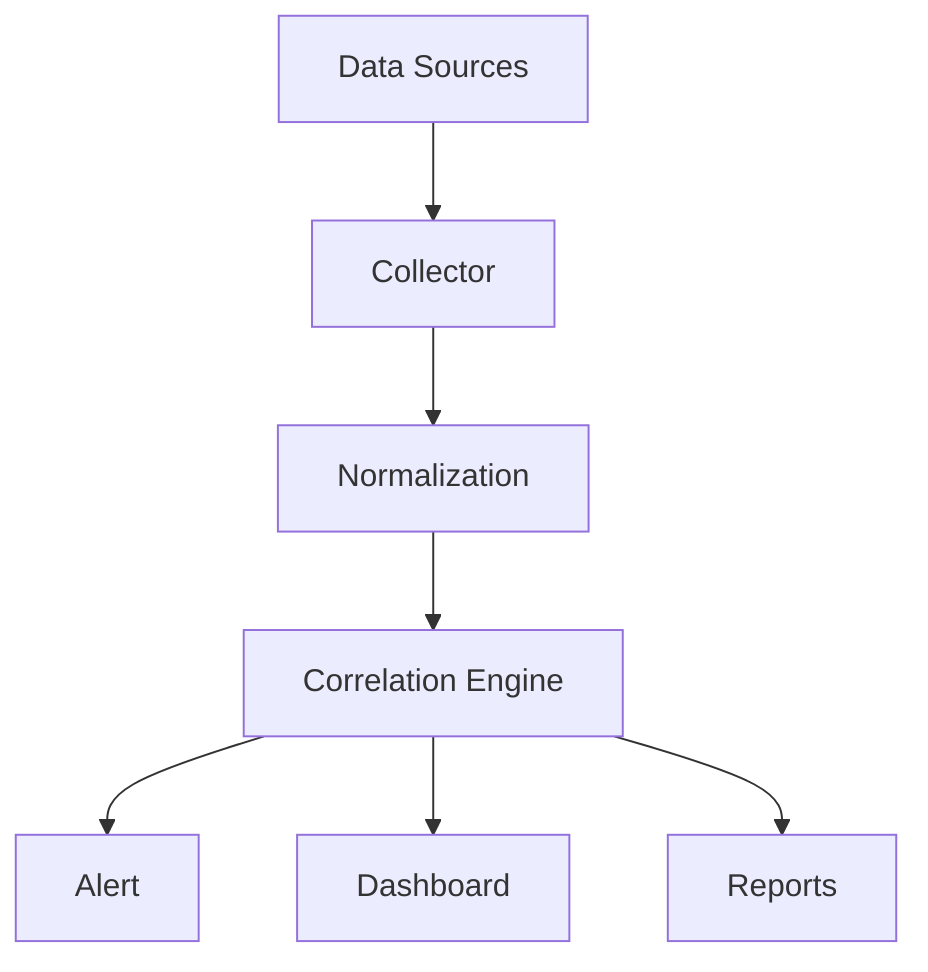

# Konsep Dasar IDS, IPS, dan SIEM

## 1. Pendahuluan

### 1.1 Gambaran Umum
Sistem deteksi dan pencegahan intrusi (IDS/IPS) serta SIEM (Security Information and Event Management) adalah komponen penting dalam keamanan jaringan modern.

### 1.2 Tujuan Pembelajaran
Setelah mempelajari materi ini, peserta didik mampu:
- Memahami konsep IDS dan IPS
- Menjelaskan arsitektur SIEM
- Menganalisis log keamanan
- Mengidentifikasi indikator serangan

## 2. Intrusion Detection System (IDS)

### 2.1 Konsep Dasar


### 2.2 Jenis-Jenis IDS
1. **Network-based IDS (NIDS)**
   - Memantau lalu lintas jaringan
   - Contoh: Snort, Suricata

2. **Host-based IDS (HIDS)**
   - Memantau aktivitas di host
   - Contoh: OSSEC, Wazuh

3. **Signature-based**
   - Mendeteksi pola serangan yang diketahui
   - Efektif untuk serangan umum

4. **Anomaly-based**
   - Mendeteksi penyimpangan dari baseline
   - Baik untuk serangan zero-day

## 3. Intrusion Prevention System (IPS)

### 3.1 Perbedaan IDS dan IPS
| Aspek | IDS | IPS |
|-------|-----|-----|
| Posisi | Out-of-band | Inline |
| Aksi | Hanya mendeteksi | Mencegah dan mendeteksi |
| Dampak | Tidak mempengaruhi lalu lintas | Bisa memblokir lalu lintas |
| Contoh | Snort (mode IDS) | Suricata (mode IPS) |

### 3.2 Tipe Pencegahan
1. **Network-based IPS (NIPS)**
2. **Host-based IPS (HIPS)**
3. **Wireless IPS (WIPS)**
4. **Network Behavior Analysis (NBA)**

## 4. Security Information and Event Management (SIEM)

### 4.1 Arsitektur SIEM


### 4.2 Komponen SIEM
1. **Data Collection**
   - Logs
   - Network flows
   - Alerts

2. **Normalization**
   - Parsing
   - Enrichment
   - Indexing

3. **Correlation**
   - Rules
   - Behavioral analysis
   - Threat intelligence

4. **Visualization**
   - Dashboards
   - Reports
   - Alerting

## 5. Tools Populer

### 5.1 Open Source
- **Wazuh**: HIDS dengan SIEM capabilities
- **Security Onion**: Distro keamanan jaringan
- **ELK Stack**: Elasticsearch, Logstash, Kibana
- **Graylog**: Manajemen log terpusat

### 5.2 Komersial
- **Splunk**: Platform analisis data
- **IBM QRadar**: Solusi SIEM enterprise
- **Microsoft Sentinel**: SIEM berbasis cloud
- **FortiSIEM**: Solusi terintegrasi

## 6. Studi Kasus: Implementasi di Perusahaan

### 6.1 Skenario
Perusahaan dengan 200 karyawan membutuhkan:
- Monitoring lalu lintas jaringan
- Deteksi serangan real-time
- Pencatatan aktivitas pengguna
- Laporan kepatuhan

### 6.2 Solusi yang Direkomendasikan
1. **NIDS**: Suricata (mode IPS)
2. **HIDS**: Wazuh
3. **SIEM**: Wazuh + ELK Stack
4. **Log Management**: Graylog

## 7. Praktik Terbaik

### 7.1 Implementasi
1. Tentukan kebutuhan bisnis
2. Pilih tools yang sesuai
3. Buat baseline normal
4. Uji sebelum produksi
5. Monitor dan sesuaikan

### 7.2 Pemeliharaan
1. Update signature/rule secara berkala
2. Tinjau log dan alert
3. Sesuaikan threshold
4. Lakukan tuning rules
5. Backup konfigurasi

## 8. Tantangan

### 8.1 False Positif/Negatif
- Terlalu banyak alert yang tidak relevan
- Serangan yang tidak terdeteksi

### 8.2 Kinerja
- Beban pemrosesan yang tinggi
- Keterlambatan deteksi

### 8.3 Integrasi
- Kompatibilitas berbagai sumber data
- Format log yang berbeda-beda

## 9. Tren Terkini
1. **AI/ML** untuk deteksi anomali
2. **UEBA** (User and Entity Behavior Analytics)
3. **SOAR** (Security Orchestration, Automation, and Response)
4. **Cloud-native SIEM**
5. **Threat Intelligence Integration**

## 10. Latihan

### 10.1 Analisis Log
Diberikan sampel log:
```
Jul  7 10:15:22 firewall01 kernel: [UFW BLOCK] IN=eth0 OUT= MAC=... SRC=192.168.1.100 DST=192.168.1.1 ... DPT=22
```
Pertanyaan:
1. Apa yang terjadi pada log di atas?
2. Apakah ini termasuk indikator serangan?
3. Tindakan apa yang sebaiknya diambil?

### 10.2 Desain Arsitektur
Rancang arsitektur IDS/IPS/SIEM untuk:
- Sekolah dengan 500 perangkat
- 3 server (web, file, database)
- Koneksi internet 100Mbps

## 11. Referensi
1. Bejtlich, R. (2004). The Tao of Network Security Monitoring
2. Chuvakin, A., et al. (2013). Security Analytics for Dummies
3. NIST SP 800-94: Guide to Intrusion Detection and Prevention Systems
4. Dokumentasi Wazuh: https://documentation.wazuh.com/

---
<div align="center">
  <p>Dokumen Teori - Deteksi Intrusi & SIEM</p>
  <p>© 2025 SMKN 1 Punggelan</p>
</div>
