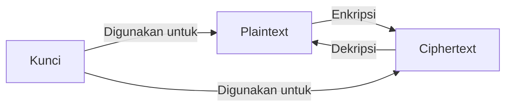
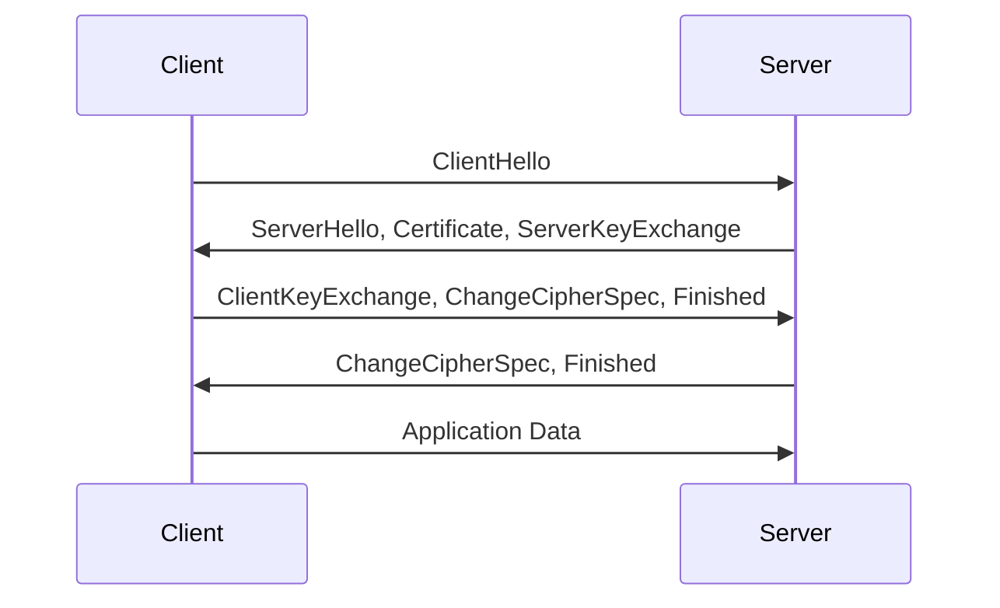

# Kriptografi dan Protokol Keamanan Jaringan

## 1. Pendahuluan

### 1.1 Gambaran Umum
Kriptografi adalah ilmu dan seni mengamankan komunikasi dengan teknik matematis untuk mencapai kerahasiaan, integritas, autentikasi, dan non-repudiasi.

### 1.2 Tujuan Pembelajaran
Setelah mempelajari materi ini, peserta didik mampu:
- Memahami konsep dasar kriptografi
- Menerapkan enkripsi simetris dan asimetris
- Menggunakan protokol keamanan jaringan
- Menganalisis implementasi kriptografi

## 2. Dasar-Dasar Kriptografi

### 2.1 Konsep Dasar


### 2.2 Tujuan Kriptografi
1. **Kerahasiaan (Confidentiality)**
   - Hanya pihak berwenang yang bisa mengakses informasi
   - Dijaga dengan enkripsi

2. **Integritas (Integrity)**
   - Memastikan data tidak berubah selama transmisi
   - Menggunakan hash dan digital signature

3. **Autentikasi (Authentication)**
   - Memverifikasi identitas pengirim/penerima
   - Menggunakan sertifikat digital

4. **Non-repudiasi (Non-repudiation)**
   - Pihak tidak bisa menyangkal tindakannya
   - Menggunakan tanda tangan digital

## 3. Jenis-Jenis Kriptografi

### 3.1 Kriptografi Simetris
- Menggunakan kunci yang sama untuk enkripsi dan dekripsi
- Contoh algoritma:
  - AES (Advanced Encryption Standard)
  - DES (Data Encryption Standard)
  - 3DES (Triple DES)
  - ChaCha20

### 3.2 Kriptografi Asimetris
- Menggunakan pasangan kunci (publik dan privat)
- Contoh algoritma:
  - RSA (Rivest-Shamir-Adleman)
  - ECC (Elliptic Curve Cryptography)
  - ElGamal

### 3.3 Fungsi Hash
- Mengubah data menjadi nilai hash dengan panjang tetap
- Contoh algoritma:
  - SHA-256
  - SHA-3
  - BLAKE2

## 4. Protokol Keamanan Jaringan

### 4.1 SSL/TLS


### 4.2 IPsec
- Melindungi komunikasi di lapisan jaringan
- Dua mode:
  - Transport Mode
  - Tunnel Mode
- Komponen:
  - AH (Authentication Header)
  - ESP (Encapsulating Security Payload)
  - IKE (Internet Key Exchange)

### 4.3 SSH (Secure Shell)
- Enkripsi untuk remote login
- Menggunakan kunci asimetris untuk autentikasi
- Port default: 22

## 5. Implementasi Praktis

### 5.1 Enkripsi File dengan OpenSSL
```bash
# Enkripsi file dengan AES-256
openssl enc -aes-256-cbc -salt -in rahasia.txt -out rahasia.enc

# Dekripsi file
openssl enc -d -aes-256-cbc -in rahasia.enc -out rahasia_decrypted.txt
```

### 5.2 Membuat Sertifikat Digital
```bash
# Generate private key
openssl genrsa -out server.key 2048

# Generate CSR (Certificate Signing Request)
openssl req -new -key server.key -out server.csr

# Generate self-signed certificate
openssl x509 -req -days 365 -in server.csr -signkey server.key -out server.crt
```

## 6. Keamanan Kriptografi

### 6.1 Ancaman Umum
1. **Brute Force Attack**
2. **Man-in-the-Middle**
3. **Side-channel Attacks**
4. **Quantum Computing Threats**

### 6.2 Praktik Terbaik
1. Gunakan algoritma yang masih dianggap aman
2. Implementasikan Perfect Forward Secrecy
3. Update perangkat lunak secara berkala
4. Gunakan panjang kunci yang memadai

## 7. Studi Kasus

### 7.1 Implementasi HTTPS
1. Mendapatkan sertifikat SSL/TLS
2. Konfigurasi web server (Nginx/Apache)
3. Pengalihan HTTP ke HTTPS
4. Pengaturan HSTS

### 7.2 VPN dengan OpenVPN
1. Instalasi OpenVPN
2. Generate sertifikat
3. Konfigurasi server dan client
4. Pengujian koneksi aman

## 8. Tren Terkini
1. **Post-Quantum Cryptography**
2. **Homomorphic Encryption**
3. **Zero-Knowledge Proofs**
4. **Multi-Party Computation**

## 9. Latihan

### 9.1 Analisis Sertifikat SSL
1. Kunjungi situs web dengan HTTPS
2. Periksa detail sertifikat
3. Identifikasi informasi:
   - Penerbit sertifikat
   - Masa berlaku
   - Algoritma yang digunakan
   - Rantai sertifikat

### 9.2 Enkripsi Pesan
1. Buat pasangan kunci RSA
2. Enkripsi pesan dengan kunci publik
3. Dekripsi dengan kunci privat
4. Verifikasi integritas dengan hash

## 10. Referensi
1. Stallings, W. (2017). Cryptography and Network Security
2. Paar, C., & Pelzl, J. (2010). Understanding Cryptography
3. NIST FIPS 140-3: Security Requirements for Cryptographic Modules
4. RFC 8446: The Transport Layer Security (TLS) Protocol Version 1.3

---
<div align="center">
  <p>Dokumen Teori - Enkripsi & Komunikasi Aman</p>
  <p>© 2025 SMKN 1 Punggelan</p>
</div>
