```mermaid
graph TD
    A[Keamanan Jaringan Lanjutan] --> B[Analisis Jaringan]
    A --> C[Autentikasi Terpusat]
    A --> D[Monitoring Keamanan]
    A --> E[Komunikasi Aman]
    A --> F[Proyek Integrasi]
    
    B --> B1[Port Scanning]
    B --> B2[Packet Analysis]
    B --> B3[Vulnerability Assessment]
    B --> B4[Tools: Nmap, Wireshark]
    
    C --> C1[FreeRADIUS]
    C --> C2[AAA Framework]
    C --> C3[Integrasi MikroTik]
    
    D --> D1[SIEM Architecture]
    D --> D2[Log Analysis]
    D --> D3[Incident Response]
    D --> D4[Tools: Wazuh]
    
    E --> E1[VPN Configuration]
    E --> E2[Encryption Methods]
    E --> E3[Secure Protocols]
    
    F --> F1[System Integration]
    F --> F2[Documentation]
    F --> F3[Presentation]
    C --> C1[FreeRADIUS]
    C --> C2[AAA Framework]
    C --> C3[MFA Implementation]
    
    D --> D1[IDS/IPS]
    D --> D2[SIEM]
    D --> D3[Log Management]
    
    E --> E1[Enkripsi]
    E --> E2[VPN]
    E --> E3[Secure Protocols]
```

# 📚 SISTEM KEAMANAN JARINGAN - SEMESTER 2
## Kelas XI - SMKN 1 Punggelan

## 🏫 Identitas Modul

| **Komponen** | **Keterangan** |
|--------------|----------------|
| Nama Sekolah | SMKN 1 Punggelan |
| Program Keahlian | Sistem Informasi Jaringan dan Aplikasi (SIJA) |
| Mata Pelajaran | Sistem Keamanan Jaringan |
| Kelas/Semester | XI/2 |
| Tahun Ajaran | 2025/2026 |
| Penyusun | Idiarso, S.Kom |
| Alokasi Waktu | 16 Minggu (48 JP @ 45 menit) |
| Capaian Pembelajaran | Menerapkan prinsip-prinsip keamanan jaringan lanjutan dalam mengamankan infrastruktur TI |

## 🎯 Tujuan Pembelajaran

### A. Kognitif
1. **Menganalisis** lalu lintas jaringan menggunakan tools seperti Nmap dan Wireshark
2. **Mengimplementasikan** sistem autentikasi terpusat menggunakan FreeRADIUS
3. **Mengintegrasikan** Multi-Factor Authentication (MFA) dalam sistem keamanan
4. **Mengkonfigurasi** sistem deteksi intrusi dan SIEM (Wazuh)
5. **Menerapkan** enkripsi dan VPN untuk komunikasi aman

### B. Psikomotorik
1. **Melakukan** scanning jaringan dan analisis paket
2. **Mengkonfigurasi** FreeRADIUS server dan integrasi dengan Mikrotik
3. **Mengimplementasikan** SIEM untuk monitoring keamanan
4. **Membuat** koneksi VPN yang aman
5. **Mendokumentasikan** seluruh proses konfigurasi dan analisis

### C. Afektif
1. **Menunjukkan** sikap bertanggung jawab dalam mengelola sistem keamanan
2. **Bekerja sama** dalam tim untuk menyelesaikan proyek keamanan
3. **Menghargai** etika dan regulasi terkait keamanan informasi

## 📖 Peta Konsep

## 📋 Struktur Materi

1. **Analisis Jaringan**
   - Konsep Scanning Jaringan
   - Analisis Lalu Lintas dengan Wireshark
   - Tools dan Teknik Analisis Keamanan

2. **Sistem Autentikasi Terpusat**
   - Konsep AAA (Authentication, Authorization, Accounting)
   - Implementasi FreeRADIUS
   - Integrasi dengan Perangkat Jaringan

3. **Manajemen Akses Lanjutan**
   - Multi-Factor Authentication (MFA)
   - OTP dan Biometrik
   - Best Practice Keamanan Akses

4. **Deteksi Intrusi & SIEM**
   - Konsep IDS/IPS
   - Implementasi Wazuh SIEM
   - Analisis Log dan Monitoring

5. **Enkripsi & Komunikasi Aman**
   - Dasar-dasar Kriptografi
   - Implementasi VPN
   - Protokol Komunikasi Aman

6. **Proyek Integrasi**
   - Perancangan Solusi Keamanan Terpadu
   - Implementasi dan Pengujian
   - Dokumentasi Proyek

## 🛠️ Tools yang Digunakan

- **Analisis Jaringan**: Nmap, Wireshark
- **Autentikasi**: FreeRADIUS, Google Authenticator
- **Monitoring**: Wazuh SIEM, ELK Stack
- **Keamanan Jaringan**: Mikrotik, OpenVPN
- **Virtualisasi**: VirtualBox, VMware

## 📝 Sistem Penilaian

| Komponen | Bobot |
|----------|-------|
| Tugas Harian | 20% |
| Praktikum | 30% |
| Proyek Akhir | 25% |
| UTS & UAS | 25% |

## 📚 Sumber Belajar

1. **Buku Teks**:
   - "Network Security Essentials" - William Stallings
   - "The Practice of Network Security Monitoring" - Richard Bejtlich
   
2. **Sumber Online**:
   - [OWASP Top 10](https://owasp.org/www-project-top-ten/)
   - [NIST Cybersecurity Framework](https://www.nist.gov/cyberframework)
   - [Wazuh Documentation](https://documentation.wazuh.com/current/index.html)

3. **Tools dan Software**:
   - Wireshark
   - Nmap
   - FreeRADIUS
   - Wazuh SIEM
   - Mikrotik RouterOS

## 📞 Kontak Pengajar

### Idiarso, S.Kom
- **Email**: [email yang sesuai]
- **Jam Konsultasi**: Senin-Jumat, 13.00-15.00 WIB
- **Ruangan**: Lab. Komputer 1

---

  
Dokumen ini merupakan bagian dari materi pembelajaran Sistem Keamanan Jaringan Semester 2

  
© 2025 SMKN 1 Punggelan - All Rights Reserved

