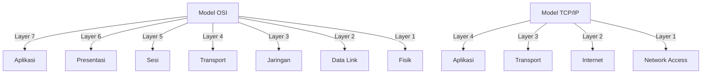

# Konsep Dasar Pemrograman Jaringan

## 1. Pendahuluan

### 1.1 Gambaran Umum
Pemrograman jaringan adalah proses menulis program yang dapat berkomunikasi dengan program lain yang berjalan di komputer yang berbeda melalui jaringan. Materi ini akan membahas dasar-dasar pemrograman jaringan menggunakan Python, yang menyediakan modul bawaan untuk menangani berbagai protokol jaringan.

     Pemrograman jaringan adalah proses menulis program yang memungkinkankomputer saling berkomunikasi dan bertukar informasi melalui jaringan komputer, baik lokal (LAN), jaringan luas (WAN), maupun internet. Dalam konteks ini, pemrograman jaringan fokus pada pembuatan aplikasi yang bisa menjalankan komunikasi data antar perangkat atau aplikasi menggunakan berbagai protokol jaringan seperti TCP/IP, UDP, HTTP, dan FTP .

Python adalah salah satu bahasa pemrograman yang populer digunaka nuntuk pemrograman jaringa nkarena menyediaka nmodul bawaan bernama socket yang memungkinkan pengembang membuat komunikasi klien-server secara efisien dan mudah pada level yangcukup rendah(lapisan transportasi). Modul ini memungkinkan konfigurasi soket dengan protokol TCP(berorientasi pada koneksi) dan UDP (tanpa koneksi) serta mendukung inter oper kemampuan dengan berbagai sistem operasi sepertiLinux, Windows, dan macOS  .

Pemrograman jaringanmembuka peluang pengembangan aplikasireal-time seperti mengobrol, webserver, layanan cloud, hingga aplikasi berbasis IoT (Internet ofThings) dengan memanfaatkan koneksi berbasis protokol jaringan tersebut  .

### 1.2 Tujuan Pembelajaran
Setelah mempelajari materi ini, peserta didik mampu:
- Memahami model referensi OSI dan TCP/IP sebagai dasar protokol komunikasi jaringan yang mendasari implementasi pemrograman jaringan.
- Mengimplementasikan pemrograman soket dengan Python , yaitu menggunakan modul socketuntuk membangun aplikasi jaringan yang mampu berkomunikasi dengan cara membuka koneksi, mengirim dan menerima data
- Membuat aplikasi client-server sederhana yang dapat saling berinteraksi melalui protokol TCP.
- melibatkan koneksi jaringan secara konkuren , misalnya dengan menggunakan threading atau multiprocessing agar server mampu melayani banyak klien sekaligus tanpa harus antri.
- Menerapkan protokol aplikasi dasar seperti HTTP dan FTP secara sederhana untuk memahami bagaimana komunikasi data pada lapisan aplikasi berlangsung.

## 2. Arsitektur Jaringan

### 2.1 Model Referensi OSI vs TCP/IP

    Model OSI (Open Systems Interconnection) adalah model konsep jaringan yang membagi komunikasi jaringan menjadi 7 lapisan: Fisik, Data Link, Jaringan, Transportasi, Sesi, Presentasi, dan Aplikasi. Model ini membantu memahami fungsi setiap lapisan jaringan secara rinci  .

    Model TCP/IP lebih praktis dan umum digunakan di dunia nyata, terdiri dari 4 lapisan yaitu Network Interface, Internet, Transport, dan Application. TCP dan UDP merupakan protokol utama di lapisan transport yang digunakan dalam pemrograman jaringan  .
    
### 2.2 Protokol Jaringan Umum
- **HTTP/HTTPS**: Protokol untuk transfer data web
- **FTP/FTPS/SFTP**: Protokol transfer file
- **SSH**: Koneksi aman ke remote server
- **SMTP/POP3/IMAP**: Protokol email
- **DNS**: Sistem penamaan domain

## 3. Socket Programming dengan Python

### 3.1 Konsep Dasar Socket
Socket adalah endpoint dari komunikasi dua arah antara dua program yang berjalan di jaringan. Socket terikat ke nomor port sehingga lapisan TCP dapat mengidentifikasi aplikasi yang dimaksud untuk mengirim data.

### 3.2 Jenis Socket
1. **Stream Sockets (SOCK_STREAM)**
   - Menggunakan TCP
   - Koneksi berorientasi
   - Handal (reliable)
   - Berurutan (in-order)

2. **Datagram Sockets (SOCK_DGRAM)**
   - Menggunakan UDP
   - Tanpa koneksi
   - Tidak handal (unreliable)
   - Bisa tidak berurutan

### 3.3 Membuat Socket Sederhana
```python
# TCP Client
import socket

# Buat socket TCP/IP
sock = socket.socket(socket.AF_INET, socket.SOCK_STREAM)

# Hubungkan ke server
server_address = ('localhost', 10000)
print(f"Menghubungkan ke {server_address}")
sock.connect(server_address)

try:
    # Kirim data
    message = 'Ini pesan dari client'
    print(f'Mengirim: {message}')
    sock.sendall(message.encode())

    # Cari respon
    amount_received = 0
    amount_expected = len(message)
    
    while amount_received < amount_expected:
        data = sock.recv(16)
        amount_received += len(data)
        print(f'Diterima: {data.decode()}')

finally:
    print('Menutup socket')
    sock.close()
```

## 4. Aplikasi Client-Server

### 4.1 Server Sederhana
```python
# TCP Server
import socket
import threading

def handle_client(connection, client_address):
    try:
        print(f"Koneksi dari {client_address}")
        
        while True:
            data = connection.recv(16)
            if data:
                print(f"Diterima: {data.decode()}")
                # Kirim balik data ke client
                connection.sendall(data)
            else:
                break
    finally:
        connection.close()

def start_server():
    # Buat socket TCP/IP
    sock = socket.socket(socket.AF_INET, socket.SOCK_STREAM)
    
    # Bind socket ke port
    server_address = ('localhost', 10000)
    print(f"Memulai server di {server_address}")
    sock.bind(server_address)
    
    # Listen for incoming connections
    sock.listen(1)
    
    try:
        while True:
            # Tunggu koneksi
            print("Menunggu koneksi...")
            connection, client_address = sock.accept()
            
            # Buat thread baru untuk menangani koneksi
            client_thread = threading.Thread(
                target=handle_client,
                args=(connection, client_address)
            )
            client_thread.daemon = True
            client_thread.start()
            
    except KeyboardInterrupt:
        print("\nMenghentikan server...")
    finally:
        sock.close()

if __name__ == "__main__":
    start_server()
```

## 5. Pemrograman Jaringan Lanjutan

### 5.1 Non-blocking Sockets
```python
import socket
import select

# Buat socket non-blocking
sock = socket.socket(socket.AF_INET, socket.SOCK_STREAM)
sock.setblocking(0)

# Bind dan listen
server_address = ('localhost', 10000)
print(f"Memulai server non-blocking di {server_address}")
sock.bind(server_address)
sock.listen(5)

# Daftar socket untuk dipantau
inputs = [sock]
outputs = []
message_queues = {}

while inputs:
    # Tunggu sampai setidaknya satu socket siap diproses
    readable, writable, exceptional = select.select(inputs, outputs, inputs)
    
    # Handle sockets yang bisa dibaca
    for s in readable:
        if s is sock:
            # Socket server siap menerima koneksi baru
            connection, client_address = s.accept()
            print(f"Koneksi baru dari {client_address}")
            connection.setblocking(0)
            inputs.append(connection)
            message_queues[connection] = []
        else:
            # Data masuk dari client
            data = s.recv(1024)
            if data:
                print(f"Diterima dari {s.getpeername()}: {data.decode()}")
                message_queues[s].append(data)
                if s not in outputs:
                    outputs.append(s)
            else:
                # Koneksi ditutup oleh client
                print(f"Menutup koneksi ke {client_address}")
                if s in outputs:
                    outputs.remove(s)
                inputs.remove(s)
                s.close()
                del message_queues[s]
    
    # Handle sockets yang bisa ditulis
    for s in writable:
        try:
            next_msg = message_queues[s].pop(0)
        except IndexError:
            # Tidak ada pesan yang menunggu
            outputs.remove(s)
        else:
            s.send(next_msg)
    
    # Handle exception
    for s in exceptional:
        print(f"Exception pada {s.getpeername()}")
        inputs.remove(s)
        if s in outputs:
            outputs.remove(s)
        s.close()
        del message_queues[s]
```

### 5.2 Thread Pool
```python
from concurrent.futures import ThreadPoolExecutor
import socket

def handle_connection(conn, addr):
    print(f"Koneksi dari {addr}")
    with conn:
        while True:
            data = conn.recv(1024)
            if not data:
                break
            print(f"Diterima: {data.decode()}")
            conn.sendall(data)
    print(f"Koneksi ditutup: {addr}")

def start_threaded_server():
    with socket.socket(socket.AF_INET, socket.SOCK_STREAM) as s:
        s.bind(('localhost', 10000))
        s.listen()
        print("Server berjalan di port 10000")
        
        with ThreadPoolExecutor(max_workers=10) as executor:
            while True:
                conn, addr = s.accept()
                executor.submit(handle_connection, conn, addr)

if __name__ == "__main__":
    start_threaded_server()
```

## 6. Studi Kasus: Aplikasi Chat Sederhana

### 6.1 Server Chat
```python
import socket
import select
import json

class ChatServer:
    def __init__(self, host='0.0.0.0', port=9999):
        self.host = host
        self.port = port
        self.clients = {}
        self.server_socket = socket.socket(socket.AF_INET, socket.SOCK_STREAM)
        self.server_socket.setsockopt(socket.SOL_SOCKET, socket.SO_REUSEADDR, 1)
        self.server_socket.bind((self.host, self.port))
        self.server_socket.listen(5)
        self.server_socket.setblocking(False)
        
        # Daftar socket untuk select()
        self.inputs = [self.server_socket]
        self.outputs = []
    
    def broadcast(self, message, sender_socket=None):
        """Kirim pesan ke semua client kecuali pengirim"""
        for sock in self.clients:
            if sock != sender_socket:
                try:
                    sock.send(message.encode())
                except:
                    # Gagal mengirim, hapus client
                    self.remove_client(sock)
    
    def remove_client(self, sock):
        """Hapus client yang terputus"""
        if sock in self.inputs:
            self.inputs.remove(sock)
        if sock in self.outputs:
            self.outputs.remove(sock)
        if sock in self.clients:
            username = self.clients[sock]
            del self.clients[sock]
            self.broadcast(f"\n{username} telah meninggalkan chat\n")
        sock.close()
    
    def run(self):
        print(f"Server chat berjalan di {self.host}:{self.port}")
        
        while self.inputs:
            readable, writable, exceptional = select.select(
                self.inputs, self.outputs, self.inputs, 1)
            
            # Handle socket yang bisa dibaca
            for sock in readable:
                if sock is self.server_socket:
                    # Koneksi baru
                    client_socket, client_address = sock.accept()
                    client_socket.setblocking(False)
                    self.inputs.append(client_socket)
                    self.outputs.append(client_socket)
                    
                    # Minta username
                    client_socket.send("Masukkan username: ".encode())
                else:
                    # Data dari client yang sudah terhubung
                    try:
                        data = sock.recv(4096)
                        if data:
                            data = data.decode().strip()
                            
                            # Jika client baru, daftarkan username
                            if sock not in self.clients:
                                username = data
                                self.clients[sock] = username
                                welcome = f"\n{username} telah bergabung ke chat\n"
                                self.broadcast(welcome, sock)
                                sock.send("Selamat datang di server chat!\n".encode())
                            else:
                                # Broadcast pesan ke semua client
                                username = self.clients[sock]
                                message = f"{username}: {data}\n"
                                self.broadcast(message, sock)
                        else:
                            # Koneksi ditutup
                            self.remove_client(sock)
                    except:
                        self.remove_client(sock)
            
            # Handle socket yang bisa ditulis
            for sock in writable:
                # Tidak perlu melakukan apa-apa di sini untuk contoh sederhana
                pass
            
            # Handle exception
            for sock in exceptional:
                self.remove_client(sock)

if __name__ == "__main__":
    server = ChatServer()
    try:
        server.run()
    except KeyboardInterrupt:
        print("\nMenghentikan server...")
```

## 7. Keamanan dalam Pemrograman Jaringan

### 7.1 Ancaman Umum
1. **Man-in-the-Middle (MITM)**
2. **Denial of Service (DoS)**
3. **Injeksi Kode**
4. **Sniffing Paket**
5. **Spoofing**

### 7.2 Praktik Terbaik
1. **Gunakan TLS/SSL** untuk enkripsi
2. Validasi input pengguna
3. Gunakan parameterized queries untuk database
4. Batasi akses dengan firewall
5. Update perangkat lunak secara berkala

## 8. Referensi
1. Python Documentation: [socket](https://docs.python.org/3/library/socket.html)
2. Real Python: [Socket Programming in Python](https://realpython.com/python-sockets/)
3. Beej's Guide to Network Programming
4. Black Hat Python: Python Programming for Hackers and Pentesters

---
<div align="center">
  <p>Dokumen Teori - Dasar Pemrograman Jaringan</p>
  <p>© 2025 SMKN 1 Punggelan</p>
</div>
