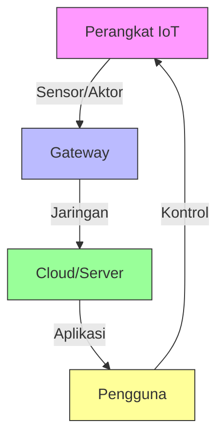

# Konsep Dasar Keamanan IoT

## 1. Pendahuluan

### 1.1 Gambaran Umum
Internet of Things (IoT) telah mengubah cara kita berinteraksi dengan perangkat elektronik sehari-hari. Namun, dengan kemudahan yang ditawarkan, muncul pula tantangan keamanan yang kompleks. Modul ini akan membahas konsep dasar keamanan IoT, kerentanan umum, dan praktik terbaik untuk mengamankan perangkat IoT.

### 1.2 Tujuan Pembelajaran
Setelah mempelajari materi ini, peserta didik mampu:
- Memahami arsitektur dan komponen IoT
- Mengidentifikasi ancaman dan kerentanan pada sistem IoT
- Menerapkan prinsip keamanan pada perangkat IoT
- Menganalisis kasus keamanan IoT
- Mengimplementasikan praktik keamanan terbaik

## 2. Arsitektur IoT

### 2.1 Komponen Utama IoT


### 2.2 Lapisan Arsitektur IoT
1. **Perangkat (Device Layer)**
   - Sensor dan aktuator
   - Mikrokontroler
   - Firmware

2. **Jaringan (Network Layer)**
   - Protokol komunikasi (WiFi, Bluetooth, Zigbee, LoRa)
   - Gateway
   - Protokol IoT (MQTT, CoAP, AMQP)

3. **Aplikasi (Application Layer)**
   - Pemrosesan data
   - Antarmuka pengguna
   - Analitik

## 3. Ancaman dan Kerentanan IoT

### 3.1 Ancaman Umum
- **Peretasan Perangkat**
  - Default credential
  - Firmware yang tidak diupdate
  - Fisik tidak aman

- **Serangan Jaringan**
  - Man-in-the-Middle (MitM)
  - Denial of Service (DoS)
  - Eavesdropping

- **Keamanan Data**
  - Penyadapan data
  - Data tampering
  - Kebocoran data pribadi

### 3.2 Kerentanan Umum OWASP IoT Top 10
1. **Kredensial Lemah**
   - Password default/tertebak
   - Kredensial hardcoded
   - Contoh: Kamera IP dengan password admin:admin

2. **Layanan Jaringan Tidak Aman**
   - Port terbuka tidak perlu
   - Layanan tanpa autentikasi
   - Contoh: Telnet aktif di perangkat IoT

3. **Antarmuka Ekosistem Tidak Aman**
   - API tidak terproteksi
   - Web interface rentan
   - Contoh: Panel admin tanpa HTTPS

4. **Mekanisme Pembaruan Tidak Aman**
   - Update tidak terenkripsi
   - Tidak ada verifikasi tanda tangan
   - Contoh: Firmware update via HTTP

5. **Komponen Tidak Aman**
   - Library usang
   - Komponen pihak ketiga rentan
   - Contoh: Versi OpenSSL lama

6. **Perlindungan Privasi Tidak Memadai**
   - Pengumpulan data berlebihan
   - Penyimpanan data sensitif tidak aman
   - Contoh: Penyimpanan data pengguna tanpa enkripsi

7. **Transfer dan Penyimpanan Data Tidak Aman**
   - Data tidak terenkripsi
   - Protokol tidak aman
   - Contoh: Mengirim data sensor via HTTP

8. **Manajemen Perangkat Buruk**
   - Tidak ada inventaris perangkat
   - Monitoring terbatas
   - Contoh: Tidak ada log akses perangkat

9. **Pengaturan Default Tidak Aman**
   - Konfigurasi awal lemah
   - Fitur tidak perlu aktif
   - Contoh: Akun guest aktif default

10. **Keamanan Fisik Lemah**
    - Port debug terbuka
    - Tidak ada proteksi tamper
    - Contoh: Port USB debug aktif

## 4. Prinsip Keamanan IoT

### 4.1 Keamanan Berlapis (Defense in Depth)
- **Autentikasi Kuat**
  ```python
  # Contoh implementasi autentikasi JWT
  import jwt
  
  def create_token(user_id):
      payload = {
          'user_id': user_id,
          'exp': datetime.utcnow() + timedelta(hours=1)
      }
      return jwt.encode(payload, 'secret_key', algorithm='HS256')
  ```
- **Enkripsi Data**
  - AES-256 untuk data sensitif
  - TLS 1.2+ untuk komunikasi
  - Enkripsi end-to-end

### 4.2 Keamanan dari Desain
1. **Privasi**
   - Data minimalis
   - Anonimasi data
   - Persetujuan pengguna

2. **Minimal Permukaan Serangan**
   - Nonaktifkan layanan tidak perlu
   - Prinsip least privilege
   - Isolasi komponen

### 4.3 Pembaruan Keamanan
- **OTA Update Aman**
  ```mermaid
  sequenceDiagram
      Perangkat->>Server: Minta pembaruan
      Server-->>Perangkat: Kirim metadata (versi, ukuran)
      Perangkat->>Server: Verifikasi tanda tangan
      Server-->>Perangkat: Kirim pembaruan terenkripsi
      Perangkat->>Perangkat: Verifikasi dan instal
  ```

## 5. Implementasi Praktis

### 5.1 Pengamanan Perangkat Keras
- **Secure Boot**
  - Verifikasi bootloader
  - Tanda tangan kode
  - Proteksi flash memory

- **Keamanan Fisik**
  | Komponen | Ancaman | Mitigasi |
  |----------|---------|----------|
  | Port USB | Eksploitasi | Nonaktifkan debug |
  | Chipset | Cloning | Pengenal unik |
  | Sensor | Manipulasi | Validasi data |

### 5.2 Keamanan Jaringan IoT
- **Segmentasi Jaringan**
  ```
  [Internet]
      |
  [Firewall]
      |
  +-------------------+
  | Jaringan Utama    |
  |  - Server         |
  |  - Database       |
  +-------------------+
          |
  +-------------------+
  | Jaringan IoT      |
  |  - Perangkat IoT  |
  |  - Gateway        |
  +-------------------+
  ```

### 5.3 Manajemen Identitas
- **RBAC (Role-Based Access Control)**
  - Admin: Full access
  - Operator: Monitoring
  - Guest: Baca saja

## 6. Studi Kasus: Sistem Parkir

### 6.1 Ancaman dan Solusi
| Ancaman | Dampak | Solusi |
|---------|--------|--------|
| Spoofing Kamera | Akses tidak sah | Autentikasi perangkat |
| Manipulasi Data | Laporan salah | Checksum data |
| DoS | Sistem down | Rate limiting |

### 6.2 Implementasi Keamanan
1. **Autentikasi Perangkat**
   ```python
   def verify_device(mac):
       # Daftar MAC address terpercaya
       trusted = {
           '00:1A:2B:3C:4D:5E': 'gate-01',
           '00:1A:2B:3C:4D:5F': 'camera-01'
       }
       return trusted.get(mac)
   ```

2. **Enkripsi Data**
   ```python
   from cryptography.fernet import Fernet
   
   key = Fernet.generate_key()
   cipher = Fernet(key)
   
   def encrypt_data(data):
       return cipher.encrypt(data.encode())
   ```

## 7. Praktik Terbaik

### 7.1 Pengembangan Aman
- Gunakan tool SAST/DAST
- Lakukan code review
- Terapkan secure coding

### 7.2 Monitoring
- Log semua akses
- Deteksi anomali
- Alerting otomatis

## 8. Tantangan Masa Depan
- **Edge Computing**
  - Keamanan di edge
  - Verifikasi perangkat
  
- **AI/ML**
  - Deteksi serangan
  - Analisis perilaku

## 9. Referensi
1. OWASP IoT Security Guidelines
2. NISTIR 8259A
3. ENISA IoT Security Baseline
4. IoT Security Foundation

---

<div align="center">
  <p>Dokumen Teori - Keamanan IoT</p>
  <p>© 2025 SMKN 1 Punggelan</p>
</div>
