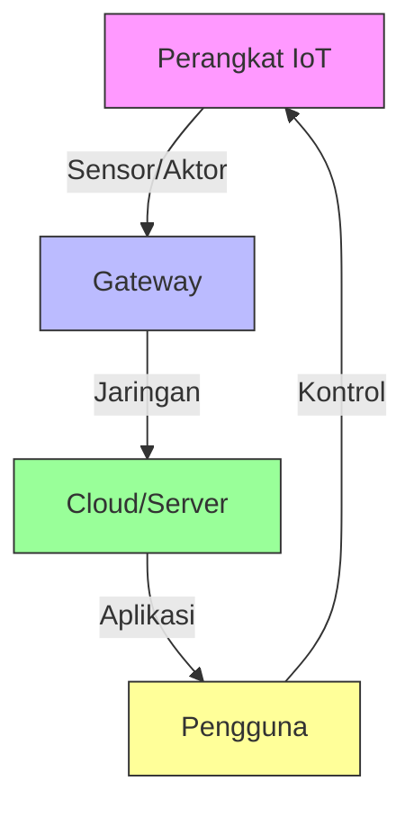

# Konsep Dasar Keamanan IoT

## 1. Pendahuluan

### 1.1 Gambaran Umum
Internet of Things (IoT) telah mengubah cara kita berinteraksi dengan perangkat elektronik sehari-hari. Namun, dengan kemudahan yang ditawarkan, muncul pula tantangan keamanan yang kompleks. Modul ini akan membahas konsep dasar keamanan IoT, kerentanan umum, dan praktik terbaik untuk mengamankan perangkat IoT.

### 1.2 Tujuan Pembelajaran
Setelah mempelajari materi ini, peserta didik mampu:
- Memahami arsitektur dan komponen IoT
- Mengidentifikasi ancaman dan kerentanan pada sistem IoT
- Menerapkan prinsip keamanan pada perangkat IoT
- Menganalisis kasus keamanan IoT
- Mengimplementasikan praktik keamanan terbaik

## 2. Arsitektur IoT

### 2.1 Komponen Utama IoT

### 2.2 Lapisan Arsitektur IoT
1. **Perangkat (Device Layer)**
   - Sensor dan aktuator
   - Mikrokontroler
   - Firmware

2. **Jaringan (Network Layer)**
   - Protokol komunikasi (WiFi, Bluetooth, Zigbee, LoRa)
   - Gateway
   - Protokol IoT (MQTT, CoAP, AMQP)

3. **Aplikasi (Application Layer)**
   - Pemrosesan data
   - Antarmuka pengguna
   - Analitik

## 3. Ancaman dan Kerentanan IoT

### 3.1 Ancaman Umum
- **Peretasan Perangkat**
  - Default credential
  - Firmware yang tidak diupdate
  - Fisik tidak aman

- **Serangan Jaringan**
  - Man-in-the-Middle (MitM)
  - Denial of Service (DoS)
  - Eavesdropping

- **Keamanan Data**
  - Penyadapan data
  - Data tampering
  - Kebocoran data pribadi

### 3.2 Kerentanan Umum OWASP IoT Top 10
1. Weak, Guessable, or Hardcoded Passwords
2. Insecure Network Services
3. Insecure Ecosystem Interfaces
4. Lack of Secure Update Mechanism
5. Use of Insecure or Outdated Components
6. Insufficient Privacy Protection
7. Insecure Data Transfer and Storage
8. Lack of Device Management
9. Insecure Default Settings
10. Lack of Physical Hardening

## 4. Prinsip Keamanan IoT

### 4.1 CIA Triad pada IoT
- **Confidentiality**: Enkripsi data
- **Integrity**: Validasi data
- **Availability**: Ketahanan terhadap DoS

### 4.2 Zero Trust Architecture
- Verify explicitly
- Use least privilege access
- Assume breach

## 5. Praktik Keamanan IoT

### 5.1 Keamanan Perangkat Keras
- Secure boot
- TPM (Trusted Platform Module)
- Secure element
- Physical tamper protection

### 5.2 Keamanan Perangkat Lunak
- Update firmware secara berkala
- Code signing
- Secure coding practices
- Input validation

### 5.3 Keamanan Komunikasi
- Enkripsi (TLS/DTLS)
- Autentikasi perangkat
- Pembaruan kunci
- Intrusion Detection System (IDS)

## 6. Studi Kasus

### 6.1 Mirai Botnet (2016)
- Menargetkan perangkat IoT dengan kredensial default
- Menciptakan botnet besar untuk serangan DDoS
- Dampak: Menjatuhkan layanan besar seperti Twitter, Netflix, Reddit

### 6.2 Stuxnet (2010)
- Malware yang menargetkan SCADA systems
- Merusak fasilitas pengayaan uranium Iran
- Demonstrasi pertama serangan siber terhadap infrastruktur fisik

## 7. Tools Keamanan IoT

### 7.1 Analisis Keamanan
- Wireshark
- Nmap
- Shodan
- Firmware Analysis Toolkit

### 7.2 Pengujian Keamanan
- OWASP ZAP
- Burp Suite
- Kali Linux IoT Tools

## 8. Tantangan dan Tren Masa Depan

### 8.1 Tantangan
- Skala dan kompleksitas
- Umur panjang perangkat
- Regulasi yang beragam
- Keterbatasan sumber daya

### 8.2 Tren Masa Depan
- AI untuk keamanan IoT
- Blockchain untuk kepercayaan perangkat
- Quantum-safe cryptography
- Edge computing security

## 9. Referensi
1. OWASP IoT Project
2. NIST Guidelines for IoT Security
3. ENISA Baseline Security Recommendations for IoT
4. IoT Security Foundation Best Practice Guides

---

  
Dokumen Teori - Keamanan IoT

  
© 2025 SMKN 1 Punggelan

