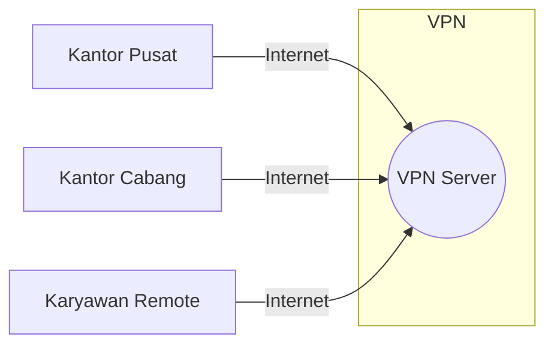

# Konsep Dasar VPN dan IPsec

## 1. Pendahuluan

### 1.1 Gambaran Umum
Virtual Private Network (VPN) dan IP Security (IPsec) adalah teknologi kunci dalam membangun koneksi aman melalui jaringan yang tidak aman seperti internet. Modul ini akan membahas konsep, arsitektur, dan implementasi VPN dan IPsec.

### 1.2 Tujuan Pembelajaran
Setelah mempelajari materi ini, peserta didik mampu:
- Memahami konsep dasar VPN dan IPsec
- Mengidentifikasi komponen dan protokol VPN
- Menerapkan konfigurasi VPN dasar
- Menganalisis keamanan implementasi VPN
- Memecahkan masalah umum VPN

## 2. Konsep Dasar VPN

### 2.1 Definisi VPN

### 2.2 Jenis-Jenis VPN
1. **Berdasarkan Penggunaan**
   - Remote Access VPN
   - Site-to-Site VPN
   - Extranet VPN
   - Intranet VPN

2. **Berdasarkan Protokol**
   - IPsec VPN
   - SSL/TLS VPN
   - PPTP VPN
   - L2TP/IPsec VPN
   - OpenVPN

## 3. Arsitektur IPsec

### 3.1 Komponen IPsec
- **Security Associations (SA)**
- **Authentication Header (AH)**
- **Encapsulating Security Payload (ESP)**
- **Internet Key Exchange (IKE)**

### 3.2 Mode Operasi IPsec
1. **Transport Mode**
   - Hanya mengenkripsi payload
   - Header asli tetap
   - Cocok untuk host-to-host

2. **Tunnel Mode**
   - Mengenkripsi seluruh paket
   - Menambahkan header baru
   - Cocok untuk gateway-to-gateway

## 4. Protokol dan Algoritma

### 4.1 Protokol Pertukaran Kunci
- **IKEv1**
  - Phase 1: Membangun SA yang aman
  - Phase 2: Membuat SA untuk data

- **IKEv2**
  - Lebih efisien
  - Dukungan MOBIKE
  - Perlindungan DoS yang lebih baik

### 4.2 Algoritma Kriptografi
| Komponen | Algoritma |
|----------|-----------|
| Enkripsi | AES, 3DES, ChaCha20 |
| Autentikasi | HMAC-SHA256, HMAC-SHA384 |
| Pertukaran Kunci | Diffie-Hellman (Group 14, 19, 20, 21) |
| Integritas | SHA-256, SHA-384 |

## 5. Implementasi VPN

### 5.1 OpenVPN
- Open source
- Menggunakan SSL/TLS
- Fleksibel dan dapat dikonfigurasi

### 5.2 IPsec/L2TP
- Bawaan banyak sistem operasi
- Mudah dikonfigurasi
- Kompatibilitas luas

### 5.3 WireGuard
- Modern dan ringan
- Kode yang sederhana
- Performa tinggi

## 6. Keamanan VPN

### 6.1 Ancaman Umum
- Serangan Man-in-the-Middle
- Kebocoran DNS
- Kebocoran IPv6
- Serangan downgrade

### 6.2 Praktik Terbaik
- Gunakan protokol yang kuat (IKEv2, WireGuard)
- Nonaktifkan protokol yang tidak aman (PPTP, SSLv3)
- Terapkan autentikasi dua faktor
- Pantau log secara berkala

## 7. Studi Kasus

### 7.1 Implementasi Perusahaan
- Koneksi aman antar kantor
- Akses remote yang aman
- Pemisahan lalu lintas

### 7.2 Tantangan dan Solusi
- Masalah kompatibilitas
- Masalah kinerja
- Masalah keamanan

## 8. Referensi
1. RFC 4301 - Security Architecture for IP
2. NIST SP 800-77 - Guide to IPsec VPNs
3. OpenVPN Documentation
4. WireGuard Whitepaper

---

  
Dokumen Teori - VPN dan IPsec

  
© 2025 SMKN 1 Punggelan

