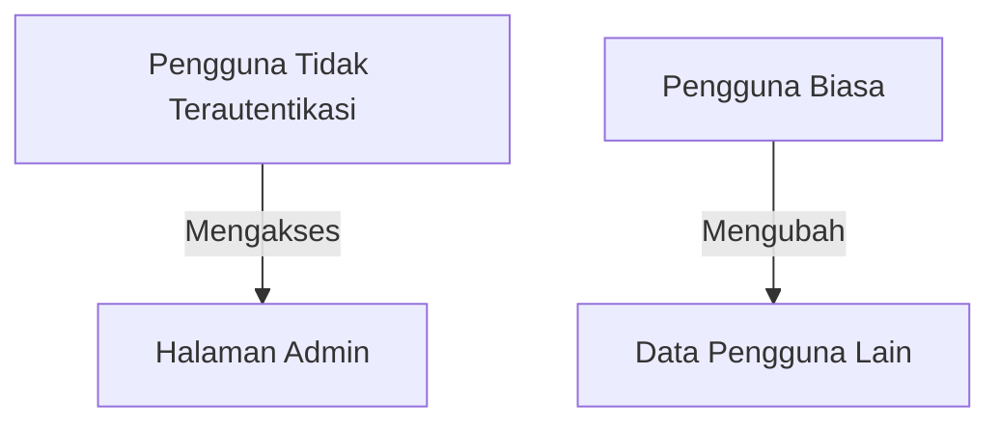

# Konsep Dasar Keamanan Aplikasi Web

## 1. Pendahuluan

### 1.1 Gambaran Umum
Keamanan aplikasi web adalah praktik melindungi website, aplikasi, dan layanan online dari ancaman digital yang mengeksploitasi kerentanan dalam kode. Modul ini mencakup prinsip, ancaman, dan praktik terbaik dalam pengembangan aplikasi web yang aman.

### 1.2 Tujuan Pembelajaran
Setelah mempelajari materi ini, peserta didik mampu:
- Memahami ancaman keamanan aplikasi web terkini
- Mengidentifikasi kerentanan umum pada aplikasi web
- Menerapkan praktik pengembangan yang aman
- Melakukan pengujian keamanan dasar
- Menganalisis dan memitigasi risiko keamanan

## 2. OWASP Top 10 2021

### 2.1 Broken Access Control

**Mitigasi:**
- Terapkan kebijakan kontrol akses yang ketat
- Gunakan role-based access control (RBAC)
- Validasi izin untuk setiap permintaan

### 2.2 Cryptographic Failures
- Penyimpanan password tanpa hashing
- Penggunaan protokol tidak aman (HTTP, SSL/TLS lemah)
- Kesalahan implementasi kriptografi

### 2.3 Injection
- SQL Injection
- Command Injection
- LDAP Injection

### 2.4 Insecure Design
- Kekurangan dalam arsitektur keamanan
- Kegagalan dalam pemodelan ancaman

### 2.5 Security Misconfiguration
- Konfigurasi default yang tidak aman
- Header HTTP yang tidak aman
- Pesan error yang mengungkap informasi sensitif

## 3. Prinsip Keamanan Aplikasi Web

### 3.1 Defense in Depth
- Lapisan keamanan berganda
- Tidak mengandalkan satu mekanisme pertahanan

### 3.2 Least Privilege
- Berikan akses minimal yang diperlukan
- Prinsip "need to know"

### 3.3 Fail Securely
- Gagal dengan aman
- Jangan bocorkan informasi sensitif

### 3.4 Keep It Simple
- Kompleksitas adalah musuh keamanan
- Kode yang sederhana lebih mudah diamankan

## 4. Teknik Serangan Umum

### 4.1 Cross-Site Scripting (XSS)
- Stored XSS
- Reflected XSS
- DOM-based XSS

### 4.2 Cross-Site Request Forgery (CSRF)
- Eksploitasi otentikasi pengguna
- Permintaan lintas situs yang tidak sah

### 4.3 Server-Side Request Forgery (SSRF)
- Memaksa server membuat koneksi ke sumber daya internal
- Eksfiltrasi data sensitif

### 4.4 XML External Entity (XXE)
- Eksposur file sistem
- Serangan denial of service

## 5. Praktik Pengembangan Aman

### 5.1 Input Validation
- Validasi semua input
- Gunakan whitelist, bukan blacklist
- Sanitasi output

### 5.2 Manajemen Session
- Session timeout
- Regenerasi session ID
- Secure dan HttpOnly flags

### 5.3 Pengelolaan Error
- Logging yang aman
- Halaman error yang ramah pengguna
- Jangan bocorkan stack trace

## 6. Tools Keamanan

### 6.1 Static Application Security Testing (SAST)
- SonarQube
- Checkmarx
- Fortify

### 6.2 Dynamic Application Security Testing (DAST)
- OWASP ZAP
- Burp Suite
- Nikto

### 6.3 Dependency Scanning
- OWASP Dependency-Check
- Snyk
- npm audit

## 7. Studi Kasus

### 7.1 Pelanggaran Data
- Analisis kasus nyata
- Dampak bisnis
- Pelajaran yang didapat

### 7.2 Bug Bounty
- Program bug bounty
- Penemuan kerentanan yang bertanggung jawab
- Proses pelaporan

## 8. Referensi
1. OWASP Top 10 2021
2. NIST SP 800-115
3. SANS Top 25 Most Dangerous Software Errors
4. WSTG (Web Security Testing Guide)

---

  
Dokumen Teori - Keamanan Aplikasi Web

  
© 2025 SMKN 1 Punggelan

