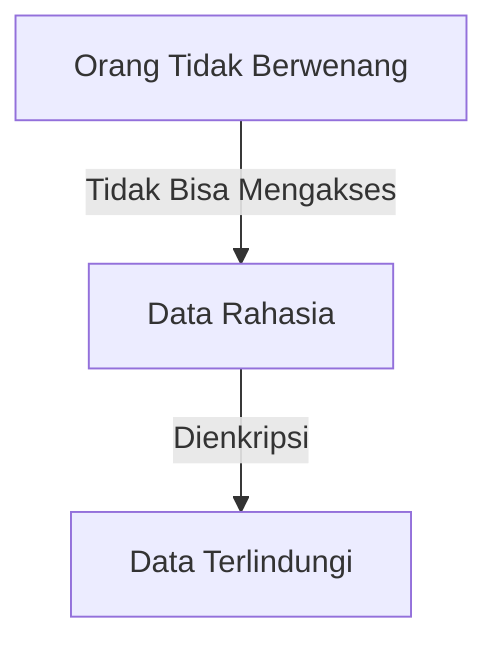

# Konsep Dasar Keamanan Siber dan Etika Hacking

## 🎯 Tujuan Pembelajaran
Setelah mempelajari materi ini, peserta didik mampu:
1. Memahami konsep dasar keamanan siber
2. Menjelaskan prinsip-prinsip keamanan informasi (CIA Triad)
3. Memahami perbedaan antara ethical hacking dan malicious hacking
4. Menjelaskan peran dan tanggung jawab seorang ethical hacker
5. Memahami kerangka hukum yang mengatur aktivitas keamanan siber

## 1. Pendahuluan

### 1.1 Gambaran Umum Keamanan Siber
Keamanan siber adalah praktik melindungi sistem, jaringan, dan program dari serangan digital. Ancaman keamanan siber terus berkembang seiring dengan kemajuan teknologi.

### 1.2 Pentingnya Keamanan Siber
- Meningkatnya serangan siber secara global
- Dampak finansial dari pelanggaran data
- Perlindungan aset digital dan privasi
- Kepatuhan terhadap regulasi

## 2. Prinsip Dasar Keamanan Informasi (CIA Triad)

### 2.1 Confidentiality (Kerahasiaan)

- Memastikan informasi hanya dapat diakses oleh pihak yang berwenang
- Contoh: Enkripsi data, kontrol akses

### 2.2 Integrity (Integritas)
- Memastikan keakuratan dan konsistensi data
- Mencegah modifikasi tidak sah
- Contoh: Checksum, digital signatures

### 2.3 Availability (Ketersediaan)
- Memastikan data dan sistem tersedia ketika dibutuhkan
- Contoh: Sistem backup, proteksi DDoS

## 3. Konsep Hacking dan Jenis-jenis Hacker

### 3.1 Definisi Hacking
- Aktivitas mengidentifikasi dan mengeksploitasi kerentanan dalam sistem komputer
- Bisa bersifat legal (ethical) atau ilegal (malicious)

### 3.2 Jenis-jenis Hacker
| Tipe Hacker | Motivasi | Legalitas |
|-------------|----------|-----------|
| White Hat | Meningkatkan keamanan | Legal |
| Black Hat | Keuntungan pribadi, niat jahat | Ilegal |
| Grey Hat | Di antara keduanya | Seringkali ilegal |
| Script Kiddie | Iseng, pamer | Ilegal |
| Hacktivist | Motivasi politik/ideologi | Seringkali ilegal |

## 4. Ethical Hacking

### 4.1 Pengertian
- Praktik mengidentifikasi kerentanan secara legal untuk meningkatkan keamanan
- Dilakukan dengan izin pemilik sistem
- Mengikuti kode etik yang ketat

### 4.2 Tahapan Ethical Hacking
1. **Perizinan** - Mendapatkan otorisasi tertulis
2. **Ruang Lingkup** - Menentukan batasan pengujian
3. **Pelaporan** - Mendokumentasikan temuan
4. **Tidak Merusak** - Tidak menyebabkan kerusakan

## 5. Kerangka Hukum dan Etika

### 5.1 Regulasi Terkait
- UU ITE (Undang-Undang Informasi dan Transaksi Elektronik)
- UU PDP (Perlindungan Data Pribadi)
- ISO/IEC 27001 (Standar Manajemen Keamanan Informasi)

### 5.2 Etika Profesional
- Menghormati privasi
- Melindungi kerahasiaan informasi
- Bertanggung jawab atas tindakan
- Mengikuti prinsip "do no harm"

## 6. Tools Dasar Keamanan Siber

### 6.1 Kategori Tools
- **Scanning**: Nmap, Nessus
- **Enkripsi**: OpenSSL, GnuPG
- **Forensik**: Autopsy, FTK
- **Analisis Jaringan**: Wireshark, Tcpdump

### 6.2 Praktik Terbaik
- Selalu update tools
- Gunakan tools hanya pada sistem yang diizinkan
- Dokumentasikan setiap langkah
- Patuhi kebijakan keamanan organisasi

## 7. Studi Kasus

### 7.1 Contoh Kasus Pelanggaran Keamanan
- **Kasus**: Kebocoran Data BPJS Kesehatan
  - **Dampak**: 279 juta data terekspos
  - **Penyebab**: Konfigurasi database yang tidak aman
  - **Pelajaran**: Pentingnya pengamanan akses database

### 7.2 Contoh Ethical Hacking
- **Program Bug Bounty**
- **Penetration Testing**
- **Security Audit**

## 8. Ringkasan
- Keamanan siber adalah tanggung jawab bersama
- Ethical hacking membantu mengidentifikasi kerentanan sebelum dieksploitasi
- Selalu patuhi hukum dan etika dalam praktik keamanan siber

## 📚 Referensi
1. NIST Cybersecurity Framework
2. EC-Council Certified Ethical Hacker (CEH) v11
3. ISO/IEC 27001:2022
4. UU No. 19 Tahun 2016 tentang Perubahan UU ITE

---

  
Dokumen Teori - Konsep Dasar Keamanan Siber dan Etika Hacking

  
© 2025 SMKN 1 Punggelan

