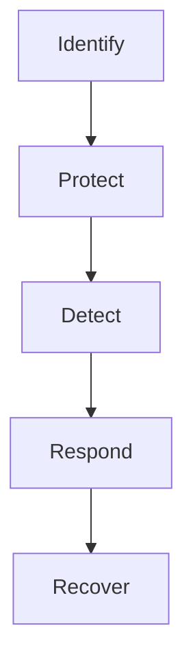
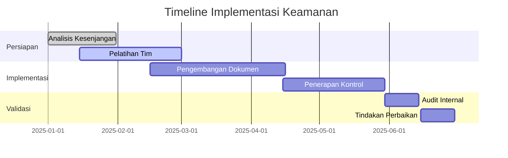

# 📚 Referensi Cepat - Standar dan Metodologi Keamanan

## 🏗️ Kerangka Kerja Utama

### 1. NIST Cybersecurity Framework


### 2. ISO/IEC 27001 Klausul Utama
1. **4-10** - Persyaratan Sistem Manajemen
2. **Annex A** - 93 Kontrol Keamanan
   - A.5: Kebijakan Keamanan
   - A.6: Organisasi Keamanan
   - A.8: Keamanan Aset
   - A.9: Kontrol Akses
   - A.12: Keamanan Operasional
   - A.14: Akuisisi, Pengembangan, dan Pemeliharaan Sistem
   - A.16: Manajemen Insiden
   - A.17: Kelangsungan Bisnis

## 📋 Template Dokumen

### 1. Template Kebijakan Keamanan
```markdown
# KEBIJAKAN KEAMANAN INFORMASI

## 1. Pendahuluan
- Tujuan dan ruang lingkup
- Pihak yang terkait

## 2. Tanggung Jawab
- Manajemen
- Staf TI
- Pengguna

## 3. Kebijakan
- Penggunaan aset TI
- Manajemen akses
- Perlindungan data
- Tanggap insiden

## 4. Penegakan
- Pelanggaran dan sanksi
- Pengecualian
- Tinjauan berkala
```

### 2. Template Laporan Temuan Keamanan
```markdown
# LAPORAN TEMUAN KEAMANAN

## 1. Ringkasan Eksekutif
- Deskripsi singkat
- Tingkat keparahan
- Rekomendasi utama

## 2. Detail Temuan
### [ID] Nama Temuan
- **Deskripsi**: 
- **Tingkat Risiko**: 
- **Lokasi**: 
- **Bukti**: 
- **Dampak**: 
- **Rekomendasi**: 
- **Timeline Perbaikan**:

## 3. Lampiran
- Bukti teknis
- Referensi
```

## 🛠️ Tools Penting

### 1. Manajemen Risiko
- **Lynis**: Audit keamanan sistem
  ```bash
  sudo lynis audit system
  ```
- **OpenVAS**: Pemindaian kerentanan
  ```bash
  openvas-start
  # Akses di https://127.0.0.1:9392
  ```

### 2. Dokumentasi
- **Dradis**: Kolaborasi pengujian keamanan
- **CherryTree**: Catatan terstruktur
- **Draw.io**: Diagram arsitektur keamanan

## 📜 Regulasi & Standar

### 1. Internasional
- **ISO/IEC 27001**: Manajemen Keamanan Informasi
- **NIST SP 800-53**: Kontrol Keamanan untuk Sistem Federal
- **PCI DSS**: Standar Keamanan Data Industri Kartu Pembayaran
- **GDPR**: Perlindungan Data UE

### 2. Nasional
- **UU ITE**: Undang-undang Informasi dan Transaksi Elektronik
- **Peraturan Pemerintah 71/2019**: Penyelenggaraan Sistem dan Transaksi Elektronik
- **Permenkominfo 20/2016**: Perlindungan Data Pribadi

## 📊 Matriks Pemetaan

### ISO 27001 vs NIST CSF
| ISO 27001 | NIST CSF |
|-----------|----------|
| A.5.1.1 Kebijakan Keamanan | ID.GV-1 |
| A.9.1.1 Kebijakan Akses | PR.AC-1 |
| A.12.4.1 Pencatatan Peristiwa | DE.AE-1 |
| A.16.1.1 Tanggapan Insiden | RS.RP-1 |
| A.17.1.1 Kelangsungan Bisnis | RC.RP-1 |

## 🔍 Daftar Periksa Keamanan Dasar

### 1. Sistem
- [ ] Pembaruan keamanan terpasang
- [ ] Firewall diaktifkan
- [ ] Backup otomatis berjalan
- [ ] Log aktivitas diaktifkan

### 2. Jaringan
- [ ] Enkripsi WPA3 untuk Wi-Fi
- [ ] Segmentasi jaringan
- [ ] Pemantauan lalu lintas
- [ ] Filtering port

### 3. Aplikasi
- [ ] Input validation
- [ ] Otentikasi kuat
- [ ] Proteksi XSS/CSRF
- [ ] Error handling aman

## 📚 Sumber Daya

### 1. Online
- [NIST Cybersecurity Framework](https://www.nist.gov/cyberframework)
- [ISO 27001 Security](https://www.iso.org/isoiec-27001-information-security.html)
- [OWASP Cheat Sheets](https://cheatsheetseries.owasp.org/)
- [CIS Benchmarks](https://www.cisecurity.org/cis-benchmarks/)

### 2. Buku
- "ISO 27001/ISO 27002: A Pocket Guide"
- "NIST Cybersecurity Framework: A Pocket Guide"
- "The Basics of IT Audit"

## 📅 Timeline Implementasi

### Contoh Rencana 6 Bulan


---
<div align="center">
  <p>Dokumen Referensi - Standar dan Metodologi Keamanan</p>
  <p>© 2025 SMKN 1 Punggelan</p>
  <p>Update Terakhir: 07/07/2025</p>
</div>
