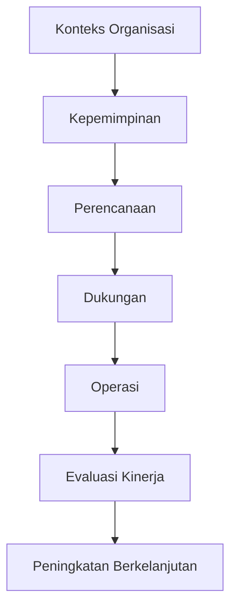
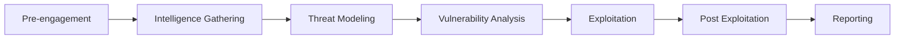

# Standar dan Metodologi Keamanan Informasi

## 🎯 Tujuan Pembelajaran
Setelah mempelajari materi ini, peserta didik mampu:
1. Memahami standar keamanan informasi internasional
2. Menjelaskan siklus hidup pengembangan keamanan (SDLC)
3. Memahami kerangka kerja keamanan siber (NIST, ISO/IEC 27001)
4. Menerapkan metodologi pengujian keamanan
5. Memahami pentingnya dokumentasi dalam keamanan informasi

## 1. Pendahuluan

### 1.1 Gambaran Umum
Standar dan metodologi keamanan informasi memberikan kerangka kerja terstruktur untuk mengelola risiko keamanan siber. Dokumen ini akan membahas berbagai standar industri dan metodologi yang digunakan dalam pengujian keamanan.

### 1.2 Manfaat Standar
- Konsistensi dalam penerapan keamanan
- Pengakuan internasional
- Peningkatan kepercayaan pelanggan
- Kepatuhan regulasi
- Pengurangan risiko keamanan

## 2. Standar Internasional

### 2.1 ISO/IEC 27001

**Klausul Utama:**
1. Konteks Organisasi
2. Kepemimpinan
3. Perencanaan
4. Dukungan
5. Operasi
6. Evaluasi Kinerja
7. Peningkatan

### 2.2 NIST Cybersecurity Framework
**Lima Fungsi Inti:**
1. **Identify** - Mengembangkan pemahaman organisasi
2. **Protect** - Mengembangkan dan menerapkan safeguards
3. **Detect** - Mengembangkan dan menerapkan aktivitas deteksi
4. **Respond** - Mengembangkan dan menerapkan respons insiden
5. **Recover** - Mengembangkan dan menerapkan rencana pemulihan

### 2.3 PCI DSS (Payment Card Industry Data Security Standard)
**Persyaratan Utama:**
- Bangun dan pertahankan jaringan yang aman
- Lindungi data pemegang kartu
- Kelola kerentanan
- Terapkan tindakan pengendalian akses yang kuat
- Pantau dan uji jaringan secara teratur
- Pertahankan kebijakan keamanan informasi

## 3. Metodologi Pengujian Keamanan

### 3.1 OWASP Testing Guide
**Fase Pengujian:**
1. Information Gathering
2. Configuration Management Testing
3. Identity Management Testing
4. Authentication Testing
5. Authorization Testing
6. Session Management Testing
7. Input Validation Testing
8. Error Handling
9. Cryptography
10. Business Logic Testing
11. Client-side Testing

### 3.2 PTES (Penetration Testing Execution Standard)

### 3.3 OSSTMM (Open Source Security Testing Methodology Manual)
**Empat Jenis Pengujian:**
1. **Visibility** - Apa yang terlihat oleh penyerang?
2. **Access** - Bagaimana akses dapat diperoleh?
3. **Trust** - Seberapa besar kepercayaan yang diberikan?
4. **Controls** - Seberapa baik kontrol keamanan berfungsi?

## 4. Siklus Hidup Pengembangan Keamanan (SDLC)

### 4.1 Fase SDLC
1. **Perencanaan** - Analisis kebutuhan keamanan
2. **Perancangan** - Arsitektur keamanan
3. **Implementasi** - Pengkodean yang aman
4. **Pengujian** - Pengujian keamanan
5. **Penerapan** - Deployment yang aman
6. **Pemeliharaan** - Pembaruan keamanan

### 4.2 Praktik Pengembangan Aman
- Pelatihan pengembang
- Code review
- Pengujian keamanan otomatis
- Manajemen dependensi
- Hardening konfigurasi

## 5. Dokumentasi Keamanan

### 5.1 Dokumen Penting
1. **Kebijakan Keamanan**
2. Standar dan Prosedur
3. Rencana Respons Insiden
4. Laporan Audit
5. Dokumentasi Risiko

### 5.2 Template Laporan Pengujian
1. Ringkasan Eksekutif
2. Metodologi
3. Temuan
4. Bukti
5. Rekomendasi
6. Lampiran

## 6. Studi Kasus

### 6.1 Implementasi ISO 27001 di Perusahaan Fintech
**Tantangan:**
- Perlindungan data finansial
- Kepatuhan regulasi
- Manajemen risiko

**Solusi:**
- Penerapan kontrol keamanan
- Pelatihan staf
- Audit berkala

### 6.2 Pengujian Keamanan Aplikasi E-commerce
**Metodologi:**
- OWASP Testing Guide
- Pengujian otentikasi
- Pengujian pembayaran
- Pengujian akses data

## 7. Ringkasan
- Standar keamanan memberikan kerangka kerja yang terstruktur
- Metodologi pengujian membantu mengidentifikasi kerentanan
- Dokumentasi yang baik sangat penting untuk kepatuhan dan audit
- Penerapan SDLC aman mengurangi risiko keamanan

## 📚 Referensi
1. ISO/IEC 27001:2022
2. NIST Cybersecurity Framework 1.1
3. OWASP Testing Guide v4
4. PTES Technical Guidelines
5. OSSTMM v3

---

  
Dokumen Teori - Standar dan Metodologi Keamanan Informasi

  
© 2025 SMKN 1 Punggelan

