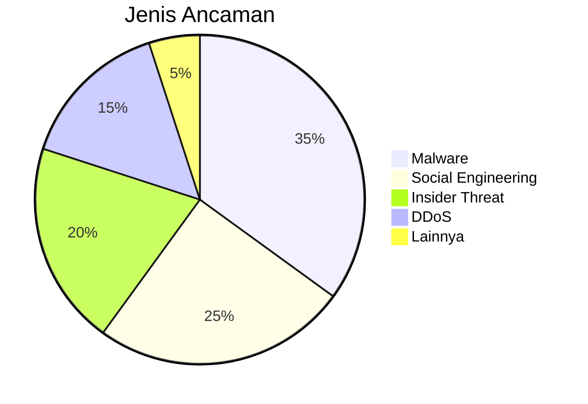
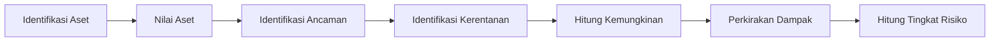

# Konsep dan Penerapan Manajemen Risiko Keamanan Informasi

## 🎯 Tujuan Pembelajaran
Setelah mempelajari materi ini, peserta didik mampu:
1. Memahami konsep dasar manajemen risiko keamanan informasi
2. Mengidentifikasi aset, ancaman, dan kerentanan
3. Melakukan analisis dan evaluasi risiko
4. Mengembangkan rencana penanganan risiko
5. Menerapkan kerangka kerja manajemen risiko

## 1. Pendahuluan

### 1.1 Gambaran Umum
Manajemen risiko keamanan informasi adalah proses mengidentifikasi, menilai, dan mengendalikan ancaman terhadap aset informasi organisasi. Pendekatan ini membantu organisasi untuk:
- Melindungi aset informasi
- Mematuhi peraturan yang berlaku
- Mengoptimalkan alokasi sumber daya
- Meningkatkan ketahanan organisasi

### 1.2 Standar dan Kerangka Kerja
- **ISO 31000**: Manajemen Risiko
- **ISO/IEC 27005**: Manajemen Risiko Keamanan Informasi
- **NIST SP 800-30**: Panduan Manajemen Risiko Keamanan Informasi
- **OCTAVE**: Pendekatan Penilaian Risiko dari SEI
- **FAIR**: Faktor Analisis Risiko Informasi

## 2. Komponen Utama Manajemen Risiko

### 2.1 Aset (Apa yang Dilindungi?)
- **Fisik**: Server, perangkat jaringan, dokumen
- **Digital**: Data, perangkat lunak, kredensial
- **Manusia**: Staf, pengetahuan, reputasi
- **Layanan**: Ketersediaan layanan TI, layanan pelanggan

### 2.2 Ancaman (Dari mana datangnya bahaya?)


### 2.3 Kerentanan (Kelemahan yang bisa dieksploitasi)
- **Teknis**: Bug perangkat lunak, konfigurasi salah
- **Prosedural**: Kebijakan yang lemah, pelatihan yang tidak memadai
- **Manusia**: Kesalahan pengguna, kurangnya kesadaran
- **Fisik**: Akses fisik tidak terkendali, bencana alam

### 2.4 Dampak (Apa konsekuensinya?)
- **Kuantitatif**: Nilai kerugian finansial
- **Kualitatif**: Dampak pada reputasi, kepatuhan

## 3. Proses Manajemen Risiko

### 3.1 Identifikasi Risiko
- **Teknik**:
  - Brainstorming
  - Wawancara
  - Audit keamanan
  - Analisis dokumen
  - Pemindaian kerentanan

### 3.2 Analisis Risiko


### 3.3 Evaluasi Risiko
- **Matriks Risiko**:
  | Kemungkinan\Dampak | Rendah (1) | Sedang (2) | Tinggi (3) |
  |---------------------|------------|------------|------------|
  | **Tinggi (3)**     | 3          | 6          | 9          |
  | **Sedang (2)**     | 2          | 4          | 6          |
  | **Rendah (1)**     | 1          | 2          | 3          |

### 3.4 Penanganan Risiko
1. **Hindari** - Menghentikan aktivitas berisiko
2. **Transfer** - Asuransi atau outsourcing
3. **Mitigasi** - Menerapkan kontrol keamanan
4. **Terima** - Menerima risiko jika dalam batas yang dapat diterima

### 3.5 Pemantauan dan Tinjauan
- Pemantauan berkelanjutan
- Tinjauan berkala
- Pembaruan penilaian risiko

## 4. Metodologi Penilaian Risiko

### 4.1 Kuantitatif
- **Contoh**: ALE (Annualized Loss Expectancy)
  ```
  ALE = ARO (Tingkat Kejadian Tahunan) x SLE (Kerugian Tunggal yang Diharapkan)
  ```
- **Keuntungan**: Objektif, mudah dibandingkan
- **Keterbatasan**: Membutuhkan data historis yang akurat

### 4.2 Kualitatif
- **Skala**: Rendah, Sedang, Tinggi
- **Alat**: Matriks risiko, Heat map
- **Keuntungan**: Cepat, tidak membutuhkan data kuantitatif
- **Keterbatasan**: Subjektif, sulit membandingkan risiko

## 5. Alat dan Teknik

### 5.1 Alat Analisis Risiko
- **Open Source**: 
  - DREAD
  - OCTAVE Allegro
  - CORAS
- **Komersial**:
  - RSA Archer
  - ServiceNow IRM
  - MetricStream

### 5.2 Pemindaian Kerentanan
```bash
# Contoh penggunaan OpenVAS
openvas-start
# Akses https://localhost:9392
# Buat target dan lakukan pemindaian
```

## 6. Studi Kasus

### 6.1 Kebocoran Data Perusahaan Retail
- **Aset**: Database pelanggan
- **Ancaman**: Serangan eksternal
- **Kerentanan**: Sistem yang tidak di-patch
- **Dampak**: Kerugian $3,5 juta, penurunan kepercayaan pelanggan
- **Tindakan**: Penerapan enkripsi, pelatihan kesadaran keamanan

### 6.2 Ransomware di Lembaga Pendidikan
- **Aset**: Data akademik, penelitian
- **Ancaman**: Serangan ransomware
- **Kerentanan**: Backup tidak teruji
- **Dampak**: Gangguan operasional, kerugian data
- **Tindakan**: Pembaruan sistem, backup terenkripsi

## 7. Praktik Terbaik

### 7.1 Pengelolaan Risiko yang Efektif
- Libatkan pemangku kepentingan
- Integrasikan dengan manajemen bisnis
- Lakukan penilaian berkala
- Dokumentasikan semua keputusan

### 7.2 Tantangan Umum
- Keterbatasan sumber daya
- Perubahan ancaman yang cepat
- Resistensi terhadap perubahan
- Kepatuhan terhadap regulasi

## 8. Ringkasan
- Manajemen risiko adalah proses berkelanjutan
- Pendekatan berbasis risiko membantu alokasi sumber daya yang efektif
- Kombinasi pendekatan kualitatif dan kuantitatif memberikan hasil terbaik
- Pemantauan dan tinjauan berkala sangat penting

## 📚 Referensi
1. ISO/IEC 27005:2022 - Information security, cybersecurity and privacy protection
2. NIST SP 800-30 Rev. 1 - Guide for Conducting Risk Assessments
3. OCTAVE Allegro: The OCTAVE Approach
4. FAIR Framework - The Standard for Risk Analysis
5. ISACA Risk IT Framework

---
<div align="center">
  <p>Dokumen Teori - Manajemen Risiko Keamanan Informasi</p>
  <p>© 2025 SMKN 1 Punggelan</p>
</div>
