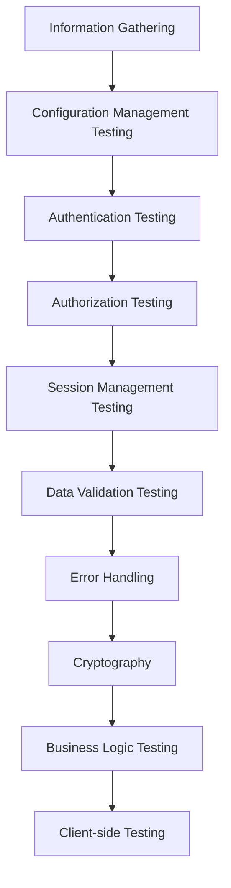

# 🔍 Pengujian Keamanan Jaringan: Pendekatan Komprehensif

## 🎯 Tujuan Pembelajaran
Setelah mempelajari materi ini, peserta didik mampu:
1. Memahami metodologi pengujian keamanan jaringan
2. Menguasai teknik pengujian kerentanan
3. Melakukan penetration testing bertanggung jawab
4. Menganalisis hasil pengujian keamanan
5. Membuat laporan temuan keamanan

## 1. Pendahuluan

### 1.1 Gambaran Umum
Pengujian keamanan jaringan adalah proses sistematis untuk mengidentifikasi kerentanan dalam infrastruktur TI dengan mensimulasikan serangan dunia nyata.

### 1.2 Pentingnya Pengujian Keamanan
- Mengidentifikasi kelemahan sebelum dieksploitasi peretas
- Memenuhi persyaratan kepatuhan (ISO 27001, PCI DSS)
- Melindungi aset dan reputasi organisasi
- Meningkatkan kesadaran keamanan

## 2. Kerangka Kerja Pengujian Keamanan

### 2.1 OWASP Testing Guide


### 2.2 PTES (Penetration Testing Execution Standard)
1. Pre-engagement Interactions
2. Intelligence Gathering
3. Threat Modeling
4. Vulnerability Analysis
5. Exploitation
6. Post Exploitation
7. Reporting

## 3. Metodologi Pengujian

### 3.1 Black Box Testing
- Tanpa pengetahuan internal sistem
- Mensimulasikan serangan eksternal
- Tools: Nmap, Burp Suite, OWASP ZAP

### 3.2 White Box Testing
- Akses penuh ke kode dan arsitektur
- Pemeriksaan menyeluruh
- Tools: SonarQube, Fortify, Checkmarx

### 3.3 Grey Box Testing
- Pengetahuan terbatas tentang sistem
- Gabungan black dan white box
- Tools: Metasploit, SQLmap

## 4. Teknik Pengujian

### 4.1 Pemindaian Jaringan
```bash
# Contoh penggunaan Nmap untuk pemindaian mendalam
nmap -sS -sV -sC -O -p- -T4 -A -v target_ip -oN scan_results.txt

# Parameter:
# -sS: SYN scan
# -sV: Deteksi versi layanan
# -sC: Jalankan script default NSE
# -O: Deteksi OS
# -p-: Semua port (1-65535)
# -T4: Kecepatan pengujian
# -A: Deteksi agresif
```

### 4.2 Pengujian Aplikasi Web
```
OWASP Top 10 2023:
1. Broken Access Control
2. Cryptographic Failures
3. Injection
4. Insecure Design
5. Security Misconfiguration
6. Vulnerable Components
7. Authentication Failures
8. Software/Data Integrity Failures
9. Security Logging & Monitoring Failures
10. Server-Side Request Forgery
```

### 4.3 Eksploitasi
```bash
# Contoh penggunaan Metasploit Framework
msfconsole
use exploit/multi/handler
set payload windows/meterpreter/reverse_tcp
set LHOST your_ip
set LPORT 4444
exploit
```

## 5. Tools Penting

### 5.1 Pemetaan Jaringan
| Tool | Fungsi | Contoh Penggunaan |
|------|--------|-------------------|
| Nmap | Pemindaian jaringan | `nmap -sV target` |
| Wireshark | Analisis paket | Filter: `http.request` |
| Netdiscover | Discovery jaringan | `netdiscover -r 192.168.1.0/24` |

### 5.2 Pengujian Aplikasi Web
| Tool | Kategori | Keterangan |
|------|----------|-------------|
| Burp Suite | Proxy | Intercept & analisis traffic |
| OWASP ZAP | Scanner | Otomatis temukan kerentanan |
| SQLmap | Eksploitasi | Deteksi & eksploitasi SQLi |

### 5.3 Eksploitasi
| Tool | Platform | Keterangan |
|------|----------|-------------|
| Metasploit | Multi-platform | Framework eksploitasi |
| Cobalt Strike | Windows | Red team operations |
| Empire | Windows | Post-exploitation |

## 6. Pelaporan dan Analisis

### 6.1 Komponen Laporan
1. Ringkasan Eksekutif
2. Metodologi
3. Temuan Utama
4. Analisis Risiko
5. Rekomendasi
6. Lampiran Teknis

### 6.2 Template Temuan Kerentanan
```markdown
## [ID] Nama Kerentanan

### Deskripsi
[Penjelasan detail kerentanan]

### Dampak
- [ ] Confidentiality
- [ ] Integrity
- [ ] Availability

### Tingkat Keparahan
[Kritis/Tinggi/Sedang/Rendah]

### Bukti
```bash
[Perintah/Output yang relevan]
```

### Rekomendasi
1. [Rekomendasi 1]
2. [Rekomendasi 2]

### Referensi
- [CVE-XXXX-XXXX](link)
- [OWASP: Nama Kerentanan](link)
```

## 7. Praktik Etis dan Hukum

### 7.1 Persetujuan Tertulis
- Surat penugasan resmi
- Lingkup pengujian yang jelas
- Jadwal pengujian

### 7.2 Batasan Hukum
- UU ITE
- Peraturan perlindungan data
- Kebijakan organisasi

## 8. Studi Kasus

### 8.1 Kasus Peretasan Perusahaan Retail
- **Kerentanan**: SQL Injection
- **Dampak**: 40 juta data pelanggan bocor
- **Penyebab**: Input validation yang lemah
- **Solusi**: Parameterized queries

### 8.2 Serikan Ransomware di Lembaga Kesehatan
- **Vektor**: Phishing email
- **Dampak**: Gangguan layanan 72 jam
- **Solusi**: Pelatihan kesadaran + backup terenkripsi

## 9. Tren Terkini

### 9.1 Pengujian Keamanan IoT
- Tantangan unik perangkat IoT
- Tools: Firmware analysis, hardware hacking

### 9.2 Keamanan Cloud Native
- Pengujian container security
- Serverless security testing

## 10. Sumber Daya

### 10.1 Sertifikasi
- CEH (Certified Ethical Hacker)
- OSCP (Offensive Security Certified Professional)
- eJPT (eLearnSecurity Junior Penetration Tester)

### 10.2 Platform Latihan
- Hack The Box
- TryHackMe
- PortSwigger Web Security Academy

---
<div align="center">
  <p>Dokumen Teori - Pengujian Keamanan Jaringan</p>
  <p>© 2025 SMKN 1 Punggelan - Program Keahlian Teknik Komputer dan Jaringan</p>
</div>
