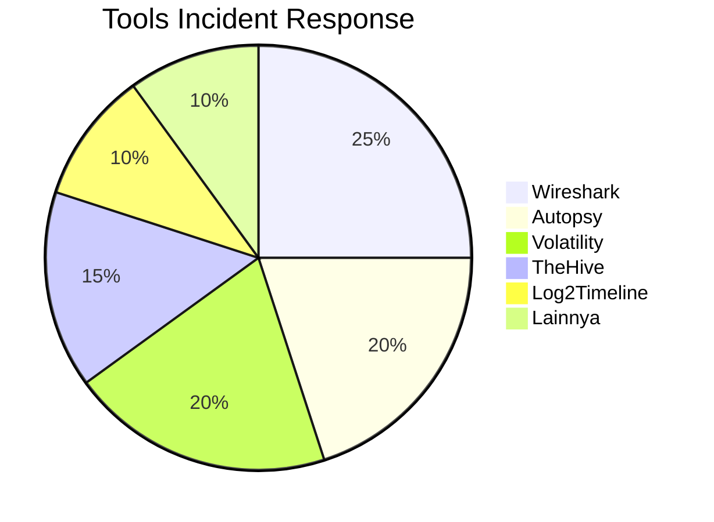

# 🚨 Praktikum: Simulasi Tanggap Insiden Keamanan Siber

## 🎯 Tujuan Pembelajaran
Setelah menyelesaikan praktikum ini, peserta didik mampu:
1. Menerapkan prosedur tanggap insiden secara sistematis
2. Melakukan analisis forensik digital dasar
3. Menggunakan tools incident response secara efektif
4. Mendokumentasikan temuan insiden
5. Berkomunikasi dalam situasi krisis keamanan

## 📋 Persiapan

### 1. Lingkungan Lab
- **Sistem Operasi**: Kali Linux 2023.x
- **Tools**: Wireshark, Autopsy, Volatility, TheHive
- **Target**: Metasploitable 2/3 (sebagai sistem yang dikompromikan)
- **Jaringan**: Terisolasi/VLAN khusus

### 2. Tools yang Akan Digunakan


## 📝 Skenario Insiden

### 1. Latar Belakang
Anda adalah anggota Tim Tanggap Insiden (CSIRT) di sebuah perusahaan e-commerce. Pada pukul 09:00 WIB, sistem monitoring mendeteksi aktivitas mencurigakan pada server web perusahaan.

### 2. Indikator Kompromi (IoC)
- Peningkatan traffic tidak biasa pada port 80/443
- File mencurigakan ditemukan di `/var/www/html/backdoor.php`
- Log akses mencurigakan dari IP 192.168.1.100
- Proses tersembunyi dengan PID 1337

## 🔍 Langkah Kerja

### 1. Persiapan (Preparation)

#### 1.1 Persiapan Tools
```bash
# Update sistem dan tools
sudo apt update && sudo apt upgrade -y

# Install tools incident response
sudo apt install -y autopsy volatility wireshark thehive

# Buat direktori kerja
mkdir -p ~/incident_response/{evidence,reports,logs}
```

#### 1.2 Persiapan Dokumentasi
```markdown
# FORMULIR PELAPORAN INSIDEN

## Informasi Dasar
- Nomor Tiket: INC-2025-001
- Pelapor: [Nama Lengkap]
- Tanggal/Waktu: [Otomatis]
- Sistem Terdampak: Web Server (192.168.1.10)
- Kategori Insiden: [Pilih: Malware/Data Breach/DDoS/dll]

## Deskripsi Awal
[Deskripsikan gejala yang diamati]
```

### 2. Deteksi dan Analisis Awal

#### 2.1 Analisis Jaringan
```bash
# Capture traffic jaringan
sudo tcpdump -i eth0 -w ~/incident_response/evidence/network_capture.pcap

# Analisis koneksi aktif
netstat -tulnp
ss -tulnp
lsof -i

# Cari koneksi mencurigakan
netstat -antp | grep ESTABLISHED
```

#### 2.2 Analisis Sistem
```bash
# Cek proses yang berjalan
ps aux | grep -i "backdoor\|shell\|reverse"
top -b -n 1
htop

# Cek file yang dimodifikasi baru-baru ini
find /var/www/ -type f -mtime -1 -ls | sort -k8

# Analisis log
sudo tail -f /var/log/apache2/access.log | grep -v "200"
sudo grep -i "error\|fail\|denied" /var/log/syslog
```

### 3. Penanganan (Containment)

#### 3.1 Isolasi Sistem
```bash
# Blokir IP mencurigakan
sudo iptables -A INPUT -s 192.168.1.100 -j DROP

# Matikan proses mencurigakan
sudo kill -9 1337

# Nonaktifkan akun yang dikompromikan
sudo usermod -L [username]
```

### 4. Analisis Forensik

#### 4.1 Pengambilan Bukti
```bash
# Buat image memori
sudo dd if=/dev/mem of=~/incident_response/evidence/memory_dump.mem bs=1M

# Ambil hash file mencurigakan
sha256sum /var/www/html/backdoor.php > ~/incident_response/evidence/hashes.txt

# Salin log yang relevan
cp /var/log/apache2/access.log ~/incident_response/logs/
cp /var/log/auth.log ~/incident_response/logs/
```

#### 4.2 Analisis dengan Volatility
```bash
# Identifikasi profil OS
volatility -f memory_dump.mem imageinfo

# Daftar proses
volatility -f memory_dump.mem --profile=LinuxUbuntu1804x64 pslist

# Analisis network connections
volatility -f memory_dump.mem --profile=LinuxUbuntu1804x64 netscan
```

### 5. Pemberantasan (Eradication)

#### 5.1 Pembersihan Sistem
```bash
# Hapus file berbahaya
sudo rm -f /var/www/html/backdoor.php

# Perbarui sistem
sudo apt update && sudo apt upgrade -y

# Perbaiki izin file
sudo chown -R www-data:www-data /var/www/
sudo chmod -R 750 /var/www/
```

### 6. Pemulihan (Recovery)

#### 6.1 Restorasi Sistem
```bash
# Restore dari backup
sudo rsync -avz /backup/web/ /var/www/

# Restart layanan
sudo systemctl restart apache2
sudo systemctl restart mysql
```

### 7. Dokumentasi dan Pelaporan

#### 7.1 Template Laporan Insiden
```markdown
# LAPORAN INSIDEN KEAMANAN SI-2025-001

## 1. Ringkasan Eksekutif
- **Tanggal Insiden**: [Tanggal]
- **Jenis Insiden**: [Kategori]
- **Tingkat Keparahan**: [Kritis/Tinggi/Sedang/Rendah]
- **Dampak**: [Deskripsi Dampak]

## 2. Kronologi
1. [Waktu] - [Kejadian]
2. [Waktu] - [Tindakan]
3. [Waktu] - [Penyelesaian]

## 3. Temuan Utama
### 3.1 [Nama Temuan]
- **Deskripsi**: 
- **Dampak**: 
- **Rekomendasi**:

## 4. Tindakan yang Dilakukan
1. [Tindakan 1]
2. [Tindakan 2]
3. [Tindakan 3]

## 5. Rekomendasi
1. [Rekomendasi 1]
2. [Rekomendasi 2]
3. [Rekomendasi 3]

## 6. Lampiran
- [ ] Screenshot
- [ ] Log
- [ ] Bukti Lainnya
```

## 📌 Tugas Praktikum

### Tugas 1: Analisis Jaringan (30 menit)
1. Gunakan Wireshark untuk menganalisis file `network_capture.pcap`
2. Identifikasi paket mencurigakan
3. Catat alamat IP dan port yang terlibat

### Tugas 2: Analisis Forensik (45 menit)
1. Gunakan Autopsy untuk menganalisis image disk
2. Identifikasi file mencurigakan
3. Ekstrak bukti digital yang relevan

### Tugas 3: Pembuatan Laporan (45 menit)
1. Buat laporan insiden lengkap
2. Sertakan bukti temuan
3. Berikan rekomendasi perbaikan

## 🧩 Tantangan Lanjutan

### Tantangan 1: Analisis Malware
```bash
# Ekstrak string dari file mencurigakan
strings backdoor.php > strings_output.txt

# Analisis perilaku dengan strace
strace -f -o trace_output.txt php backdoor.php
```

### Tantangan 2: Timeline Analisis
```bash
# Buat timeline aktivitas sistem
log2timeline.py timeline.plaso /dev/sda1
psort.py -o l2tcsv -w timeline.csv timeline.plaso
```

## 📚 Referensi
1. [NIST Computer Security Incident Handling Guide](https://csrc.nist.gov/publications/detail/sp/800-61/rev-2/final)
2. [SANS Incident Handler's Handbook](https://www.sans.org/security-resources/incident-handler-handbook/)
3. [MITRE ATT&CK Framework](https://attack.mitre.org/)
4. [FIRST Standards](https://www.first.org/standards/)

## ⚠️ Etika dan Legalitas
1. Hanya lakukan praktikum pada lingkungan yang diizinkan
2. Patuhi peraturan yang berlaku
3. Jaga kerahasiaan informasi sensitif
4. Laporkan temuan yang signifikan

---
<div align="center">
  <p>Panduan Praktikum - Simulasi Tanggap Insiden Keamanan</p>
  <p>© 2025 SMKN 1 Punggelan - Program Keahlian Teknik Komputer dan Jaringan</p>
</div>
