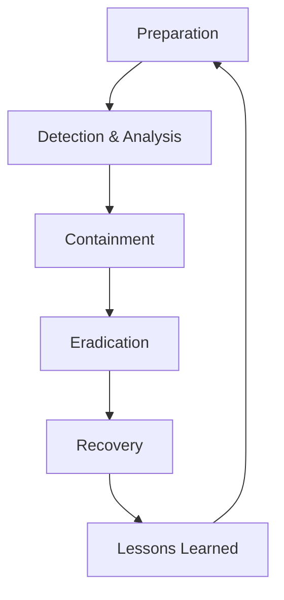
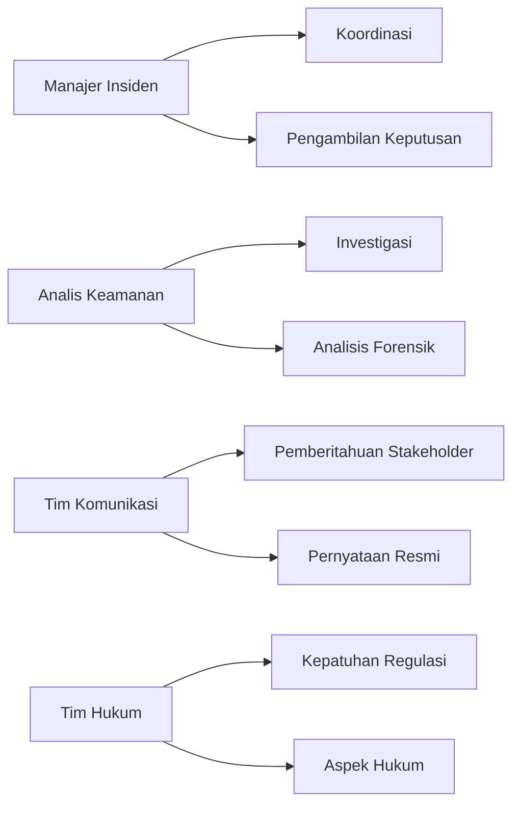

# 🚨 Manajemen Insiden Keamanan Siber: Pendekatan Komprehensif

## 🎯 Tujuan Pembelajaran
Setelah mempelajari materi ini, peserta didik mampu:
1. Memahami siklus hidup manajemen insiden keamanan
2. Mengidentifikasi dan mengklasifikasikan insiden keamanan
3. Menerapkan prosedur respons insiden yang efektif
4. Melakukan analisis forensik digital dasar
5. Mengembangkan rencana pemulihan pasca-insiden

## 1. Pendahuluan

### 1.1 Gambaran Umum
Manajemen Insiden Keamanan Siber adalah kerangka kerja terstruktur untuk mendeteksi, merespons, dan memulihkan diri dari pelanggaran keamanan siber.

### 1.2 Pentingnya Manajemen Insiden
- Meminimalkan dampak insiden keamanan
- Memenuhi persyaratan regulasi (PDP, UU ITE, dll.)
- Melindungi aset dan reputasi organisasi
- Meningkatkan ketahanan siber

## 2. Kerangka Kerja Manajemen Insiden

### 2.1 NIST SP 800-61r2


### 2.2 SANS Incident Response Process
1. Preparation
2. Identification
3. Containment
4. Eradication
5. Recovery
6. Lessons Learned

## 3. Klasifikasi Insiden Keamanan

### 3.1 Berdasarkan Tingkat Keparahan
| Level | Deskripsi | Waktu Respons | Contoh |
|-------|-----------|---------------|--------|
| 1 - Kritis | Dampak besar, mengancam kelangsungan bisnis | Segera <15 menit | Ransomware, Kebocoran data masif |
| 2 - Tinggi | Dampak signifikan pada operasional | <4 jam | Serangan DDoS, Deface website |
| 3 - Sedang | Dampak terbatas | <24 jam | Malware umum, Percobaan serangan |
| 4 - Rendah | Dampak minimal | <72 jam | Alert keamanan ringan |

### 3.2 Berdasarkan Jenis Serangan
- **Malware** (Ransomware, Spyware, dll.)
- **Phishing** (Email, Telepon, SMS)
- **DDoS** (Distributed Denial of Service)
- **Insider Threat** (Karyawan, Mantan Karyawan)
- **Advanced Persistent Threat (APT)**

## 4. Tim Tanggap Insiden (CSIRT)

### 4.1 Struktur Tim
- **Manajer Insiden**: Koordinasi keseluruhan
- **Analis Keamanan**: Investigasi teknis
- **Komunikasi**: Hubungan dengan stakeholder
- **Hukum**: Aspek legal dan kepatuhan
- **IT Support**: Implementasi teknis

### 4.2 Peran dan Tanggung Jawab


## 5. Prosedur Tanggap Insiden

### 5.1 Persiapan (Preparation)
- Dokumen kebijakan dan prosedur
- Daftar kontak darurat
- Alat dan sumber daya
- Pelatihan dan simulasi

### 5.2 Deteksi dan Analisis
```bash
# Contoh perintah deteksi awal
grep -i "failed" /var/log/auth.log
grep -i "intrusion" /var/log/syslog
netstat -tulnp | grep -i "estab"
ps aux | grep -i "suspicious"
```

### 5.3 Penanganan (Containment)
- **Segera**: Isolasi sistem yang terinfeksi
- **Jangka Pendek**: Blokir alamat IP mencurigakan
- **Jangka Panjang**: Perbaiki kerentanan

### 5.4 Pemberantasan (Eradication)
- Hapus malware
- Perbarui sistem yang rentan
- Ubah kredensial yang mungkin bocor

### 5.5 Pemulihan (Recovery)
- Kembalikan sistem dari backup bersih
- Pantau aktivitas mencurigakan
- Validasi integritas sistem

### 5.6 Pelajaran yang Didapat (Lessons Learned)
- Review insiden
- Identifikasi area perbaikan
- Perbarui kebijakan dan prosedur

## 6. Forensik Digital Dasar

### 6.1 Prinsip Forensik
1. Jangan mengubah bukti asli
2. Dokumentasikan semua tindakan
3. Gunakan alat yang terverifikasi
4. Pertahankan rantai kustodi

### 6.2 Alat Forensik
- **Memory Analysis**: Volatility, Rekall
- **Disk Imaging**: FTK Imager, dd
- **Network Forensics**: Wireshark, NetworkMiner
- **Malware Analysis**: Cuckoo Sandbox, IDA Pro

### 6.3 Pengumpulan Bukti
1. Dokumentasi awal
2. Pengambilan image disk
3. Pengumpulan log
4. Analisis memori
5. Preservasi bukti

## 7. Komunikasi Krisis

### 7.1 Template Komunikasi
```markdown
# PERNYATAAN RESMI INSIDEN KEAMANAN

## Ringkasan Insiden
- **Tanggal/Waktu**: 
- **Jenis Insiden**: 
- **Dampak**: 
- **Status Saat Ini**: 

## Tindakan yang Dilakukan
1. [Tindakan 1]
2. [Tindakan 2]
3. [Tindakan 3]

## Langkah Selanjutnya
- [ ] Pemantauan berkelanjutan
- [ ] Investigasi lebih lanjut
- [ ] Pembaruan akan disampaikan

## Kontak
- Email: 
- Hotline: 
- Situs Web: 
```

### 7.2 Pihak yang Perlu Diberitahu
- Manajemen eksekutif
- Departemen Hukum
- Tim TI/Keamanan
- Pelanggan (jika diperlukan)
- Otoritas (sesuai peraturan)

## 8. Studi Kasus Nyata

### 8.1 Kasus Kebocoran Data Perusahaan Fintech
- **Kronologi**: Serangan phishing terhadap karyawan
- **Dampak**: 2 juta data nasabah bocor
- **Tindakan**: 
  1. Isolasi sistem yang terkompromi
  2. Pemberitahuan ke regulator dalam 3x24 jam
  3. Kerjasama dengan CERT untuk investigasi

### 8.2 Serangan Ransomware di Rumah Sakit
- **Kronologi**: Eksploitasi RDP yang tidak diamankan
- **Dampak**: Gangguan layanan 5 hari
- **Pelajaran**: 
  - Perlunya backup terisolasi
  - Pentingnya pembaruan keamanan
  - Pelatihan kesadaran keamanan

## 9. Regulasi dan Kepatuhan

### 9.1 Peraturan Terkait
- **UU ITE**: Pelaporan insiden kebocoran data
- **Peraturan Menteri Kominfo**: Perlindungan data pribadi
- **ISO 27035**: Standar manajemen insiden keamanan informasi
- **NIST SP 800-61**: Panduan penanganan insiden keamanan komputer

### 9.2 Daftar Periksa Kepatuhan
- [ ] Pelaporan insiden sesuai ketentuan
- [ ] Dokumentasi lengkap
- [ ] Pelatihan staf
- [ ] Uji coba rencana respons insiden

## 10. Alat dan Sumber Daya

### 10.1 Tools Open Source
- **SIEM**: Wazuh, ELK Stack
- **Incident Response**: TheHive, MISP
- **Forensik**: Autopsy, SIFT Workstation
- **Komunikasi**: Mattermost, Rocket.Chat

### 10.2 Template Dokumen
- Daftar periksa tanggap insiden
- Formulir pelaporan insiden
- Template komunikasi krisis
- Laporan pasca-insiden

## 📚 Referensi
1. NIST SP 800-61r2: Computer Security Incident Handling Guide
2. SANS Incident Handler's Handbook
3. ISO/IEC 27035:2016 - Information security incident management
4. ENISA Good Practice Guide for Incident Management

---
<div align="center">
  <p>Dokumen Teori - Manajemen Insiden Keamanan Siber</p>
  <p>© 2025 SMKN 1 Punggelan - Program Keahlian Teknik Komputer dan Jaringan</p>
</div>
