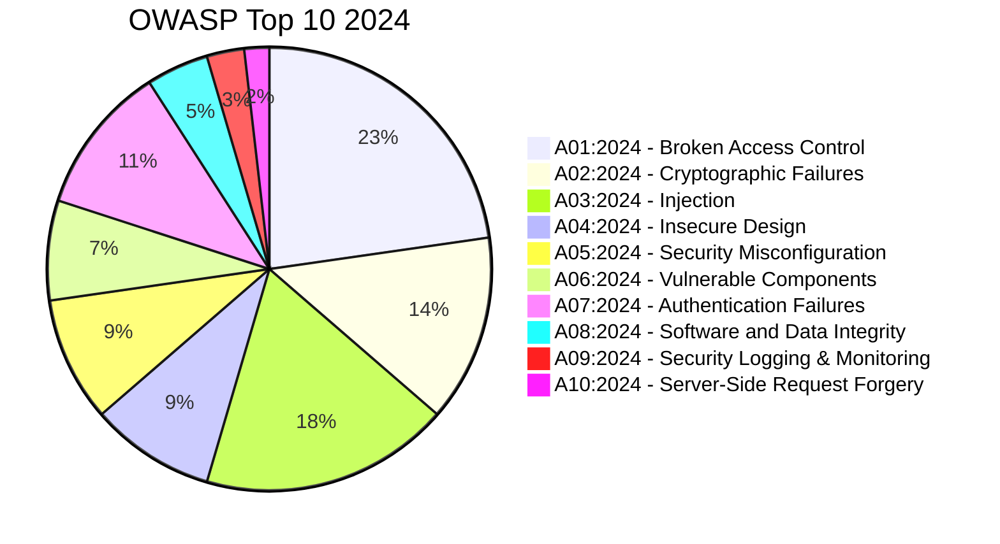
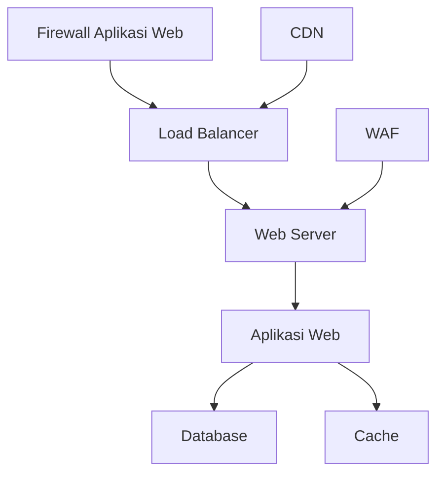
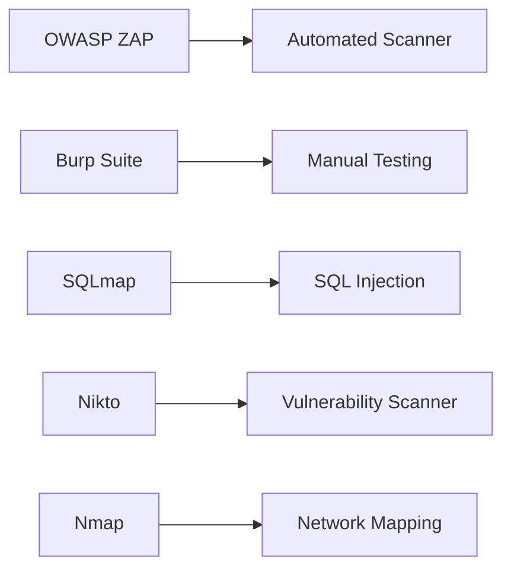

# 🔒 Keamanan Aplikasi Web: Konsep dan Praktik Terkini

## 🎯 Tujuan Pembelajaran
Setelah mempelajari materi ini, peserta didik mampu:
1. Memahami kerentanan umum aplikasi web (OWASP Top 10 2024)
2. Menerapkan praktik pengembangan yang aman (Secure Coding)
3. Melakukan pengujian keamanan aplikasi web
4. Mengimplementasikan mekanisme pertahanan yang efektif
5. Memahami standar dan regulasi keamanan aplikasi web

## 1. Pendahuluan

### 1.1 Gambaran Umum
Keamanan aplikasi web adalah praktik melindungi situs web, aplikasi, dan layanan online dari ancaman keamanan siber dengan mengeksploitasi kerentanan dalam kode, arsitektur, atau infrastruktur.

### 1.2 Pentingnya Keamanan Aplikasi Web
- Melindungi data sensitif pengguna
- Menjaga ketersediaan layanan
- Mencegah kerugian finansial
- Mematuhi regulasi (PDP, PCI DSS, dll.)
- Menjaga reputasi organisasi

## 2. OWASP Top 10 2024

### 2.1 Daftar Kerentanan Utama


### 2.2 Detail Kerentanan Utama

#### A01:2024 - Broken Access Control
- **Deskripsi**: Gagal membatasi akses pengguna yang tidak berwenang
- **Contoh**:
  - Memodifikasi parameter URL untuk mengakses data pengguna lain
  - Mengakses halaman admin tanpa otentikasi
- **Dampak**: Kebocoran data, penghapusan data

#### A03:2024 - Injection
- **Jenis**:
  - SQL Injection
  - Command Injection
  - LDAP Injection
  - XSS (Cross-Site Scripting)
- **Contoh Serangan**:
  ```sql
  ' OR '1'='1' --
  <script>alert('XSS')</script>
  ```

## 3. Arsitektur Keamanan Aplikasi Web

### 3.1 Lapisan Pertahanan (Defense in Depth)


### 3.2 Komponen Penting
- **Web Application Firewall (WAF)**
- **Content Security Policy (CSP)**
- **Web Application Scanners**
- **Runtime Application Self-Protection (RASP)**
- **API Security Gateways**

## 4. Praktik Pengembangan Aman

### 4.1 Input Validation
- Validasi sisi server
- Whitelist daripada blacklist
- Gunakan library validasi yang terpercaya
- Contoh (Python/Flask):
  ```python
  from flask import request
  from werkzeug.security import check_password_hash
  
  @app.route('/login', methods=['POST'])
  def login():
      username = request.form.get('username', '').strip()
      password = request.form.get('password', '')
      
      # Validasi input
      if not username or not password:
          return "Username dan password harus diisi", 400
          
      # Verifikasi password
      user = User.query.filter_by(username=username).first()
      if user and check_password_hash(user.password_hash, password):
          return "Login berhasil"
      return "Username atau password salah", 401
  ```

### 4.2 Manajemen Autentikasi yang Aman
- Gunakan algoritma hashing yang kuat (Argon2, bcrypt, PBKDF2)
- Implementasikan 2FA/MFA
- Batas percobaan login
- Contoh (Node.js):
  ```javascript
  const bcrypt = require('bcrypt');
  const saltRounds = 10;
  
  // Hash password
  async function hashPassword(password) {
      return await bcrypt.hash(password, saltRounds);
  }
  
  // Verifikasi password
  async function verifyPassword(plainPassword, hashedPassword) {
      return await bcrypt.compare(plainPassword, hashedPassword);
  }
  ```

## 5. Pengujian Keamanan Aplikasi Web

### 5.1 Metodologi Pengujian
1. **Pengujian Otomatis**
   - Static Application Security Testing (SAST)
   - Dynamic Application Security Testing (DAST)
   - Interactive Application Security Testing (IAST)

2. **Pengujian Manual**
   - Penetration Testing
   - Code Review
   - Threat Modeling

### 5.2 Tools Pengujian


## 6. Keamanan API Web

### 6.1 Ancaman Umum
- API Abuse
- BOLA (Broken Object Level Authorization)
- Ekspos Data Sensitif
- Kurangnya Pembatasan Sumber Daya

### 6.2 Praktik Terbaik
- Gunakan OAuth 2.0/OpenID Connect
- Validasi input secara ketat
- Terapkan rate limiting
- Enkripsi data sensitif

## 7. Keamanan Aplikasi Web Modern

### 7.1 Keamanan Aplikasi Single Page (SPA)
- Implementasi CSP yang tepat
- Lindungi terhadap XSS
- Keamanan State Management
- Keamanan WebSockets

### 7.2 Keamanan Serverless
- Least Privilege Principle
- Perlindungan terhadap Event Injection
- Keamanan Dependensi
- Pemantauan dan Logging

## 8. Regulasi dan Standar

### 8.1 Standar Internasional
- OWASP ASVS (Application Security Verification Standard)
- NIST SP 800-63 (Digital Identity Guidelines)
- ISO/IEC 27034 (Application Security)
- PCI DSS (Payment Card Industry)

### 8.2 Regulasi Indonesia
- UU ITE (UU No. 11/2008 & UU No. 19/2016)
- Peraturan Menteri Kominfo No. 20/2016 (Perlindungan Data Pribadi)
- POJK No. 38/2016 (Keamanan Teknologi Informasi Sektor Jasa Keuangan)

## 9. Tren dan Tantangan Masa Depan

### 9.1 Tren Keamanan 2025
- AI/ML untuk Deteksi Ancaman
- Keamanan Aplikasi Cloud-Native
- Zero Trust Architecture
- Secure Supply Chain

### 9.2 Tantangan
- Kompleksitas Aplikasi Modern
- Keterampilan Keamanan yang Langka
- Kecepatan Pengembangan vs Keamanan
- Ancaman yang Semakin Canggih

## 📚 Referensi
1. [OWASP Top 10 2024](https://owasp.org/Top10/)
2. [OWASP Application Security Verification Standard](https://owasp.org/www-project-application-security-verification-standard/)
3. [NIST SP 800-63B](https://pages.nist.gov/800-63-3/)
4. [Web Security Academy - PortSwigger](https://portswigger.net/web-security)

---
<div align="center">
  <p>Dokumen Teori - Keamanan Aplikasi Web</p>
  <p>© 2025 SMKN 1 Punggelan - Program Keahlian Teknik Komputer dan Jaringan</p>
</div>
